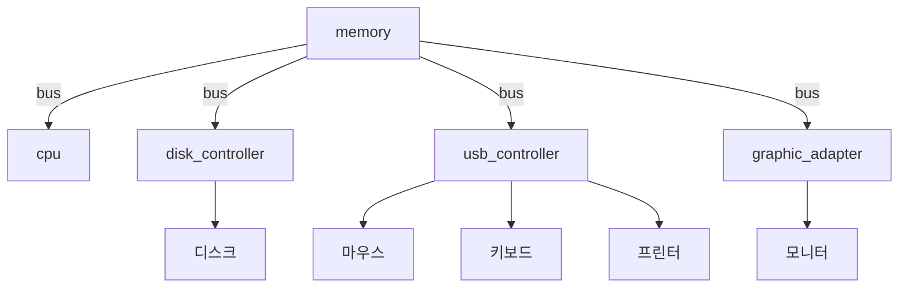

# 운영체제와 컴퓨터 시스템

태그: 1장

# 컴퓨터 시스템

운영체제는 결국 하드웨어와 관련되어 있으므로 이를 이해할 필요가 있다.

먼저 컴퓨터 시스템에 대해 간단히 알아보고, 운영체제를 공부해보자.

## 컴퓨터 시스템의 구성

현대의 컴퓨터 시스템을 그림으로 그려보자.

CPU와 수많은 device controller가 있고, 이를 bus로 연결하고 있다. 각 device controller는 특정 장치를 담당한다.

- 운영체제는 device controller마다 장치 드라이버가 있다.
- 장치 드라이버는 장치에 대한 일관된 인터페이스를 제공한다.

## 인터럽트

컴퓨터 작업이 이뤄지는 방식을 살펴보자.

1. 키보드를 친다.
2. 데이터는 다음과 같은 방식으로 이동한다.
    
    키보드 → 장치 컨트롤러 속 버퍼 (이걸 장치 드라이버가 해줌)
    
3. 장치 컨트롤러 → cpu에게 **인터럽트**를 검.
4. cpu는 인터럽트 핸들러에게 제어를 넘김
5. 인터럽트 핸들러가 데이터 처리
6. cpu는 인터럽트로 중단된 작업 처리

요즘의 운영체제는 좀 더 향상된 인터럽트 처리를 위해, 인터럽트 벡터라는 것을 사용한다.

- 이를 통해 중요한 인터럽트를 먼저 처리할 수 있다.
- ex) 나눗셈 에러 : 0 / 중단점 : 3

## 저장장치

휘발성 저장장치 = RAM (랜덤 엑세스 메모리).

- 단순히 메모리라고 하면, 이걸 의미.
- 빠르나, 너무 용량이 작고, 전원이 없으면 데이터가 날라간다.

비휘발성 저장장치 (NVS)

- SSD, 플래시 메모리, FRAM 등등
- 좀 느리지만 전원이 꺼져도 데이터가 보존된다.

## 입출력구조

인터럽트를 통한 입출력은 대량 데이터를 옮길 때 오버헤드를 일으킬 수 있다.

따라서, 이를 위해 직접 메모리 액세스(DMA)가 사용된다.

운영체제 코드의 상당한 부분이 시스템의 안정성과 성능에 대한 중요성,

장치의 다양한 특성으로 인해 입출력 관리에 할애.

## 코어와 멀티코어

**코어란?**

- 명령을 실행하고 로컬로 데이터를 저장하기 위한 레지스터를 포함하는 구성요소
- 코어로 CPU는 범용 명령어 세트를 실행할 수 있다.
- 코어 1개 : 싱글 프로세서
    
    코어 n개 : 멀티 프로세서
    

**멀티코어**

CPU가 여러개 있는 프로세서.

1. SMP : 대칭 멀티프로세싱
    
    프로세서가 두 개 이상 있고, 메인 메모리에 이를 병렬적으로 연결
    
    때에 따라서 비효율적일 수 있음.
    
2. 다중 코어
    
    프로세서 하나에 cpu를 여러 개 넣는 방식.
    
    L2 캐시를 이용해 프로세서 안에서 cpu끼리 통신한다.
    

다중 프로세서의 단점인 병목 처리를 해결하기 위해, 각 CPU 간 작고 빠른

로컬 버스를 제공하는 방식이 존재한다. 이를 NUMA(non-uniform memory

access)라고 한다.

**클러스터형 시스템**

둘 이상의 컴퓨터 시스템을 결합해서 만든 시스템.

- 높은 가용성 제공
- 비대칭형 : 일부만 응용 프로그램을 실행
- 대칭형 : 모두가 다 실행.
- 하둡이 대표적인 예시