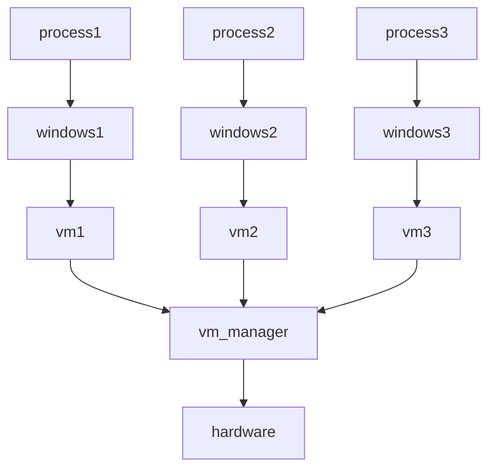

# 운영체제의 작동과 역할

태그: 1장

# 운영체제의 작동

## 기본원리

1. 부트스트랩 프로그램 : 커널을 찾아 메모리에 적재
2. 커널이 돌아가기 시작하면, 서비스를 제공
3. 시스템 프로그램에 의해 준비된 서비스 일부는 system daemon이 됨.
    
    리눅스에서의 첫 번째 시스템 프로그램 : systemd
    
4. 부팅 완료

아무런 요청이 없다면, 운영체제는 기다린다.

- 요청 = 인터럽트!
- 인터럽트의 종류에는 하드웨어 인터럽트도 있지만, 소프트웨어 인터럽트도 존재한다.
- 소프트웨어 인터럽트 = 트랩
- 소프트웨어 인터럽트는 시스템 콜이라는 특수 연산을 실행하도록 한다.

## 다중 프로그래밍과 멀티태스킹

지금 실행되고 있는 프로그램 = 프로세스

운영체제는 한 프로세스를 대기시킨 뒤, 다른 프로세스를 실행한다.

- 다중 프로그래밍의 원리가 바로 이것.
- 이걸 확장시킨게 바로 멀티태스킹

동시에 여러 프로세스를 메모리에 유지하려면 **메모리 관리방식**이 필요하다.

또, 어떤 프로세스를 어떤 순서로 결정할지 보려면 **cpu 스케쥴링**이 필요하다.

적절한 응답 시간을 보장하려면 **가상 메모리**를 사용해야 한다.

전부 운영체제에서 다루는 부분이다.

## 이중모드와 다중모드

운영체제는 잘못된 프로그램으로 인해 타 프로그램 혹은 운영체제가 피해를 입지 않도록 해야 한다.

그래서, 운영체제는 여러가지 실행 모드를 나눠 하드웨어를 지원한다.

대표적인 방법은 운영체제를 두 가지 모드, 사용자 모드와 커널 모드로 나누는 것이다.

<aside>
💡 둘은 모드 비트를 통해서 구분한다.
커널 모드(0), 사용자 모드 (1)
</aside>

```
1. 부팅 시 : 커널 모드에서 시작
2. 운영체제 적재 후 : 사용자 모드로 넘어감.
3. 트랩, 인터럽트 발생 시 (시스템 콜 호출) 커널 모드로 전환
4. 시스템 콜 실행 이후 다시 사용자 모드로 복귀
```

이러한 이중모드를 통해 위험한 명령이 오직 커널모드에서만 수행될 수 있도록 해준다.

사용자 모드에서 위험한 명령이 실행되려고 하면, 트랩이 걸린다.

일부 운영체제는 두 가지 이상의 모드를 가진다.

- ex. 인텔 프로세서의 **보호 링**
- ex. 가상화를 위한 모드

## 타이머

특정한 경우, 자원이 무한대로 소모될 수 있다. (ex. 무한 while 루프)

이를 막아주는 역할을 운영체제가 해줘야 하는데, 이를 타이머를 통해 한다.

타이머는 지정된 시간 후 컴퓨터를 인터럽트 할 수 있게 설정할 수 있다.

주로 고정률의 클록과 계수기로 구현한다.

# 역할 1 : 자원 관리

여기서 말하는 자원은 다음과 같다.
- CPU, 메모리, 파일, 저장공간, 캐시, 입출력

## 프로세스 관리

프로세스는 자원을 필요로 하며, 이외에도 초기화 데이터로 필요로 할 수 있음.

그러나 프로그램 그 자체는 프로세스가 아니며, 프로세스는 다음 수행할 명령어를

지정하는 **프로그램 카운터**를 가진 능동적인 개체이다.

운영체제는 프로세스와 관련해 다음 책임을 진다.

1. 사용자 프로세스와 시스템 프로세스의 생성과 제거
2. CPU에 프로세스와 쓰레드 스케줄하기
3. 프로세스의 일시 중지와 재수행
4. 프로세스 동기화를 위한 기법 제공
5. 프로세스 통신을 위한 기법 제공

## 메모리 관리

CPU 이용률과 컴퓨터의 응답 속도를 개선하기 위해, 메모리를 관리하는 기법이 필요.

운영체제는 이를 위해 다음과 같은 일을 담당.

1. 메모리의 어느 부분이 현재 사용되는지 추적하기
2. 필요에 따라 메모리 공간을 할당하고 회수하기
3. 어떤 프로세스들을 메모리에 적재하고 제거할지 결정하기

## 파일 시스템 관리

편리성을 높이기 위해, 운영체제는 논리적인 저장 단위인 파일을 정의.

파일은 물리적 매체로 매핑되며, 저장장치를 통해 이들 파일에 접근.

파일의 사용을 위해서는 접근 권한 등을 통제하는 것도 필요.

운영체제는 이를 위해 다음과 같은 일을 담당.

1. 파일의 생성 및 제거
2. 디렉토리의 생성 및 제거
3. 파일과 디렉토리를 조작하기 위한 프리미티브의 제공
4. 파일을 보조저장장치로 매핑
5. 파일 백업

## 대용량 저장장치 관리

보조 저장장치의 적절한 관리가 없이는 컴퓨터가 돌아가기 어렵다.

운영체제는 다음과 같은 역할을 통해 보조 저장장치를 관리한다.

1. 마운트 및 언마운트
2. 사용가능 공간 관리
3. 저장장소 할당
4. 디스크 스케쥴링
5. 보호

보조저장장치는 효율적으로 사용해야 한다. 컴퓨터 전체 동작 속도는 보조

저장장치 서브시스템과 이를 조작하는 알고리즘의 영향을 받을 수 있다.

3차 저장장치; CD, DVD 등은 성능에 영향을 미치지는 않지만 역시 

운영체제에 의해서 관리되어야만 한다.

## 캐시 관리

캐싱은 컴퓨터 시스템의 중요한 원리이다.

정보는 저장장치에 저장되었다가, 더 빠른 장치인 캐시에 일시적으로 보관된다.

그러나 캐시의 크기는 제한적임으로 캐시 관리는 굉장히 중요하다.

특히, 멀티 프로세스 환경에서는 이러한 접근이 굉장히 중요하다.

여러개의 프로세스가 변수 A에 접근할 경우 가장 최근에 갱신된 것을 서로 원하기 때문이다.

CPU에 내부 레지스터 뿐만 아닌 로컬 캐시도 있다면 문제는 더 복잡해 진다.

A의 복사본이 동시에 여러 캐시에 존재할 수 있기 때문에, A의 변형이 즉각적으로 이뤄져야 한다.

이를 캐시 일관성 문제라고 한다.

운영체제의 목적 : 사용자에게 특정 하드웨어 장치의 특성을 숨기는 것.

## 입출력 시스템 관리
입출력 시스템의 구성요소

1. 메모리 관리 구성요소
2. 일반적인 장치 드라이버 인터페이스
3. 특정 하드웨어 장치들을 위한 드라이버


# 역할 2 : 보안관리

만약, 컴퓨터 시스템이 다수의 사용자를 가지며 다수 프로세스의 병행 수행을 허락한다면

반드시 데이터에 대한 접근을 규제해야 한다.

보호를 위해 운영체제는 사용자 식별자 (user ID)의 리스트를 유지한다.

이 식별자는 사용자마다 할당되고 유일하다.

또, 사용자들의 집합을 구분해야 할 경우도 생긴다.

이걸 보고 그룹이라고 하며, 그룹 이름과 그 그룹에 속한 사용자들을 정의할 필요가 있다.

운영체제는 그룹 이름과 그룹 식별자로 이를 실현한다.

사용자는 때때로 원하는 작업을 수행하기 위해 권한을 올리고 싶어 한다.

운영체제는 권한 상승을 허용하는 다양한 방법을 제공한다.

ex. 유닉스의 setuid 속성을 이용해 접근할 파일의 소유주 식별자를 이용해 동작.

프로세스는 종료되거나 특권을 해제하기 전까지 유효 사용자 식별자로 수행

# 역할 3 : 가상화

우선 가상화의 정의를 보자.

<aside>
💡 가상화 : 단일 컴퓨터의 하드웨어를 여러 가지 실행환경으로 추상화하여 개별 환경이 자신만의 컴퓨터에서 실행되고 있다는 환상을 만들 수 있는 기술

</aside>

맥 위에 vmware를 통해 가상 윈도우 3개가 올라가져 있다고 치자.



이때의 맥을 우리는 host라고 하고, 윈도우를 guest라고 한다.

각각의 vm을 우리는 가상머신 관리자, VMM이라고 한다.

# 역할 4 : 분산 시스템

서로 떨어진 컴퓨터를 엮는 시스템을 분산 시스템이라고 한다.

분산 시스템의 컴퓨터들은 네트워크로 연결되어 있다.

운영체제의 입장에서 네트워크 프로토콜은 인터페이스 장치, 장치 드라이버,

그리고 데이터를 처리하는 소프트웨어가 있어야 한다.

# 부록 : 자료구조

운영체제를 알기 위해 필요한 자료구조는 다음과 같다.

모르는 파트는 자료구조 파트를 참고하면 될 것 같다.

1. 리스트, 스택, 큐
2. 트리
3. 해시함수
4. 비트맵 = 0과 1로 된 문자열

# 다양한 컴퓨팅 환경

운영체제가 어떻게 사용되는지 한번 보자.

1. 전통적인 컴퓨팅
2. 모바일 컴퓨팅
3. 클라이언트 서버 컴퓨팅
    - 현대 네트워크 구조 = 서버 시스템이 클라이언트의 요청을 만족시키는 배치
    - 이를 **클라이언트-서버 구조**라고 한다.
    - 서버 시스템은 크게 계산 서버와 파일 서버로 나눌 수 있다.
    - 계산 서버 : 클라이언트가 계산 작업을 요청할 수 있는 인터페이스 제공
    - 파일 서버 : 클라이언트가 파일을 다룰 수 있는 인터페이스 제공

4. p2p
    - 클라이언트-서버와 달리 클라이언트, 서버의 구분이 없음
    - 서비스가 네트워크에 분산된 여러 노드에 의해 제공될 수 있음.

5. 클라우드 컴퓨팅
6. 임베디드 컴퓨팅
    - 엄격한 시간 제약이 있기 때문에 실시간 운영체제를 수행.
    - 정해진 시간 제약 내에 올바른 결과를 돌려줄 수 있을 때에만 정확히 동작