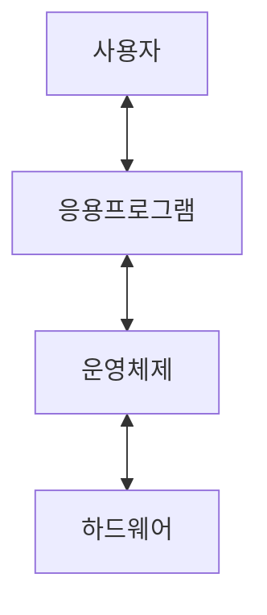

# 다양한 운영체제

태그: 1장

# 운영체제란 무엇인가?

- 컴퓨터 사용자와 컴퓨터 하드웨어 사이의 중개자
- 사용자가 프로그램을 편리하고 효율적으로 수행할 수 있는 환경을 제공
- 하드웨어를 관리하는 소프트웨어

# 운영체제가 할 일

다음은 전체 컴퓨터 시스템의 구성요소를 나타낸 그래프이다.

화살표를 통해 움직이는 것은 계산용 자원이다.

- 하드웨어 : 기본 계산용 자원을 제공한다.
- 응용 프로그램 : 자원을 활용해 다양한 계산문제를 해결한다.

그렇다면, 운영체제는 무엇을 하는가?

→ 다양한 응용 프로그램에게 자원을 분배한다. (= 하드웨어 사용을 제어한다.)

→ 즉, 운영체제는 사회에서 **정부의 역할과 유사하다.**

운영체제의 역할을 좀 더 심도 있게, 사용자와 시스템의 관점에서 보자.

## 사용자 관점

사용자 : 운영체제가 자신의 작업을 편리하게 해 주길 원한다.

- 이 관점에서 운영체제는 시스템의 용이성을 위해 설계됨.
    - ex) 터치스크린, 음성인식 등을 인식하는 ios
- 물론, 사용자 관점을 전혀 반영하지 않는 운영체제도 존재
    - ex) 차량이나 가전제품 등에 들어가는 내장형(임베디드) 컴퓨터

## 시스템 관점

관점 1 : 운영체제는 자원의 분배자(resource allocator)

- 컴퓨터 시스템 (=하드웨어)는 여러가지 자원을 가진다.
    - CPU 시간, 메모리 공간, 저장장치, 입출력 장치
    - 자원에 대한 상충된 요청을 해결하는 것이 운영체제의 목표

관점 2 : 운영체제는 제어 프로그램(control program)

- 여러 입출력 장치와 응용 프로그램을 제어.
    - 컴퓨터의 부적절한 사용을 방지하기 위한 제어
    - 특히 입출력 장치의 제어와 작동에 깊이 관여.

## 구성요소

운영체제는 보통 다음 3가지를 포함한다.

- 컴퓨터에서 항상 실행되는 프로그램인 **커널**
- 개발자에게 추가적인 서비스를 제공하는 **미들웨어 프레임워크**
- 시스템 실행 중 시스템 관리에 도움이 되는 **시스템 프로그램**

대체 왜 공부하는가?

- 운영체제를 이해함으로써 효율적인 프로그래밍을 할 수 있다.
- 즉, 운영체제를 사용하는 사람들에게도 좋다.