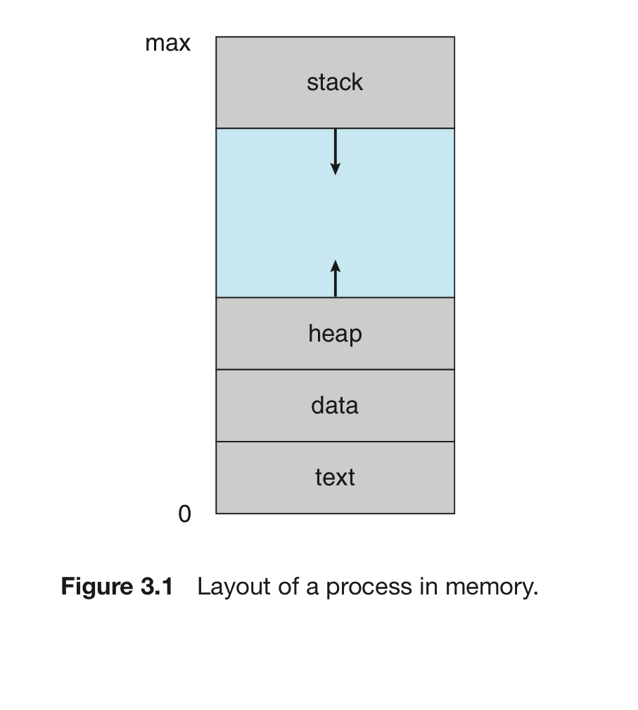
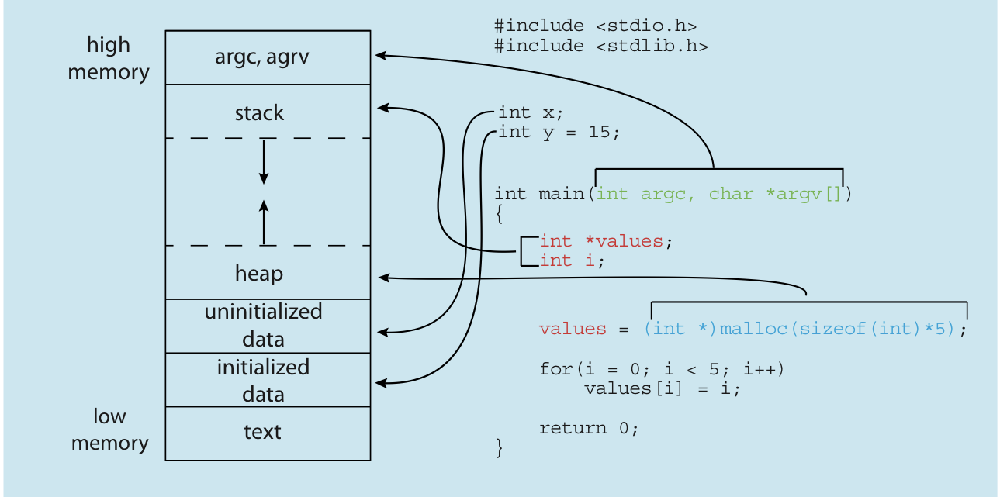

# 개요 : 프로세스란?

숫자: 파트1

# 프로세스의 정의

## 프로세스란 무엇인가?

<aside>
💡 간단히 말해서, 실행중인 프로그램을 프로세스라고 한다.

</aside>

## 왜 생겨났는가?

초기의 컴퓨터 시스템 : 한 번에 하나의 프로그램 실행.

- 하나의 프로그램이 시스템을 완전히 제어

오늘날 컴퓨터 시스템 : 메모리에 다수의 프로그램이 적재되어 병행 실행을 허용

- 다양한 프로그램을 좀 더 견고하게 제어하고, 구획화하는 것이 필요해지게 됨.
- 그래서 생긴 것이 프로세스의 개념

따라서 오늘날 컴퓨터과학에서는 **하나의 시스템 = 프로세스의 집합체!**

## 프로세스와 작업

컴퓨터에서 모든 CPU 활동을 부르는 명칭 = 프로세스

단, 운영체제의 이론과 용어가 정립되던 시절에는 작업(job)이라는 용어를 주로 씀.

그래서 운영체제의 역할을 설명할 때 작업(job)이라는 용어를 여전히 사용.



# 프로세스와 메모리

프로그램이 (가상)메모리에 적재되면, 프로세스가 된다.

(아이콘을 클릭하거나, 터미널에 `./a.out` 치면 메모리 적재된다는 뜻!)

- 프로그램 : 디스크에 저장된 파일. 수동적인 존재.
- 프로세스 : 다음 명령을 지정하는 프로그램 카운터와 자원의 집합을 가짐. 능동적인 존재.

프로세스의 현재 상태는 프로그램 카운터 값과 프로세서 레지스터의 내용으로 나타낸다.

## 프로세스의 메모리 배치

(가상)메모리는 다음과 같은 구조로 되어 있다.

- 텍스트
- 스택
- 힙
- 데이터

위로 갈수록 메모리 주소의 값이 크다.

실제 램과는 가상메모리 테이블로 연결되어 있다.

`프로세스의 0x1234 → 물리메모리 0x5678`

실제 프로그래밍 코드는 다음과 같이 배치된다.

- 실행코드 → 텍스트 세션
- 전역변수 → 데이터 섹션
- 동적할당 → 힙 섹션
- 함수 호출 시 임시 데이터 저장 → 스택 세션
    - ex. 함수 매개변수, 복귀 주소, 지역변수

텍스트와 데이터 섹션 : 크기가 불변.

스택과 힙 섹션 : 프로그램 실행 중 크기가 변화. 

- 스택은 아래로 커지는 반면, 힙은 위로 커진다.
- 운영체제는 이 둘이 서로 겹치지 않도록 해야 함.

## 참고 : C언어 코드와 메모리 구조



## 프로세스의 상태주기

프로세스는 실행되면서 그 상태가 바뀐다.


이러한 상태의 이름은 운영체제마다 다르고, 또 더 세분화되기도 한다.

- 새로운(new) : 프로세스가 생성 중
- 대기(ready) : 프로세스가 어떤 이벤트가 일어나길 기다림.
- 실행(running) : 명령어가 실행되는 중
- 준비(waiting) : 프로세스가 처리기(=프로세서, cpu)에 할당되기를 기다림.
- 종료(terminated) : 프로세스 실행이 종료됨.

중요한 것은, 하나의 코어에서는 하나의 프로세스만 실행된다는 것이다.

## 프로세스 제어 블록 (PCB)

각 프로세스는 운영체제에서 프로세스 제어 블록에 의해 표현된다.

ex) 리눅스의 프로세스를 C언어로 표현하면 다음과 같다.

```c
long state; // 프로세스 상태
struct sched_entity se; // 스케쥴링 정보
struct task_struct *parent; // 이 프로세스의 부모
struct list_head children; // 이 프로세스의 자식
struct files_struct *files; // 오픈 파일
struct mm_struct *mm; // 이 프로세스의 주소공간
```

프로세스 제어 블록은 특정 프로세스에 대한 여러 정보를 수록한다.

- 프로그램 카운터 : 다음에 실행할 명령어의 주소를 가리킨다.
- CPU 레지스터 : 컴퓨터의 구조에 따라 다양한 수와 유형을 가진다.
    - 누산기, 인덱스 레지스터, 스택 레지스터, 범용 레지스터, 상태 코드 정보 등등
    - 이 상태 정보는 나중에 프로세스가 다시 스케줄 될 때 계속 올바르게 실행되기
    위해 인터럽트 발생 시 저장되어야 함.
- CPU 스케쥴링 정보 : 프로세스 우선순위, 스케줄 큐에 대한 포인터와 다른 스케쥴 매개변수 포함.
- 메모리 관리 정보 : 운영체제에 의해 사용되는 메모리 시스템에 따라 기준 레지스터와 한계
    
    레지스터의 값, 페이지 테이블, 세그먼트 테이블에 대한 정보를 포괄.
    
- 회계 정보 : CPU 사용시간, 실시간 사용수치(real-time used), 시간 제한 등을 포함.
- 입출력 상태 정보 : 프로세스에 할당된 입출력 장치와 열린 파일의 목록 등을 포함.

<aside>
💡 PCB = (회계 데이터 + 프로세스 시작/재시작 데이터 + 기타 데이터)의 저장소

</aside>

## 참고 : 쓰레드

현대 운영체제 = 프로세스가 여러 개의 쓰레드를 가질 수 있음.

- 과거 1 프로세스 = 1 쓰레드일 땐, 프로세스가 한 번에 한 개의 일만 할 수 있었다.
- ex) 워드를 실행시킬 때, 문자 입력과 철자 검사가 동시에 안됨.
- 지금은 이게 다 됨

이러한 다중 쓰레드는 다중 프로세서 시스템에서 이득을 얻을 수 있음.

왜? 여러 쓰레드가 병렬로 실행될 수 있기 때문.

- ex) 하나의 쓰레드가 문자를 입력받을 동안, 다른 쓰레드가 철자 검사를 할 수 있음.
- 이때, PCB는 쓰레드에 관한 정보도 포함함.