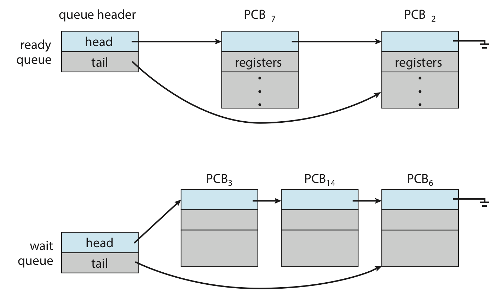
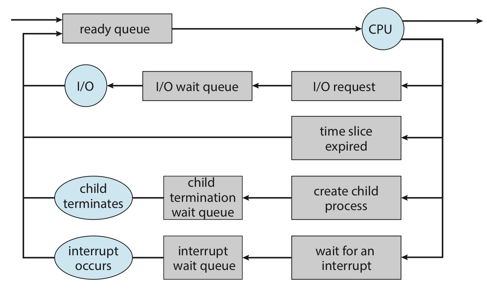

# 프로세스의 스케쥴링과 연산

숫자: 파트2, 파트3

# 프로세스 스케쥴링

## 프로세스 스케쥴러

어떤 프로세스를 선택할지 고를 때, 그 기준이 있다.

- CPU 이용을 최대화하기 위해 프로세스를 실행되도록 함. (= 다중 프로그래밍)
- 실행되는 다양한 프로그램끼리 연동될 수 있게 프로세스들 사이에서
CPU 코어를 빈번하게 교체 = 시간 공유

이를 달성하기 위해 **프로세스 스케쥴러**라는 것이 등장.

1 코어 = 1 프로세스만 실행가능. (다중 코어는 한 번에 여러 개 실행 가능)

따라서, 코어 < 프로세스면 어떠한 프로세스는 기다려 함.

- 현재 메모리에 있는 프로세스 = 다중 프로그래밍 정도(degree of multiprogramming)

다중 프로그래밍과 시간 공유의 목표를 동시에 달성하려면 프로세스의 일반적인 동작을
고려해야 한다.

일반적으로 대부분의 프로세스는 I/O 바운드 프로세스와 CPU 바운드 프로세스로 |
나눌 수 있다. 

- I/O 바운드 프로세스 : 계산 시간 < 입출력 시간
- CPU 바운드 프로세스 : 계산 시간 > 입출력 시간

## 스케쥴링 큐

프로세스들을 저장하는 공간이라고 할 수 있다.



프로세스가 어떻게 작동하는지를 스케쥴링 큐와 엮어서 보자.

1. 프로세스가 시스템에 들어가면 **준비 큐**에 들어간다.
2. 프로세스가 실행된다.
3. 실행 중 어떠한 이벤트가 발생하면, 그 이벤트를 위한 **대기 큐**에 들어간다.
4. 이벤트가 이뤄지면 다시 준비 큐로 들어간다.
5. 종료될 때까지 이 과정을 반복한다.
    
    종료되면 모든 큐에서 제거 후 PCB 및 자원이 반환.
    

즉, 프로세스는 실행되는 동안 대기 큐와 준비 큐를 왔다갔다 한다.



## CPU 스케쥴링

그럼, 준비 큐에 있는 프로세스들 중 어떤 걸 CPU에 넣어야 할까?

이를 결정해 주는 것이 CPU 스케쥴러의 역할이다.

I/O 바운드 프로세스 : I/O 요청 대기를 위해 몇 밀리초 동안만 실행.

CPU 바운드 프로세스 : 오랜 시간 동안 실행이 필요. 단, 너무 오래 붙들어선 

안되므로 적어도 100밀리초마다 한 번씩 실행.

일부 운영체제는 스와핑이라는 기능을 가지고 있다.

- 메모리가 거의 꽉 차려고 할 때 보통 이 기능을 사용한다.
- 프로세스를 메모리에서 제거한 뒤(스왑아웃), 나중에 다시 적재(스왑인)한다.
    - 중단된 위치에서 계속 실행하면 된다.

## 문맥 교환 (context switch)

인터럽트가 발생하면, 현재 돌아가는 프로세스를 잠깐 CPU에서 빼야 한다.

이때 그 프로세스의 정보를 저장하고, 새 프로세스의 보관 상태를 복구해야 한다.

이 작업을 **문맥 교환**이라고 한다.

```
인터럽트 발생
프로세스1 저장

(유휴상태)
(유휴상태)
(유휴상태)

프로세스1 복구
인터럽트 발생

(유휴상태)

프로세스2 복구
인터럽트 처리
프로세스2 저장

(유휴상태)
```

`프로세스1 저장`과 `프로세스2 복구`가 일어나는 시간을 문맥 교환 시간이라고 한다.

이 시간 동안 시스템은 아무것도 할 수 없으므로, 이는 순수한 오버헤드이다.

- pcb 중 레지스터에 그 정보를 저장
- 교환속도는 메모리 속도, 레지스터 수, 특수 명령어 등에 따라 달라진다.
- 전형적인 속도는 수 마이크로초까지 분포되어 있다.
- **즉, 하드웨어의 지원에 크게 좌우된다는 뜻!**

```
일부 프로세서는 여러 개의 레지스터의 집합을 제공.
- 문맥 교환은 현행 레지스터 집합의 포인터 변경을 포함
- 물론 레지스터 집합들보다도 활성 프로세스들이 더 많다면, 시스템은
전처럼 레지스터 자료를 메모리로 또는 메모리에서 복사해야 함.

운영체제가 복잡해질수록, 문맥교환 시 해야 할 작업량이 많아짐.
```

# 프로세스의 연산

## 프로세스 생성

인제 직접 프로세스를 만들고, 종료해보는 기법을 알아보자.

프로세스는 여러 개의 프로세스를 낳을 수 있다.

우리는 이 둘을 **부모 프로세스**, **자식 프로세스**로 구분한다.

유닉스나 윈도우에서는 프로세스 식별자를 이용해 프로세스를 구분한다.

- 이는 보통 정수이다.
- pid는 각 프로세스에 고유한 값을 가지도록 할당된다.
- 이 식별자를 통해 프로세스에 접근할 수 있다.

### 프로세스 트리

리눅스에서 프로세스는 다음처럼 실행된다. 


즉, 전원이 켜지면 systemd가 실행되고, 뒤이어 logind가 실행되고…

이러한 그림을 **프로세스 트리**라고 한다.

터미널에서 실제로 이걸 보고 싶다면..

1. `ps -el` 명령어를 친다.
2. `pstree` 명령어를 친다.

### 부모와 자식

부모 프로세스는 자식 프로세스를 낳을 때 다음과 같은 일을 한다.

1. 자식 프로세스의 임무 달성을 위한 자원을 나눠주거나, 같이 쓸 수 있게 한다.
    
    (물론 운영체제로부터 직접 얻어올 수도 있다.)
    
2. 자식 프로세스가 자원을 너무 많이 쓰지 않게 하거나, 너무 자식 프로세스가
    
    많이 생기지 않도록 한다.
    
3. 초기화 데이터(입력)을 전달할 수 있다.

부모 프로세스와 자식 프로세스가 실행되는 데도 방법이 있다.

1. 부모 프로세스와 자식 프로세스를 같이 실행한다.
2. 부모 프로세스가 자식 프로세스가 종료될 때까지 기다린다.

이걸 저장공간의 측면에서 살펴보자.

1. 자식 프로세스 = 부모 프로세스의 복사본
2. 자식 프로세스는 자신에게 적재될 새 프로그램을 가지고 있다.

### 리눅스에서의 예시

```c
#include <sys/types.h>
#include <stdio.h>
#include <unistd.h>

int main()
{
	pid_t pid
	
	pid = fork(); // fork를 실행하면 이 코드가 옆에 하나가 더 뜬다고 생각하자.
	if (pid < 0)
	{
		fprintf(stderr, "Fork Failed");
		return 1;
	}
	else if (pid == 0) // 자식이면 여기로
		execlp("/bin/ls", "ls", NULL);
	else // 부모면 여기로
	{
		wait(NULL);
		printf("Child complete");	
	}

	return 0;
}
```

1. 자식 프로세스 낳기 : `fork()` 를 사용한다.
    - 자식 프로세스 = 원래 프로세스의 주소 공간의 복사본
        
        이를 통해, 자식과 부모가 쉽게 통신할 수 있다.
        
    - 자식의 식별자(pid) ≠ 부모의 식별자(pid)
    - 자식 pid = 0, 부모 pid > 0
2. 자식은 `exec()`를 써서 자신의 메모리 공간을 새 프로그램으로 교체
    - 여기서는 `exec()`의 한 버전인 `execlp()`를 사용했다.
    - 다만, 꼭 교체를 할 필요는 없다.
3. 부모가 기다려야 할 경우 `wait()`을 쓴다.

## 프로세스 종료

### 프로세스 종료하기 : exit()

프로세스는 보통 exit()을 통해 자신의 삭제를 요청한다.

이 시점에서 프로세스는 자신을 기다리고 있는 부모 프로세스에게 자신의 상태 값을 반환할 수 있다.

프로세스의 모든 자원이 할당 해제되고, 운영체제로 반납된다.

### 프로세스 종료하기 : 시스템 콜

특정한 시스템 콜을 통해서도 프로세스를 종료할 수 있다.

이러한 시스템 콜은 종료될 프로세스의 부모만이 호출할 수 있다.

이러한 강제종류는

1. 자식이 부모에게 할당된 자원을 초과해서 사용했을 때
    
    (물론, 자식 상태를 검사할 방편이 주어져야 한다.)
    
2. 자식에게 할당된 태스크가 더 이상 필요 없을 때
3. 부모가 exit을 하는데 운영체제가 부모 없는 자식 프로세스를 허락하지 않을 경우
    
    이러한 것을 연쇄식 종료(cascading termination)이라고 하며, 운영체제가 담당한다.
    

### 부모 없는 자식 : 좀비와 고아

보통은 부모 프로세스가 wait()를 통해 자식 프로세스가 종료할 때를 기다린다.

status에는 어느 자식이 종료되었는지 알 수 있게 식별자가 들어간다.

```c
pid_t pid;
int status;

pid = wait(&status);
```

만약, 부모 프로세스가 wait()를 실행하지 않고 그대로 종료되어 버린다면 어떻게 될까?

- 종료되었지만 부모가 아직 wait() 호출을 하지 않은 프로세스를 **좀비 프로세스**라고 한다.
- 이 경우 wait()를 호출하면 해당 프로세스의 식별자와 프로세스 테이블의 해당 항목이 운영체제에 반환된다.

- 부모가 wait()도 안한 상태에서 종료되어 버린다면, 이때의 자식 프로세스를 **고아 프로세스**라고 한다.
- 유닉스는 고아 프로세스에게 새 부모 프로세스로 init 프로세스를 지정한다.
- 리눅스는 init을 systemd로 대체.