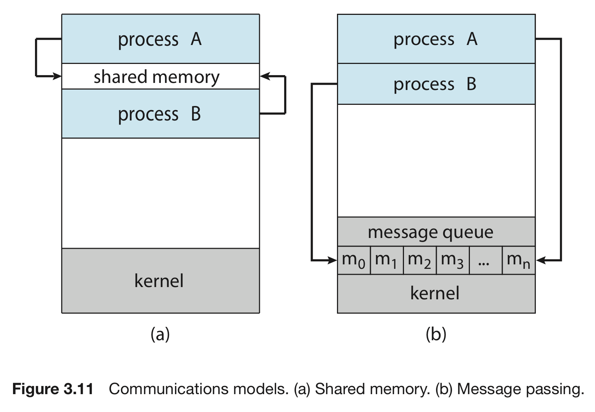

# 프로세스 간 통신 (1) : 개요 & 공유 메모리

숫자: 파트4, 파트5

# 프로세스 간 통신

운영체제 내에서 실행되는 병행 프로세스들 간에도 관계가 존재한다.

- 다른 프로세스와 데이터를 공유하지 않는다 ⇒ 독립적
- 다른 프로세스와 데이터를 공유한다 ⇒ 협력적

## 왜 협력(통신)하는가?

1. 정보 공유 : 여러 응용 프로그램이 동일한 정보에 흥미를 느낄 수 있으므로, 그러한 정보에 병행적으로 접근할 수 있다.
2. 계산 가속화 : 특정 태스크를 빠르게 처리해야 할 경우 그것을 서브 태스크로 나누어 각각이 병렬로 실행되도록 해야 한다. 이러한 가속화는 여러 개의 코어를 가진 경우에만 달성할 수 있다.
3. 모듈화 : 우리는 시스템 기능을 프로세스별, 쓰레드별로 나누길 원한다.

## 프로세스 간 통신 : IPC

**IPC(Interprocess Communication) : 프로세스 간 통신**

- 프로세스 간의 협력을 위해 프로세스끼리 서로 통신하는 것을 의미.

**IPC의 종류**

1. 공유 메모리 : 협력 프로세스들에 의해 공유되는 메모리의 영역 구축
2. 메시지 전달 : 협력 프로세스들 사이에 교환되는 메세지로 통신이 이뤄짐.



# IPC : 공유 메모리

## 공유 메모리

- 공유 메모리는 **공유 메모리 세그먼트**를 생성하는 프로세스의 주소 공간에 위치
- 각 프로세스들은 **공유 메모리 세그먼트**를 자신의 저장공간에 추가

원래 한 프로세스는 다른 프로세스에 접근할 수 없음.

- 그러나, 여기에서는 이러한 제약 조건을 프로세스끼리 해제
- 이후 공유 영역에 서로 읽고 씀으로써 정보 교환
- 데이터의 형식과 위치는 이들 프로세스에 의해 결정
- 서로 같은 위치에 쓰지 않도록 책임져야 함.

## 생산자 - 소비자 관계

한 프로세스를 생산자, 다른 프로세스를 소비자라고 보자.

- 실제로 이러한 관계는 컴퓨팅 환경에서 자주 보인다.
- 컴파일러 : 코드를 생산 / 어셈블러 : 코드를 소비
- 서버 :  콘텐츠를 생산 / 클라이언트 : 콘텐츠를 소비

생산자와 소비자를 연결하는 방법으로 공유 메모리를 생각할 수 있다.

- 이를 통해 생산과 소비가 동시 병행으로 진행될 수 있다.
- 또, 생산하지도 않은 것을 소비자가 접근하려 하지 않을 수 있다.
- 생산자가 생산한 것을 채워넣고, 소비자가 이를 꺼내는 공간을 버퍼로 
볼 수 있는데, 이때 이 버퍼가 공유 메모리에 존재하면 된다.

**이때, 두 가지 유형의 버퍼가 사용된다.**

1. 무한 버퍼
    - 버퍼의 크기에 한계가 없다.
    - 소비자는 새 항목을 기다려야 할 수도 있지만,
        
        생산자는 항상 새 항목을 생산할 수 있다.
        
2. 유한 버퍼
    - 버퍼의 크기가 고정되어 있다.
    - 버퍼가 비어있으면 소비자가 대기
        
        반대로 버퍼가 차 있으면 생산자가 대기
        

## 유한 버퍼로 통신하기

```c
#define BUFFER_SIZE 10

typedef struct {
  ...
} item;

item buffer[BUFFER_SIZE];
int in = 0;
int out = 0;
```

`buffer[BUFFER_SIZE]` ⇒ 데이터가 들어갈 자리

`in` ⇒ 다음으로 비어있는 위치를 가리키는 인덱스

`out` ⇒ 첫 번째로 채워진 위치를 가리키는 인덱스

```c
// 생산자 과정
void producer() {
	item next_produced;
	while (1) 
	{
		// 아이템 생산 (코드 생략)
		while ((in + 1) % BUFFER_SIZE == out)
			;
		buffer[in] = next_produced;
		in = (in + 1) % BUFFER_SIZE;
	}
}

// 소비자 과정
void consumer() {
	item next_produced;
	while (1) 
	{
		while (in == out)
			;
		next_produced = buffer[out];
		out = (out + 1) % BUFFER_SIZE;
		// 아이템 소비 (코드생략)
	}
}

```

지금은 한 번에 한 프로세스만 접근하도록 설계된 상황.

생산자와 소비자가 병행하게 공유 버퍼를 접근하는 상황은 추후 고려.