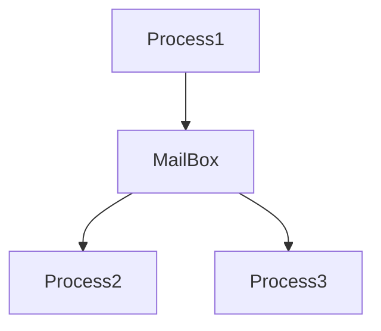

# 프로세스 간 통신 (2) : 메세지 전달

숫자: 파트6

# IPC : 메세지 전달 (이론)

## 특징

- 동일한 주소 공간을 공유하지 않고도 프로세스들이 통신을 하고,
    
    그들의 동작을 동기화 할 수 있게 허용한다.
    
- 통신하는 프로세스들이 네트워크에 의해 연결되어 있는
    
    분산 환경 에서 특히 유용하다.
    
- ex. 웹에서 사용되는 채팅 프로그램

## 메세지 시스템의 연산

메세지 시스템에는 두 가지 연산이 있다.

- `send(message)`
- `receive(message)`

두 가지 연산이 어떻게 이뤄질 지 알아보기 전, 우선 메세지의 종류를 알아보자.

### 메세지의 종류

프로세스가 보낸 메세지는 길이가 고정 일수도, 가변 일수도 있다.

**고정 길이**

- 시스템 수준의 구현은 단순하다.
- 프로그래밍 작업은 복잡해진다.

**가변 길이**

- 복잡한 시스템 수준의 구현이 있어야 한다.
- 프로그래밍 작업은 더 간단해진다.

### 통신 연결

만약 프로세스끼리 통신을 한다면, 이들 사이에 통신 연결이 있어야 한다.

이 연결은 다양하게 (논리적으로) 구현할 수 있으며, 크게 3가지로 구성된다.

- 하나의 링크
- `send(message)`
- `receive(message)`

구현 방법은 크게 다음과 같이 나뉜다.

1. 직접 연결 ↔ 간접 연결
2. 동기식 ↔ 비동기식
3. 자동 버퍼링 ↔ 명시적 버퍼링

## 연결 쟁점 (1) : 명명

프로세스가 서로를 가리킬 방법에 관한 이야기이다.

### 직접 연결

프로세스가 수신자 또는 송신자의 이름을 명시하는 것.

```c
send("프로세스 이름", message)    // ..에게 메세지를 보냄.
receive("프로세스 이름", message) // ..으로부터 메세지를 전달받음.
```

직접연결의 **특징**

- 연결이 자동으로 구축된다. 상대방 신원만 알면 된다.
- 정확히 두 프로세스 사이에만 연관된다.
- 정확히 하나의 연결만이 존재한다.

이 기법은 주소 방식에서 대칭성을 보인다. 서로 이름을 알아야 한다는 것!

물론, 비대칭적으로 설계할 수도 있다.

```c
send(p, message)     // p에게 메세지를 보냄.
receive(id, message) // 임의의 프로세스로부터 메세지를 전달받음. 
/* id = 통신을 발생시킨 프로세스의 이름 */
```

이 기법의 단점은 모듈성을 제한한다는 것이다. 

- 프로세스 이름이 바뀌면 모든 다른 프로세스 지정 부분을 검사해야 하기 때문
- 하드코딩을 해야 할 필요성이 커진다.

### 간접 연결

메세지는 메일박스, 포트에 의해 송신, 수신된다.

- 메일박스 = 프로세스들에 의해 메세지들이 넣어지고, 제거되는 객체

```c
send("메일박스 이름", message)    // 메일박스에게 메세지를 보냄.
receive("메일박스 이름", message) // 메일박스로부터 메세지를 전달받음.
```

**간접 연결의 특징**

- 연결은 프로세스끼리 공유 메일박스를 가질 때 구축
- 연결은 두 개 이상의 프로세스들과 연관될 수 있다.
- 각 프로세스 사이에는 다수의 연결이 존재할 수 있고, 각 연결은 하나의 메일박스에 대응
    - 그래프 구조 생각하면 될 듯

**여러 간접 연결 처리하기**



다음과 같은 상황에서 Process1의 메세지는 누가 받아야 하는가?

이 문제를 해결하는 기법은 여러가지가 있으며, 선택을 하면 된다.

1. 하나의 링크는 최대 2개의 프로세스와 연관되게 허용한다.
2. 한 순간에 최대 1개 프로세스만 receive()를 하게 허용한다.
3. 어느 프로세스가 메세지를 수신할지 알고리즘을 설계한다.

**메일박스의 위치**

메일박스는 한 프로세스나 운영체제에 의해 소유될 수 있다.

<한 프로세스가 가진 경우>

- 메일박스를 가진 프로세스와 사용할 프로세스를 구분해야 한다.
- 더 이상 메일박스를 소유한 프로세스가 없다면, 해당 사실을
    
    사용할 프로세스에게 알려줘야 한다.
    

<운영체제가 가진 경우>

- 자체적으로 존재한다.
- 운영체제가 새 메일박스를 생성하고, 이용할 수 있게 하고, 삭제한다.
- 메일박스를 처음 만드는 프로세스가 소유자가 되지만,
    
    소유권과 수신 특권은 다른 프로세스에게 전달될 수 있다.
    
- 그래서 복수의 수신자가 생길 수 있다.

## 연결 쟁점 (2) : 동기화

send()와 receive()를 만드는 방식을 알아보자.

크게, 봉쇄형 (= 동기식)과 비봉쇄형 (= 비동기식)이 존재한다.

- 봉쇄형 send() : 송신 프로세스는 메시지가 수신 프로세스 또는 메일박스에 의해 
수신될 때까지 봉쇄된다.
- 비봉쇄형 send() : 송신 프로세스는 메세지를 보내고 작업을 재시작한다.
- 봉쇄형 receive() : 메세지가 이용 가능할 때까지 수신 프로세스가 봉쇄된다.
- 비봉쇄형 receive() : 송신 프로세스가 유용한 메세지 또는 null을 받는다.

서로 봉쇄형이면, 랑데부가 발생

## 연결 쟁점 (3) : 버퍼링

직접연결이든 간접연결이든, 통신하는 프로세스들에 의해 교환되는 메세지는

임시 큐에 들어가 있다. 이 임시 큐는 다음과 같이 구현된다.

1. 무용량 : 링크는 자체 안에 대기하는 메세지들을 가질 수 없다.
    
    수신자는 송신자가 메시지를 수신할 때까지 기다려야 한다.
    
2. 유한 용량 : 큐는 유한한 길이 n을 가진다.
    
    큐가 꽉 차면, 송신자는 큐의 공간이 생길 때까지 봉쇄
    
3. 무한 용량 : 큐의 길이에 제한이 없다.
    
    송신자가 봉쇄되지 않는다.