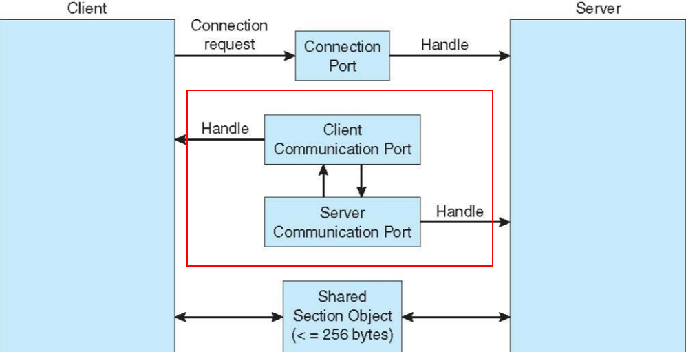

# 프로세스 간 통신 (3) : 메세지 전달 (예시)

숫자: 파트7

# IPC : 메세지 전달 (예시)

운영체제별 IPC를 살펴보자.

# 유닉스 : POSIX 공유 메모리

- 공유메모리를 위한 POSIX_API
- POSIX 공유 메모리는 memory-mapped 파일을 사용하여 구현됨
    - memory-mapped 파일 = 공유 메모리의 특정 영역을 파일과 연관시켜 놓은 것.

## 주요 구조

1. `shm_open()` 으로 공유 메모리 객체를 생성한다.
2. `ftruncate()`로 공유 메모리 객체의 크기를 바이트 단위로 설정한다.
3. `mmap()`으로 공유 메모리 객체를 포함하는 memory-mapped 파일을 구축한다.

```c
fd = shm_open(name, O_CREAT | O_RDWR, 0666);
// shm_open = shared memory open의 약자
// 객체이름 지정, 상태, 권한 부여
// 성공시 파일 디스크립터를 리턴

ftruncate(fd, 4096);
// 실제 공유되고 있는 메모리 사이즈

char *ptr = (char *)mmap(0, SIZE, PROT_READ | PROT_WRITE, MAP_SHARED, fd, 0);
// 반환값 : 성공시 (void *), 실패시 -1
// fd로 지정된 파일을 0을 시작으로 SIZE 바이트만큼 주소 0으로 대응시키겠다는 뜻.
// 중간의 PROT은 메모리 보호모드를 의미
// 중간의 flags -> 수정본이 그 프로세스에서만 보일지, 공개할지 선택.
//  MAP_SHARED : 대응되는 객체를 다른 모든 프로세스와 공유.
```

**프로세스가 생산자일 경우**

1. 데이터(=문자열, 숫자 등등)를 공유 메모리에 쓴다.

**프로세스가 소비자일 경우**

1. 공유 메모리에서 읽고 출력
2. 공유 메모리 객체를 제거.

# Apple : Mach 메세지 전달

Mach : 애플의 macOS와 iOS 등에 쓰인 커널.

- 분산 서비스용으로 설계되었지만 데스크톱 및 모바일에도 적합!
- Mach 커널 : 프로세스를 쓰레드와 태스크로 나눔.
    - **태스크** : 프로세스와 유사하지만, 제어 쓰레드가 많고 관련 적원이 적은 것.

Mach 커널은 다중 태스크의 생성과 제거를 지원

- 대부분의 통신은 메세지로 지원.
- 이때 메일박스의 이름은 **포트**.
    - **포트**는 크기가 고정되어 있고, 단방향임.
    - 양방향 통신 ⇒ 메세지가 한 포트로 전송되고 응답이 별도의 응답 **포트**로 전송

각 **포트**에는 **포트**와 상호작용할 자격이 되는지 식별하는 **포트 권한 집합**이 
연관됨.

- 포트를 생성한 **태스크**가 해당 포트의 소유자
    - 소유자는 해당 포트에서 메시지를 수신할 수 있는 유일한 태스크.
    - 소유자는 포트의 자격을 조정할 수도 있음.
- **태스크**가 생성되면 Task self 포트와 Notify 포트도 생김.
    - Task self : 태스크가 커널에 메시지를 보낼 때 사용
    - Notify : 커널에서 보낸 메시지를 태스크가 받을 때 사용

## 코드로 보기

실제 포트를 만드는 함수를 보자.

```c
mach_port_t port; // 포트 이름 = fd랑 비슷한 역할
mach_port_allocate(mach_task_self(), // task
			MACH_PORTRIGHT_RECEIVE,  // 포트 권한
			&port); // 포트 이름 권함
```

각 태스크는 또한 부트스트랩 포트에 액세스할 수 있어서 태스크가 생성한 포트를 시스템 전체의 부트스트랩 서버에 등록할 수 있음.

## 포트의 특징

포트와 관련된 큐는 크기가 제한되어 있고, 처음에는 비어있음.

- 메세지가 전달되면 큐에 복사.
- 동일한 송신자의 여러 메세지가 선입선출 구조로 큐에 삽입
- 순서를 보장하지는 않음

Mach의 문제점은 송신자의 포트에서 수신자의 포트로 메세지를 복사해야 하므로 생기는 성능 저하이다.

- 이 문제를 가상 메모리 관리 기술로 해결하려고 시도.

# 윈도우 : ALPC 메세지 전달

윈도우의 메세지 전달 설비를 ALPC(Advanced Local Procedure Call facility)라고 부른다.

- 동일 기계상의 두 프로세스 간 통신에 사용
- 원격 프로시저 호출과 같다.
- Mach처럼, 포트 객체를 사용한다.
    - 연결 포트와 통신 포트라는 두 가지 유형의 포트 존재

## 특징

다음과 같은 구조라고 생각하면 된다.



과정은 다음과 같다.

1. 서버 프로세스는 모든 프로세스가 접근할 수 있는 연결 포트 객체를 공표한다.
2. 클라이언트가 서버시스템으로부터 서비스를 원할 경우, 서버의 연결 포트 객체에 대한 핸들을 열고 연결 요청을 보낸다.
3. 서버는 채널을 생성하고 핸들을 클라이언트에게 반환한다.

메세지 크기에 따라 전달 기법이 달라진다.

1. 256바이트 이하 : 포트의 메시지 큐가 중간 저장소. 메세지는 프로세스에서 프로세스로 복사
2. 256바이트 이상 : 반드시 **섹션 객체**를 통하여 전달되어야 한다.
- **섹션 객체**란 채널과 연관된 공유 메모리의 영역을 말한다.
- 섹션 객체도 못쓰면, 서버 프로세스가 클라이언트의 주소 공간을 직접 읽거나 쓰는 API를 사용

# 리눅스 : 파이프

파이프 = 초기 리눅스 시스템에서 제공하는 IPC 기법 중 하나.

만들 때 다음 사항을 고려해야 한다.

1. 단방향 통신 vs 양방향 통신
2. 양방향 통신이 허용된다면 반이중인지, 전이중인지
    
    반이중 : 한 번에 한 방향 전송만 가능
    
    전이중 : 한 번에 양 방향 전송 가능
    
3. 통신하는 두 프로세스 간에 특정한 관계가 있어야 하는가?
4. 외부 컴퓨터와도 통신이 가능한가?

## 파이프의 종류

### 일반 파이프 / 익명 파이프

- 리눅스 : 일반 / 윈도우 : 익명
- 하나의 파이프는 단방향 통신만 가능
- 파이프는 다음 함수로 만든다.

```c
pipe(int fd[])
```

- 여기서 `fd[0]` = 읽기 종단, `fd[1]` = 쓰기 종단

유닉스에서 파이프는 일종의 특수한 파일임.

- `read()`와 `write()`를 사용
- 따라서 파이프를 생성한 프로세스 외에는 접근할 수 없음.
- 그래서 부모가 쓰기를 통해 데이터를 쓰면, 자식이 읽기로 데이터에 접근
- 부모와 자식 모두 사용하지 않는 파이프를 닫는 것에 주의.

윈도우에서 일반 파이프는 익명 파이프라고 불림.

- 유닉스와 달리 어떤 속성을 상속받는지 명시
- 파이프의 쓰기 종단을 상속받는 것을 금지해야 함.

유닉스와 윈도우 시스템 모두에서 통신하는 두 프로세스는 부모-자식 관계를 가져야만 함. 

또한 이 유형의 파이프는 컴퓨터 1대 안에서만 이뤄짐.

통신이 끝나면 이 파이프는 없어지게 됨.

### 지명 파이프

- 양방향 통신 가능
- 부모 - 자식 관계가 필요 없음
- 여러 프로세스가 이를 사용해 통신 가능
- 통신 프로세스가 종료되어도 지명 파이프는 계속 남음
- 유닉스와 윈도우 모두 이 지명 파이프를 지원.

unix에서는 FIFO라고 부름.

- mkfifo()로 생성
- 일반적인 시스템 콜: write(), read(), open()으로 조작
- 명시적으로 파일 시스템에서 삭제될 때까지 존재
- 반이중 전송만 가능
- 1대의 컴퓨터 안에서만 전송 가능
- **바이트 - 단위 통신** 만 허용

윈도우의 지명 파이프

- 전이중 통신도 허용
- **바이트 - 단위 통신** + **메시지 - 단위 통신**까지 허용