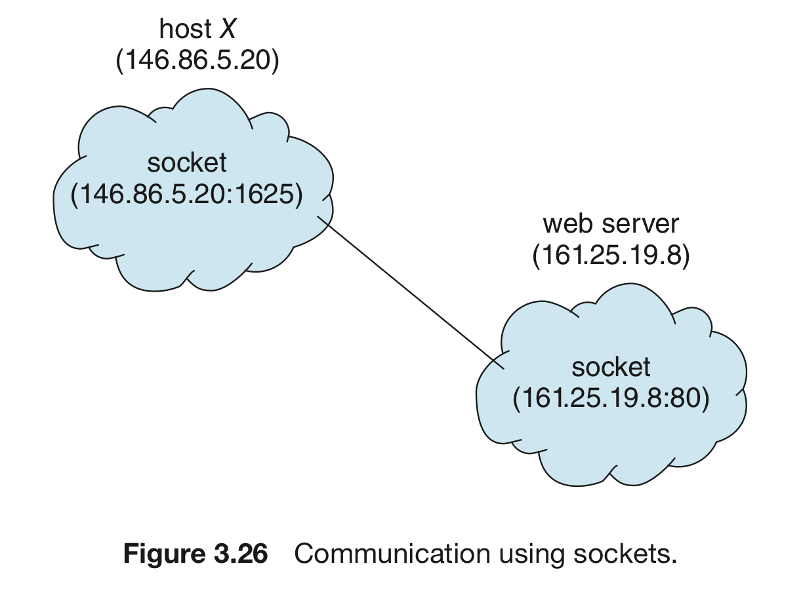

# 프로세스 간 통신 (4) : 클라이언트 서버 환경

숫자: 파트8

# 서버 환경에서의 통신

네트워크로 연결된 컴퓨터 사이에서 프로세스 통신을 하는 법을 알아보자.

크게 2가지 ; 소켓 & 원격 프로시저 호출(RPC)이 있다.

# 소켓

## 소켓이란?

통신의 극점(endpoint)를 의미.

- 두 프로세스가 네트워크 상에서 통신을 하려면 양 프로세스마다 하나씩,
    
    총 2개의 소켓이 필요해 진다.
    
- 각 소켓은 IP 주소와 포트 번호 두 가지를 접합해서 구별
- 서버 - 클라이언트 모델을 사용한다.
    
    서버 : 지정된 포트에 메세지가 도착하기를 기다린다.
    
    요청 수신 시 서버는 클라이언트 소켓으로부터 연결 요청을 수락함으로써 연결이 완성된다.
    

## 포트와 소켓

특정한 서버는 well-known 포트로부터 메시지를 기다림.

- well-known 포트 → 전 세계적으로 표준으로 사용되는 포트 번호
- ex) ssh : 22번, ftp : 21번, http : 80번

## 접속 예시

1. host X에 있는 클라이언트가 
ip 주소 161.25.19.8의 서버에 접속 시도.
2. 호스트 X는 클라이언트에 
포트번호 1625를 부여
3. 연결은 두 개의 소켓으로 구성

다른 클라이언트가 접속을 원하면
1024보단 크지만, 1625가 아닌 포트 번호를
부여하게 됨.

모든 연결이 소켓 쌍으로 구성됨을 보장.



## 소켓 : 자바로 구현하기

자바에 소켓 관련 라이브러리가 많아서 해당 언어로 구현.

- TCP (연결 기반) 소켓 : 소켓 클래스로 구현
- UDP (비연결성) 소켓 : DatagramSocket 클래스로 구현
    - 해당 클래스의 서브클래스로 MuilticastSocket이 존재.

- 해당 코드
    
    ```java
    /* 서버 */
    import java.net.*;
    import java.io.*;
    
    public class DateServer {
    	public static void main(String[] args) {
    		try {
    			ServerSocket socket = new ServerSocket(6013);
    			while (true) {
    				Socket client = socket.accept();
    				PrintWriter pout = new PrintWriter(client.getOutputStream(), true);
    				// PrintWriter 클래스로 소켓에 데이터를 쓸 수 있음)
    				
    				pout.println(new java.util.Date().toString());
    				// 날짜를 쓰는 과정. 날짜는 java.util 패키지에서 가지고 옴.
    
    				client.close()
    				// 소켓을 닫고, 요청을 기다림.
    			}
    		}
    		catch (IOException ioe) {
    			System.err.println(ioe);
    		}
    	}
    }
    ```
    
    ```java
    /* 클라이언트 */
    import java.net.*;
    import java.io.*;
    
    public class DateServer {
    	public class void main(String[] args) {
    		try {
    			Socket sock = new Socket("127.0.0.1", 6013);
    			InputStream in = sock.getInputStream();
    			BufferedReader bin = new BufferedReader(new InputStreamReader(in));
    			
    			// 날짜 읽기
    			String line;
    			while ( (line = bin.readLine()) != null) {
    				System.out.println(line);
    			}
    
    			// 소켓 닫기
    			sock.close();
    		}
    		catch (IOException ioe) {
    			System.err.println(ioe);
    		}
    	}
    }
    ```
    

## 소켓의 장단점

- 프로세스 간에 널리 사용하고 효율적임.
- 구조화되지 않은 바이트 스트림만 통신 가능.
    - 이를 해석하는 것은 클라이언트와 서버의 책임

# RPC

원격 프로시저 호출 (Remote Procedure Calls) = RPC

- 네트워크 간 통신을 위해 프로시저 호출 기법을 추상화
- IPC와 사실 유사하지만, 메시지 기반 통신을 해야 함.

## 특징

- 구조화 되어 있음. 즉 데이터의 패킷 수준을 넘어서게 됨
- 각 메시지에는 RPC daemon의 주소, 실행될 함수의 식별자, 매개변수가 포함
- 이후 요청된 함수가 실행 → 별도 메시지를 통해 반환

## RPC의 포트

단순히 메시지 패키지의 시작 부분에 포함되는 정수.

- 프로세스가 받고자 하는 서비스에 따라 달라지게 됨.
- 적절한 포트 주소로 메세지를 보내야 함.

## RPC의 특징

클라이언트 쪽에 스텁을 제공, 통신 시 필요한 자세한 사항을 숨겨줌.

- 보통 원격 프로시저마다 다른 스텁이 존재.
- 클라이언트가 원격 프로시저를 호출 시, RPC는 그에 대응하는 스텁을 호출 후
    
    원격 프로시저가 필요로 하는 매개변수를 건네줌
    
- 그 후 스텁은 매개변수를 정돈 후 서버에 메세지 전송.

매개변수 정돈 : big-endian을 쓰냐, little-endian을 쓰냐의 문제를 고려

- 이를 위해 XDR이라는 표현방식으로 통일해서 데이터를 변환.

호출의 의미(semantic)

- 네트워크 오류 때문에 호출이 실패할 수도 있음
- 따라서 정확히 한 번에 처리되도록 해야 함.

클라이언트 - 서버 간 통신 문제

- 서버의 포트 번호를 알기 위해 2가지 방법 사용
    1. 고정된 포트 주소 형태를 미리 지정.
    2. 랑데부 방식을 통해 동적으로 바인딩

## RPC와 분산 파일 시스템

RPC는 분산 파일 시스템을 구현하는데 유리.

- 분산 파일 시스템 = 몇개의 RPC 데몬 + 클라이언트
- 메시지 = 실행할 디스크 연산 포괄
- 이 연산의 결과를 클라이언트에게 반환 메세지로 보냄.