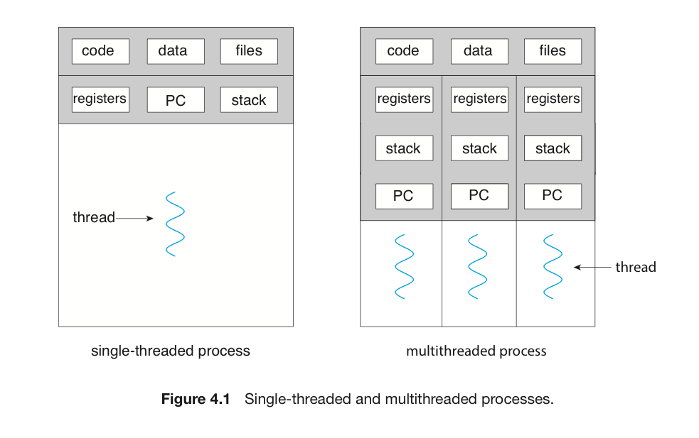
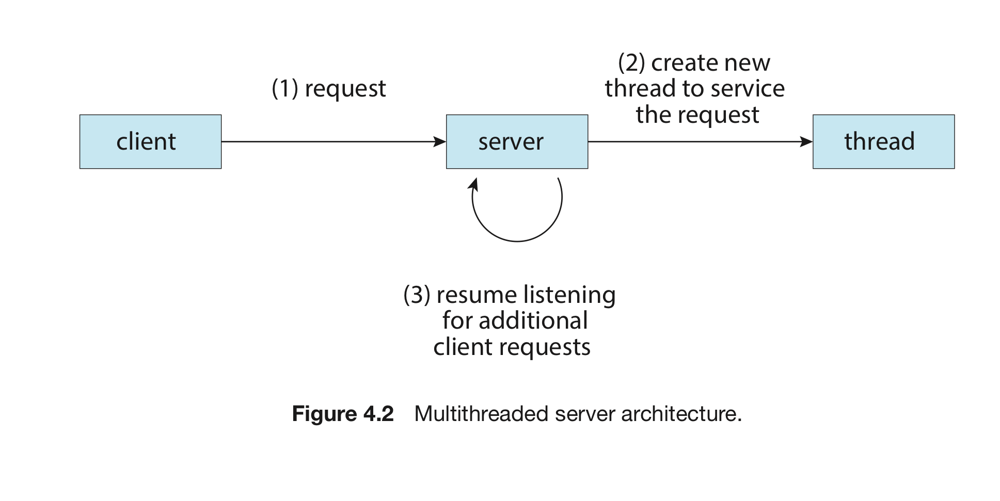

# 개요 : 쓰레드란?

숫자: 파트1

# 쓰레드란?

- cpu 이용의 기본 단위
- 쓰레드 = 쓰레드 id, 프로그램 카운터, 레지스터 집합, 스택
    - 프로세스 속 다른 쓰레드와 코드, 데이터, OS 자원을 공유
    - 프로세스가 다중 쓰레드를 가지고 있으면, 동시에 하나 이상의 작업을 할 수 있음.

단일 쓰레드 vs 다중 쓰레드

# 동기

## 언제 쓰는가? 예시 1

<aside>
💡 오늘날 대부분의 APP에서 멀티쓰레드를 쓴다.

</aside>

1. 이미지 모음에서 사진 축소판을 만드는 APP
    
    별도의 쓰레드로 개별 이미지에서 축소판을 만들 수 있다.
    
2. 웹 브라우저
    - 쓰레드1 : 이미지 및 텍스트 표시
    - 쓰레드2 : 네트워크에서 데이터 검사
3. 워드 프로세서
    - 쓰레드1 : 그래픽 표시
    - 쓰레드2 : 키 입력에 응답
    - 쓰레드3 : 맞춤법 및 문법 검사

APP들은 또한 처리 능력을 끌어낼 수(leveraging) 있도록 설계될 수 있다.

이러한 APP들은 다중 코어를 이용해 다수의 cpu-intensive(집중) 작업을 병렬로 처리할 수 있다.

## 언제 쓰는가? 예시 2

<aside>
💡 여러 개의 비슷한 작업을 수행할 필요가 있을 때 특히 더 쓰인다.

</aside>

ex) 웹 서버

- 웹 서버는 다양한 요청을 받는다.
- 이 경우 여러 개의 클라이언트들이 병행한다는 뜻이고, 단일 쓰레드로 이를 처리하면 한 번에 하나의 클라이언트에게만 서비스를 제공할 수 있다.

해결책 1 : 서버를 요청을 받아드리는 하나의 프로세스로 처리

- 문제점은 프로세스를 만드는 것이 상당히 많은 자원을 요구한다는 것!
- 클라이언트가 늘어날 때마다 프로세스를 만들면 오버헤드가 심해진다.

해결책 2 : 프로세스 안에 여러 쓰레드를 만든다.

- 클라이언트의 요청을 듣는 쓰레드를 생성.
- 요청이 또 오면, 쓰레드를 만들고 추가적인 요청을 처리할 작업을 재개.

대부분의 운영체제 커널도 일반적으로 다중 쓰레드이다.

ex) 시스템을 부트할 때 → 장치 관리용 쓰레드, 메모리 관리 쓰레드, 인터럽트 처리 쓰레드

# 장점

쓰레드의 장점은 무엇일까?

<aside>
💡 응답성, 자원 공유, 경제성, 규모 적응성(확장성)

</aside>

### 응답성

- 반응형 앱 (interactive application)에 멀티쓰레딩을 적용하면, 일부 앱의 기능이 막히거나 무거운 작업을 수행해도 계속 실행할 수 있음. 이는 반응 속도를 증가시킴.
- 버튼을 눌렀을 때와 같이 UI 설계에 도움이 됨.
    - 싱글 쓰레드면 버튼을 누르고 → 모든 연산 실행 → 결과 제출 이라는 과정을 거처야 함.
    - 멀티 쓰레드면 짧은 연산 따로, 긴 연산 따로 실행하면서 응답 시간을 줄임.

### 자원 공유

- 프로세스를 여러 개 만들 경우 : IPC로 자원을 옮겨야 한다.
- 쓰레드를 여러 개 만들 경우 : 그런거 필요 없이 자동으로 공유한다.
    - 왜? 같은 주소 공간 안에 있기 때문.

### 경제성

- 프로세스를 여러 개 만들 경우 : 자원이 낭비되어 비용이 많이 듬.
- 쓰레드를 여러 개 만들 경우 : 프로세스의 자원을 공유, 낭비되는 자원이 적다.
    - 쓰레드 생성은 비용과 자원이 더 적다.
- 또한 쓰레드 간의 문맥 교환이 더 빠르다.

### 규모 적응성

- 멀티 프로세서 구조에서 더 좋은 결과를 가져옴.
- 싱글 쓰레드는 프로세서가 몇개가 있던 **1개의 프로세서에서만** 굴러갈 수 있음.