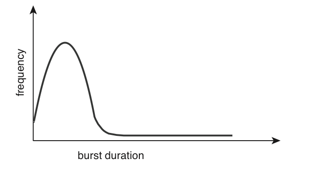
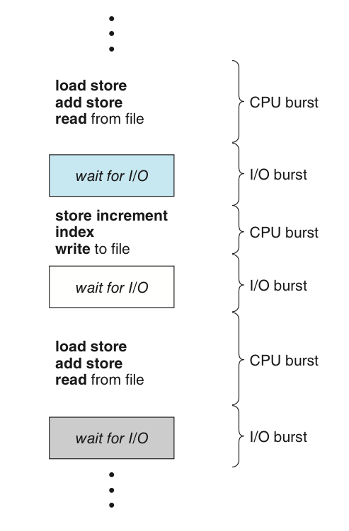

# 개요 : CPU 스케쥴링이란?

태그: 5장
숫자: 파트1, 파트2

# CPU 스케쥴링 : 정의

<aside>
💡 어떤 프로세스에게 CPU를 할당할지를 결정하는 것.

</aside>

- 다중 프로그래밍의 목적 :  CPU 이용률을 최대화 하는 것.
- 따라서 이러한 콘셉을 유지하기 위해서는 CPU 스케쥴링이 중요할 수 밖에 없다.

## CPU-I/O 버스트 사이클

<aside>
💡 버스트란? 어떤 특정된 기준(criterion)에 따라 한 단위로서 취급되는 연속된 신호(signal) 또는 [데이터](https://terms.naver.com/entry.naver?docId=847441&ref=y)의 모임. 처리 시간이라고 생각하자.

</aside>

CPU 스케쥴링의 성공은 프로세스의 성질에 따라 좌우됨.

- 프로세스의 실행은 CPU 실행과 I/O 대기의 사이클로 구성됨.
    - CPU 버스트 → I/O 버스트 → CPU 버스트 → (이하 반복)
    - 마지막 버스트는 실행을 종료하기 위한 요청과 같이 끝난다.
- CPU 버스트의 지속시간은 일반적으로 지수분포 모양이다.
    - 짧은 CPU 버스트가 많고, 긴 CPU 버스트는 적다.
    - 특히 I/O 중심의 프로그램일수록 더 그렇다.
    - 반면, CPU 지향 프로그램이면 CPU가 좀 더 길 것이다.

- 이러한 분포를 스케줄링 알고리즘 구현에 도움을 준다.

## CPU 스케쥴러

CPU가 유휴상태가 될 때마다, 운영체제는 준비 큐에 있는 프로세스 중 하나를 선택해 실행.

- 이때의 선택 절차는 CPU 스케줄러에 의해 수행된다.
- 스케줄러는 실행 준비가 되어있는 메모리 내의 프로세스 중에서 선택한다.
- 이후 이들 중 하나에게 CPU를 할당한다.

준비 큐는 반드시 선입선출(FIFO) 방식의 큐가 아니어도 됨.

- ex. 우선순위 큐, 트리, 연결 리스트 등등
- 큐 속 레코드가 바로 PCB(프로세스 제어 블록)

## 선점, 비선점 스케쥴링

**스케쥴링 알고리즘을 공부하기 전, 어떠한 상황에서 스케쥴링이 필요한지 알아보자.**

CPU 스케쥴링 결정은 다음의 4가지 상황에서 발생할 수 있다.

1. 한 프로세스가 실행 상태에서 대기 상태로 전환될 때
2. 프로세스가 실행 상태에서 준비 완료 상태로 전환될 때
3. 프로세스가 대기 상태에서 준비 완료 상태로 전환될 때
4. 프로세스가 종료 될 때

상황 1과 4는 스케쥴링 면에서는 선택의 여지가 없다.

- 반드시 새 프로세스를 선택하지 않으면 CPU가 놀게 된다.
- 이때의 스케쥴링 방법을 **비선점형 스케쥴링**이라고 함
- 일단 CPU가 한 프로세스에 할당되면 프로세스가 종료하던지,
    
    아니면 대기 상태로 전환해 CPU를 방출할 때까지 점유한다.
    

그러나 2와 3은 선택의 여지가 존재

- 굳이 스케쥴링이 필요없이 계속 돌던 프로세스를 실행해도 됨.
- 이때의 스케쥴링 방법을 **선점형 스케쥴링**이라고 함.

### 선점형 스케쥴링

- 거의 모든 최신 운영체제들은 선점 스케쥴링 알고리즘을 사용
- 단, 데이터가 다수의 프로세스에 의해 공유될 때 경쟁 조건을 초래
- 또한 운영체제 커널 설계에 영향을 줄 수 있음.
    - 시스템 콜을 처리할 동안, 커널은 한 프로세스를 위한 활동으로 바쁠 수 있음.
    - 해당 활동이 중요한 커널의 자료 변경과 관련되어 있다고 쳐 보자.
    - 이러한 변경 도중 해당 프로세스가 선점되고, 커널이 동일한 구조를 읽거나
        
        변경될 필요가 있으면 혼란이 일어날 수밖에 없다.
        
    

### 커널과 스케쥴링

운영체제 커널은 선점 또는 비선점 방식으로 설계 가능

**비선점형 커널** 

- 문맥 교환을 하기 전 시스템 콜이 완료되거나 입출력 완료를 기다리며
    
    프로세스가 봉쇄돼기만을 기다림.
    
- 커널 자료구조가 비일관적인 상태에 있을 때 커널이 해당 프로세스를 선점하지 않음.
- 결과적으로 커널 구조가 단순해짐.
- 그러나 실시간 컴퓨팅을 지원하기에는 부적절

**선점형 커널**

- 경쟁 조건을 방지하기 위해 mutex 락과 같은 기법이 필요.
- 대부분의 최신 운영체제는 커널 모드에서 실행 시 완전히 선점할 수 있음.

**인터럽트**

- 인터럽트는 어느 시점에서든 일어날 수 있고, 커널에 의해서 항상 무시당해서는 안된다.
    - 무시하면 입력을 잃어버리거나 출력이 겹쳐서 쓰여질 수 있음.
- 따라서 인터럽트의 영향을 받는 코드 부분은 반드시 동시 사용으로부터 보호해야 한다.
    - 즉, 이 코드 부분은 다수 프로세스가 병행으로 접근할 수 없게 막아야 함.
    - 진입점에서 인터럽트를 불능화, 이후 출구에서 인터럽트를 가능화.
    - 단 인터럽트 불능화는 자주 발생해선 안됨.

## 디스패처

디스패처는 CPU 코어의 제어를 CPU 스케쥴러가 선택한 프로세스에 주는 모듈.

다음과 같은 작업을 포함한다.

1. 한 프로세스에서 다른 프로세스로 문맥을 교환하는 일
2. 사용자 모드로 전환하는 일
3. 프로그램을 재시작하기 위해 사용자 프로그램의 적절한 위치로 이동하는 일

디스패처는 모든 프로세스의 문맥 교환 시 호출. 따라서 가능한 최고로 빨리 실행되어야 함.

디스패처가 한 프로세스를 정지하고 다른 프로세서의 수행을 시작하는데 걸리는 시간은 **디스패치 지연**이라고 함.

자발적 문맥 교환 : 현재 사용 불가능한 자원을 요청했기에 프로세스가 CPU 제어를 포기한 경우 발생함.

비자발적 문맥 교환 : 타임 슬라이스가 만료되거나 우선순위가 더 높은 프로세스에 의해 선점된 경우와 같이 CPU를 빼앗겼을 때 발생.

# CPU 스케쥴링 : 기준

CPU 스케쥴링 알고리즘을 비교하기 위한 기준이다.

<aside>
💡 CPU 이용률, 처리량, 총 처리 시간, 대기 시간, 응답 시간

</aside>

1. CPU 이용률
    - 말 그대로 CPU의 전체 계산 능력 중 사용되는 비율
    - 0~100%를 기준으로 잡을 때, 보통 40% ~ 90% 까지로 범위를 잡는다.
    - `top` 명령어로 cpu 이용률을 얻을 수 있다.
2. 처리량
    - 작업량을 측정하는 단위.
    - 단위 시간 당 완료된 프로세스의 갯수로 친다.
3. 총 처리 시간 (turnaround time)
    - 프로세스의 제출 시간 ~ 완료 시간 사이 간격
    - 대기 시간 + CPU 실행 시간 + I/O 시간
4. 대기 시간
    - 준비 큐에서 대기하며 보낸 시간의 합
    - 스케쥴링 알고리즘은 총 처리 시간 중 대기 시간에만 영향을 미침.
5. 응답 시간
    - 대화식 시스템을 위한 기준
    - **요구 → 첫 번째 응답이 나올 때** 까지의 시간을 의미. (출력이 아님)

대부분의 경우 평균 측정시간을 최소화하려고 노력함.

그러나 어떠한 경우에는 최솟값이나 최댓값을 최적화하는 것이 바람직할 수도 있음.

편차를 줄이는 것도 좋은 아이디어이나 연구 결과가 거의 없음.

이 책에서 비교하는 기준도 결국 평균 대기시간.