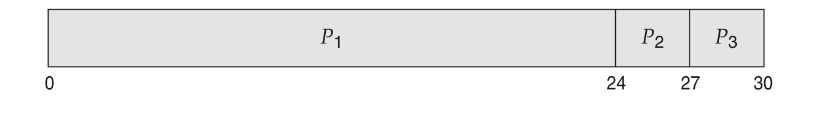
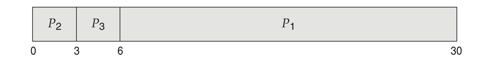
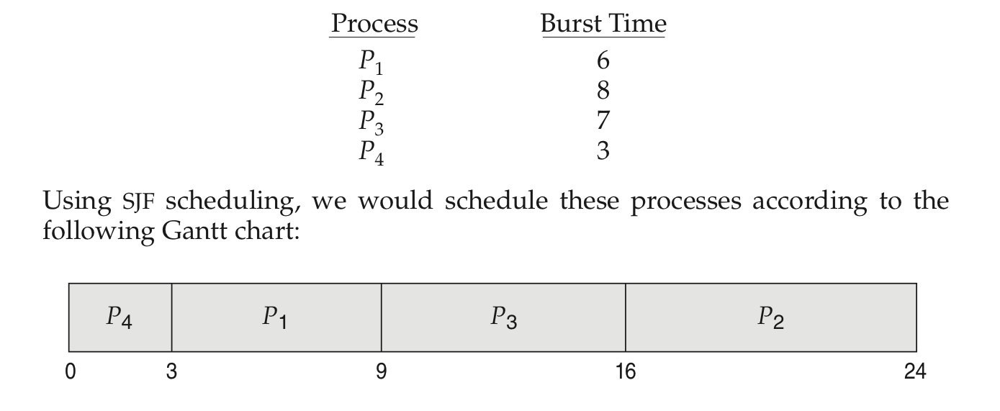
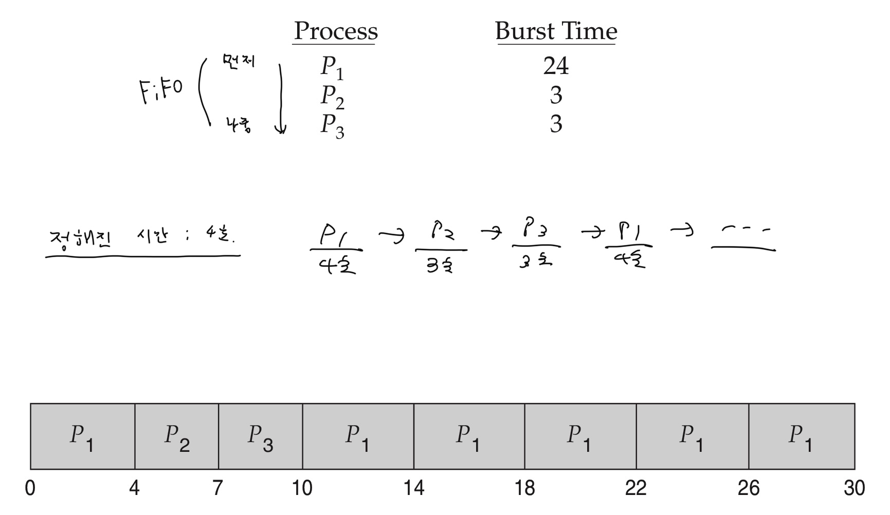
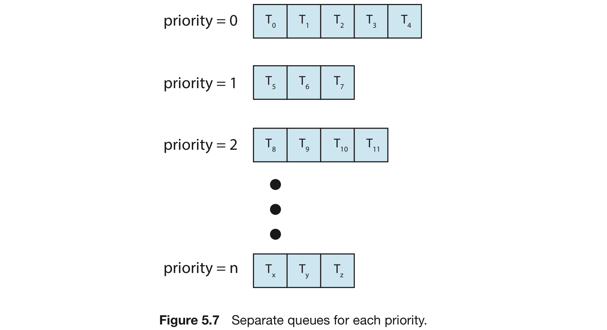
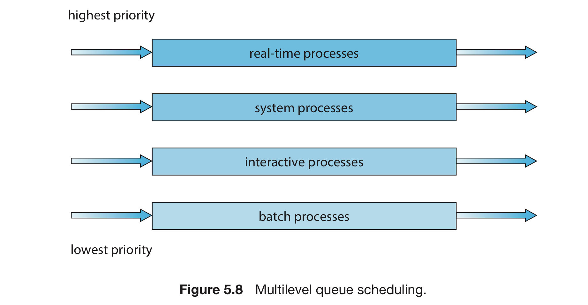
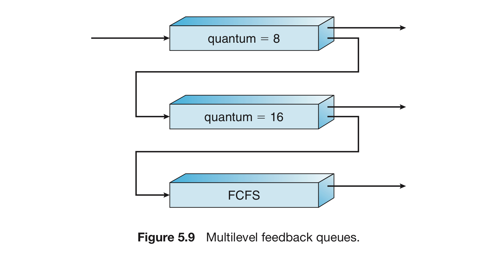

# 스케쥴링 알고리즘

태그: 5장
숫자: 파트3

여러가지 CPU 스케줄링 알고리즘에 대해서 알아보자.

# FCFS 스케줄링

CPU를 먼저 요청하는 프로세스가 CPU를 먼저 관리. 선입선출(FIFO) 큐로 관리한다.

## 장점과 단점

- 작성하기 쉽고 이해도 쉽다.
- 선입 선처리여서, 평균 대기 시간이 엄청 길어질 수 있다.

비선점형이라고 가정하자.

프로세스가 P1, P2, P3 순서로 도착하면, 평균 대기 시간 = $(0 + 24 + 27) / 3 = 17$ 

프로세스 P2, P3, P1 순서로 도착하면, 평균 도착 시간 = $(0 + 3 + 6) / 3 = 3$

따라서, FIFO 정책에서 평균대기 시간은 일반적으로 최소가 아니다.

## 동적 상황에서의 성능

<aside>
💡 여기서의 동적 상황 ⇒

</aside>

- CPU 중심(CPU-bound) 프로세스와 많은 수의 I/O 중심 프로세스를 가질 때.
    - CPU 중심 프로세스가 CPU를 할당받아 점유할 때
        - 그동안 다른 모든 프로세스는 I/O를 끝내고 준비큐로 이동하여 CPU를 기다림
        - 프로세스들이 준비 큐에서 기다리는 동안, I/O 장비는 쉬고 있다.
            - I/O 중심의 프로세스들이 CPU를 할당받을 때
                1. I/O 중심 프로세스들은 매우 짧은 CPU 버스트를 가지고 있기 때문에 CPU 작업이 빨리 끝남
                2. 빨리 종료되고 다시 CPU 중심 프로세스가 준비큐로 이동
                3. **호위효과 발생 (= 모든 다른 프로세스들이 하나의 긴 프로세스가 CPU를 양도하길 
                기다리는 것)**

## 기타 특징

- 비선점형이다.
    - CPU가 할당되면, 그 프로세스가 종료 혹은 I/O 처리를 요구하여 CPU를 방출할 때까진 CPU를 점유한다.
- 대화형 시스템에서 문제가 발생한다.
    - 대화형 시스템에서는 각 프로세스가 규칙적인 간격으로 CPU 몫을 얻어야 하기 때문

# 최단 작업 우선(SJF) 스케줄링

각 프로세스에 다음 CPU 버스트 길이를 연관시키는 스케줄링 알고리즘

- CPU가 이용 가능해지면, **CPU 버스트가 작은 순서대로 프로세스에 할당**
- 두 프로세스의 버스트가 동일하면, **먼저 들어온 순서(FIFO)**로 할당

예시를 들어보면 다음과 같다.

그래서, 주어진 프로세스 집합에 대해 최소의 평균대기 시간을 가지고, 최적임을 알 수 있다.

## 버스트 추정

그런데, CPU 스케줄링 수준에서는 다음 CPU 버스트 길이를 구할 수 없다.

따라서 우리는 다음 CPU 버스트 길이를 근사하는 점화식을 이용한다. 

(일종의 확률과정 = 시계열분석이라고 할 수 있다.)

$$
\tau_{n+1} = 
\alpha~t_n + (1-\alpha)\tau_n
$$

- $\tau_{n+1}$ : n + 1번째 CPU 버스트의 추정치.
- t : n번째 CPU 버스트의 길이
- $\tau_{n}$ : n번째 CPU 버스트의 추정치.

n + 1번째 CPU 버스트의 추정치 = 현재 CPU의 버스트 길이 + 과거의 정보

- 이때 현재가 더 가중치가 큰지, 과거가 더 가중치가 큰 지를 $\alpha$가 정한다.
- 만약 $\alpha = 0$이면 과거의 정보만 영향을 미친다.
- 만약 $\alpha = 1$이면 현재의 정보만 영향을 미친다.

이를 확장해서 생각해보면,

$$
\tau_{n} = \sum_{x=0}^{n-1}~
{(1-\alpha)}^x\cdot\alpha~t_n 
+ {(1-\alpha)}^{n-1}~\tau_0
$$

- $\tau_0$ : 초기값.
- 일반적으로 $\alpha$와 $1- \alpha$가 모두 1보다 작거나 같음
- 따라서 항이 뒤로 갈수록 그 가중치가 작아지게 됨.

## 기타 특징

- 선점형이거나 비선점형일 수 있음.
    - 앞 프로세스가 실행되는 동안, 새 프로세스가 오면 선택이 발생!
    - **새 프로세스의 CPU 버스트 < 지금 프로세스 CPU 버스트** 인 경우
    선점형인지 비선점형인지에 따라 선택이 달라짐.
    - 선점형 : 현재 실행하고 있는 프로세스이 중단될 수 있음
    - 비선점형 : 현재 실행하고 있는 프로세스가 끝난 후 타 프로세스 시작
- 최소 잔여시간 우선 알고리즘이라고도 불림.

# 라운드 로빈 스케줄링

일단 그림을 보면서 이해해 보자.

- 이때 정해진 시간을 시간 할당량, 또는 타임 슬라이스라고 한다.
- 순서는 FIFO, 즉 선입 선출이다.
    - 프로세스를 원형 큐에 넣고 시간을 할당하는 것.
    - 시간이 지나면 바로 다음 프로세스로 이동 (=디스패치)

그림에서도 알 수 잇듯, 프로세스가 가진 CPU 버스트에 따라 동작이 달라진다.

1. 프로세스의 CPU 버스트가 시간 할당량보다 작은 경우 → 알아서 진행
2. 프로세스의 CPU 버스트가 시간 할당량보다 작은 경우 → 뒤로 밀린다.
    - 시간이 끝난 후 인터럽트가 발생 → 이후 뒤로 이동.

## 기타 특징

- 평균 대기 시간이 길다.
- 한 프로세스는 1번의 타임 슬라이스만 제공받는다.
    - 즉, 선점형 알고리즘이다.
- 시간 할당량의 크기에 매우 많은 영향을 받는다.
    - 시간 할당량이 크면 사실 FIFO와 다를 게 없다.
    - 반대로 매우 적다면 문맥 교환이 너무 많아진다. (=느려진다)
    - 따라서, 시간할당량이 문맥 교환시간보다 커야 한다.
- 총 처리 시간 또한 시간 할당량의 크기에 좌우된다.
    - 평균 총 처리 시간은 시간 할당량이 증가해도 반드시 줄지는 않는다.
    - 물론, 대부분의 프로세스가 단일 시간할당량 안에 끝나면 개선
    - 한 마디로, 잘 나눠야 한다는 뜻!

# 우선순위 스케줄링

우선순위를 정해놓고, 가장 높은 우선순위를 가진 프로세스를 CPU가 선점

- SJF 스케줄링도 사실 우선순위 스케줄링의 일종

## 기타 특징

- 우선순위가 같은 프로세스들 → 선입 선처리 순서로 스케쥴
- 우선순위에는 일정한 범위의 수가 사용되나, 꼭 오름차순일 필요는 없다.
- 우선순위의 기준 : 내부적 혹은 외부적.
- 선점형이 될 수도, 비선점형이 될 수도 있다.

## 문제점 : 무한봉쇄

- 무한봉쇄 또는 기아상태라고도 한다.
- 낮은 순위의 프로세스들이 계속 실행되지 못하는 상황.
    - 새 프로세스들이 높은 순위를 뺏어가기 때문
    - 결국 실행되기도 하지만, 실행되지 못하고 크래시가 날 때도 있다.

이를 해결하는 방법 = 노화(aging)

- 자꾸 뒤로 밀리는 프로세스들에 대한 일종의 보상책이라고 할 수 있다.
- 대기시간이 오래된 프로세스들의 우선순위를 조금씩 높여준다.

# 다단계 큐 스케줄링

- 큐를 여러 개 두는 방식이라고 생각하면 된다.
- 우선순위 + 라운드 로빈

또는 프로세스 유형에 따라 분할할 수도 있다.

흔히 대화형(foreground)와 백그라운드(background)로 구분한다.

- 각 큐 내부에 자체 스케쥴링 알고리즘이 존재.
- 큐끼리도 스케쥴링이 존재 : 일반적으로 고정 우선순위의 선점형 스케쥴링
    - ex. 실시간 큐는 대화형 큐보다 절대적으로 높은 우선순위 가짐
- 큐 사이에 우선순위를 둘 수도 있다.
- 큐들 사이에 시간을 나누어 쓸 수도 있음.

# 다단계 피드백 큐 스케쥴링

- 다단계 큐 스케쥴링을 좀 더 진화시킨 알고리즘
- 프로세스가 큐 사이를 오고갈 수 있다.
- 다만, 설계하기 복잡하다.

일반적으로 다음의 매개변수에 의해 정의된다.

- 큐의 갯수
- 각 큐를 위한 스케쥴링 알고리즘
- 한 프로세스의 위치를 올려주는 시기 결정법
- 한 프로세스의 위치를 낮춰주는 시기 결정법
- 프로세스에 서비스가 필요할 때 프로세스가 들어갈 큐를 결정하는 방법