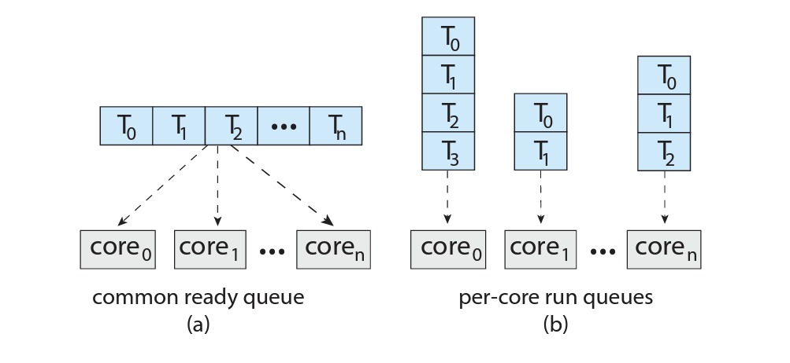
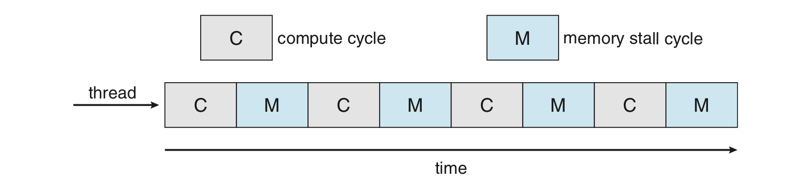
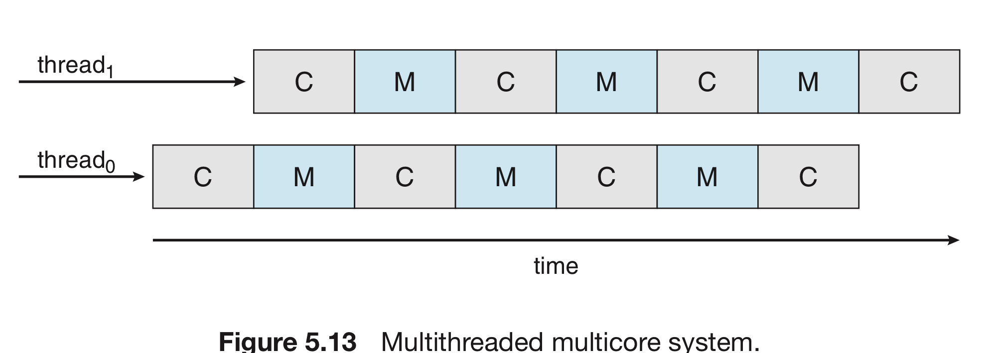
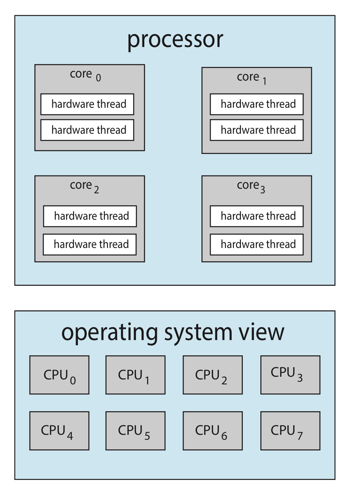
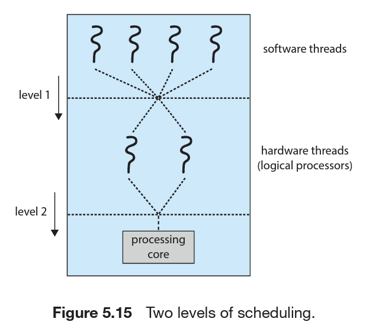
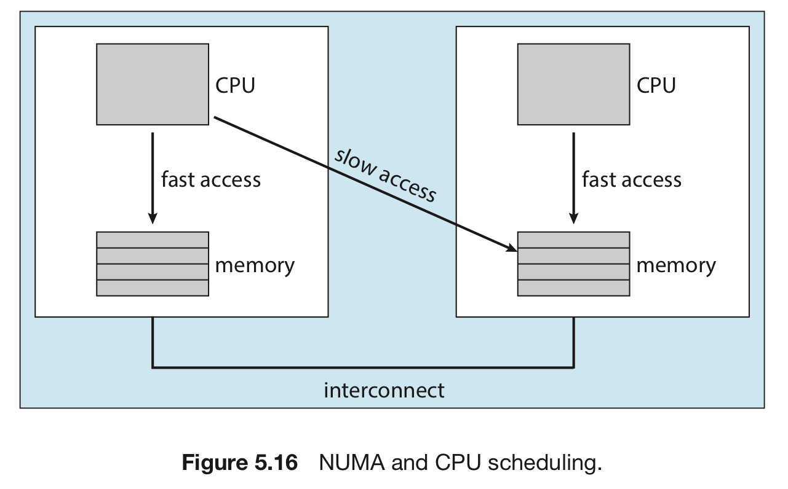

# 멀티코어 스케쥴링

태그: 5장
숫자: 파트5

# 개요 : 멀티코어 스케쥴링

멀티코어 프로세서의 경우, 어떻게 스케쥴링을 하는지 알아보자.

- 우선, 여러 쓰레드가 병렬로 실행될 수 있으므로 부하 공유가 가능해진다.
- 그만큼 스케쥴링 문제도 그에 상응해 더 복잡해진다.

보통 **다중 프로세스 multiprocessor**라는 말은 물리적인 프로세서가 여럿인 경우를 칭함. 

요즘 현대적인 컴퓨팅 체제에서는 ***다중 프로세서***란 다음 구조들을 모두 의미

1. 다중 코어 CPU (multicore CPU)
2. 다중 쓰레드 코어 (multithreaded core)
3. NUMA 시스템 (NUMA system)
4. 이기종 다중 처리 (Heterogenous multiprocessing)

이 구조들을 바탕으로 다중 프로세서 스케줄링을 다뤄보자.

# 멀티 프로세서 스케쥴링 접근법

<aside>
💡 비대칭 다중 처리 vs 대칭 다중처리

</aside>

## 비대칭 다중처리

- 오직 하나의 코어만 모든 스케쥴링 결정, I/O 처리, 타 시스템의 활동을 취급
    - 이를 마스터 서버라고 함.
- 타 코어는 사용자 코드만을 수행
- 간단하지만, 마스터 서버가 병목이 될 수 있음.

## 대칭 다중처리 (SMP)

- 일반적으로 멀티 프로세서를 처리하는 방법
- 각 프로세서는 자기 스스로 스케쥴링을 진행.
- 각 스케쥴러가 준비 큐를 확인하고 실행할 쓰레드를 선택
    
    이때, 쓰레드 관리를 위한 **2가지 전략**이 나온다.
    
    1. 모든 쓰레드가 동일한 준비 큐를 사용한다.
    2. 각 프로세서는 자신만의 쓰레드 큐를 가질 수 있다. 

**이 두 전략은 서로 대조되는 전략이다.**

- 1번 옵션 선택 시, 공유 준비 큐에 경쟁 조건이 생길 수 있다.
    - 2개의 다른 프로세서가 동일한 쓰레드를 스케쥴하지 않게 해야 한다.
    - 큐에서 쓰레드가 없어지지 않도록 해야 한다.
- 2번 옵션 선택 시, 각 프로세서가 자신만의 큐에서 프로세스를 돌림
    - 따라서 공유 실행 큐 관련 문제를 겪지 않음.
    - 캐시 메모리를 좀 더 효율적으로 사용할 수 있음
    - 그러나, 각 큐마다 부하의 양이 달라질 수 있음. [해결책](#로드-밸런싱)
- 그래서 2번 옵션이 가장 대중적인 전략

# 멀티코어 프로세서

대칭 다중처리(smp) = 프로세서가 여러 개인 컴퓨터를 기반으로 나옴.

- 그런데 현대의 컴퓨터는? 프로세서는 1개인데, 코어가 여러 개인 구조.
- 각 코어를 운영체제는 각각의 CPU로 인식.
- 이때의 SMP 시스템은 프로세서를 여러 개 단 컴퓨터보다 효율적임

## 메모리 스톨

<aside>
💡 프로세서가 메모리에 접근할 때, 데이터가 사용 가능하기까지 기다리는 시간

</aside>

- 다중 코어 프로세서의 속도가 메모리의 속도보다 빠르니까 생기는 일
- 이를 위해서 **다중 쓰레드 처리 코어**가 개발됨.
    - 한 프로세스가 메모리를 기다리는 동안, 코어가 다른 쓰레드로 전환
    - 이때 코어 안에서 쓰레드를 처리하는 부분을 **하드웨어 쓰레드**라고 함.
    - 운영체제 관점에서 하드웨어 쓰레드는 하나의 CPU로 볼 수 있음.
        
        이 기술을 칩 다중 쓰레딩이라고도 함. 인텔의 하이퍼쓰레딩이 대표적인 예시.
        

기존의 코어에서 메모리 스톨이 일어날 경우.

칩 다중 쓰레딩으로 이를 극복한 모습.

프로세서가 멀티쓰레드를 지원하는 방식은 두가지이다.

쓰레드를 바꾸는 방식이라고 생각하면 될 듯

1. 거친(coarse-grained) 다중 쓰레딩
    - 쓰레드가 긴 지연시간을 가진 이벤트가 발생할 때까지 한 코어에서 수행
    - 다른 쓰레드가 실행되려면 명령어 파이프라인이 완전히 정리되어야 함
    - 따라서 쓰레드 간 교환은 비용이 많이 듬.
    - 새 쓰레드가 실행되면 파이프라인이 새 쓰레드의 명령어로 채워짐.
2. 세밀한(fine-grained) 다중 쓰레딩
    - 명령어 주기의 경계와 같이 세밀한 시점에서 쓰레드 교환이 일어남.
    - 구조적 설계로써 쓰레드 교환을 위한 회로를 포함.
    - 쓰레드 간 교환의 비용이 적어짐.

## 멀티쓰레드 스케줄

처리 코어는 1번에 1개의 하드웨어 쓰레드만 처리할 수 있음.

따라서 이에 대한 스케쥴링 단계가 필요하다.

1. 운영체제가 소프트웨어 쓰레드를 선택.
    
    이때 파트3에서 소개한 각종 알고리즘을 이용.
    
2. 하드웨어 쓰레드를 결정하는 방법을 명시.
    - 라운드 로빈 알고리즘을 사용
        - UltraSPARC T3가 선택한 방법
    - 코어 당 2개의 하드웨어-관리 쓰레드를 가진 이중코어에서 결정
        - 인텔 아이테니엄이 이 방식을 채택한 대표 사례
        - 각 하드웨어 쓰레드에 동적 긴급도가 부여
        - 긴급도가 높은 것을 먼저 선택

다만, 서로 다른 두 가지 스케쥴링 단계는 반드시 상호 배타적일 필요는 없음.

- 1번째 단계가 프로세스 자원공유를 인식하고 있으면 보다 효과적인 결정을 내릴 수 있음.
- 운영체제가 프로세서 자원 공유 수준을 알고 있으면 자원을 공유하지 않는
    
    논리 프로세서에 소프트웨어 쓰레드를 스케쥴할 수 있음.
    

# 로드 밸런싱

<aside>
💡 SMP 시스템의 모든 코어에게 부하를 잘 배분하는 것.

</aside>

SMP 시스템에서 멀티코어를 잘 활용하려면, 부하를 모든 코어에 잘 배분하는 것이 필요.

각 코어가 자기만의 준비 큐를 가지고 있는 시스템에서만 유효한 케이스

## 접근법

두 접근법은 상호배타적인 것이 아니며 동시에 구현 가능

1. push 이주
    - 특정 태스크가 주기적으로 각 코어의 부하를 검사
    - 만약 불균형 상태이면, 덜 바쁜 쪽으로 쓰레드를 이동
2. pull 이주
    - 쉬고 있는 코어가 바쁜 코어를 기다리고 있는 프로세스를 pull할 때 일어남

# 프로세서 선호도

앞의 내용을 통해 쓰레드는 여러 프로세서를 돌아다닐 수 있음.

- 그런데, 쓰레드가 이동할 때마다 이전 프로세서 내의 cache를 지우고,
    
    새 프로세서 내의 cache를 채워야 한다.
    
- 이 비용이 크기 때문에 운영체제는 기존의 cache(=warm cache)를 계속 쓰려고 하는 경향이 있는데, 이를 **프로세서 선호도**라고 한다.

스케쥴링 가능한 쓰레드의 큐를 구성하기 위한 2가지 전략은 프로세서 선호도에 영향을 미친다.

- 공통 준비 큐가 있는 경우, 선택된 쓰레드는 어느 프로세서에서건 실행 가능.
    - 쓰레드가 새 프로세서로 옮겨가면, 해당 프로세서의 캐시를 리필.
- 프로세서마다 자신의 큐가 있는 경우, 쓰레드는 항상 동일한 프로세서에 스케쥴됨.
    - 이 경우 warm cache의 내용을 활용할 수 있다.
    - 기본적으로 프로세서별 준비 큐는 프로세서 선호도를 무료로 제공.

## 선호도의 종류

- 약한 선호도 : 운영체제가 동일한 프로세서에서 프로세스를 실행시키려고 노력하는 정책을 가지지만 보장하지 않을 때
- 강한 선호도 : 프로세서는 자신이 실행될 프로세서 집합을 명시할 수 있음.

리눅스의 경우, 약한 선호도를 구현

- 하지만, 강한 선호도를 구현하는 시스템 콜도 있음.

## NUMA 시스템

시스템의 메인 메모리 아키택처(=RAM 구조)는 프로세서 선호도 문제에 영향을 줄 수 있음.

이 그림과 같이 메모리에 접근하는 시간이 메모리와 프로세스의 위치에 따라 달라지는 구조를 **NUMA(불균일 기억 장치 접근)**라고 한다.

부하균등이 프로세서 선호도의 이점을 상쇄한다.

- 한 프로세서에서 다른 프로세서로 쓰레드를 옮기면 과부하는 사라져도, 기존의 캐시 메모리(hot cache)를 이용한다는 장점은 사라진다.
- 부하균등 vs 프로세서 선호도의 균형을 맞추는 것이 중요.

# 이기종 멀티프로세서

모바일 시스템, 특히 ARM 계열에서는 빅리틀 코어라는 기술이 있다.

- 지금까지 설명한 멀티코어 : 모든 코어의 기능이 동일하다.
- 빅리틀 코어 : 클럭의 속도와 전력 관리 측면에서 차이가 난다.

각 코어의 역할을 살펴보자면…

- 빅코어 : 에너지를 더 소모하지만, 클럭의 속도가 빠른다.
- 리틀코어 : 에너지를 적게 소모하지만, 클럭의 속도가 느리다.
- 그래서 이기종(heterogeneous) 멀티프로세서라고 함.