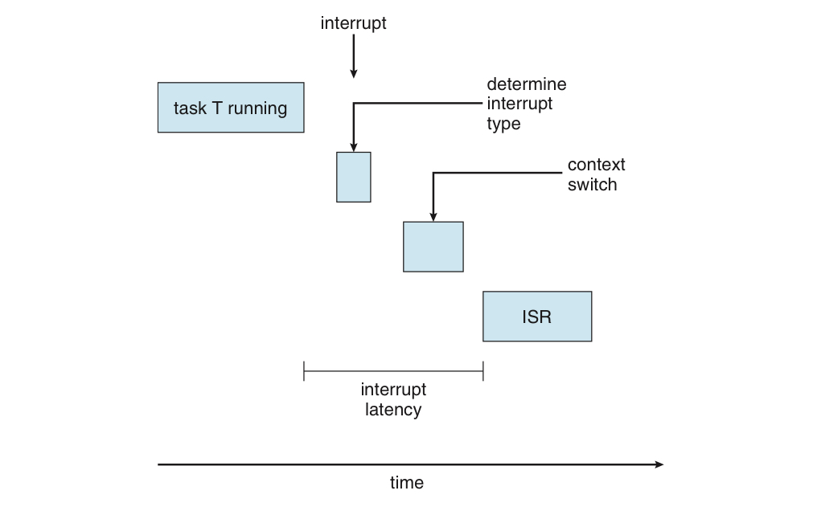
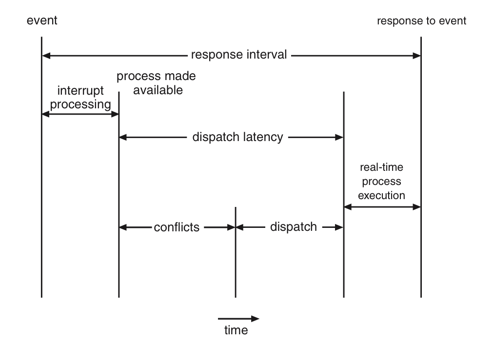

# 실시간 CPU 스케쥴링

태그: 5장
숫자: 파트6

# 실시간 운영체제의 종류

우선 실시간 운영체제의 종류에 대해서 알아보자.

- soft real-time : 연성 실시간 운영체제
    - 실시간 프로세스가 스케쥴되는 시점에 대해 아무런 보장을 하지 않음.
- hard real-time : 경성 실시간 운영체제
    - 더 엄격한 요구 조건을 만족시켜야 함.
    - 태스크는 반드시 마감 시간까지 서비스를 받아야 함.

# 지연시간 최소화

<aside>
💡 지연시간 = 이벤트 발생 ~ 서비스 수행 까지의 시간

</aside>

실시간 운영체제는 이 지연시간을 최소화해야 한다.

지연시간의 종류를 알아보자.

### 인터럽트 지연시간

인터럽트 지연시간 : 인터럽트 발생 시간 ~ 인터럽트 처리 루틴 시작

- 이 지연시간은 무조건 정해진 시간보다 작아야 한다.
- 영향을 주는 요인 = 커널 데이터 구조체를 갱신하는 동안 인터럽트가 작동 못하는 시간



### 디스패치 지연시간

디스패치 지연시간 : 하나의 프로세스를 막고 다른 프로세스를 시작 하는데 걸리는 시간

- 이 지연시간은 무조건 정해진 시간보다 작아야 한다.
- 가장 효과적인 해결법은 선점형 커널이다.



디스패치 지연시간의 충돌 단계는 다음 두 요소로 구성된다.

1. 커널에서 동작하는 프로세스 선점
2. 높은 우선순위의 프로세스가 필요한 자원을 낮은 우선순위 프로세스 자원이 방출

# 우선순위 기반 스케쥴링

주로 선점을 이용한 우선순위 기반 스케쥴링이다.

- 단, 이건 soft real-time 기능을 제공하는 것.
- 따라서 부가적인 기능이 필요하다.

실시간 OS 속 프로세스들의 특징

1. 주기적이다. 일정한 간격으로 CPU가 필요하다.
2. 각각의 프로세스는 수행시간, 마감시간, 주기가 정해져 있다.
3. 프로세스가 자신의 마감시간을 스케쥴러에게 알려줘야 한다.
    
    마감시간이 기준 이상이면 OS는 프로세스 실행을 거부한다.
    

# RM 스케쥴링

RM = Rate Monotonic : 정적 우선순위라는 의미.

## 특징

주기를 기준으로 스케쥴을 짠다.

- 주기가 짧을수록 우선순위가 높아진다.
- 주기 프로세스 = 각각의 CPU 버스트와 낮다.

```
프로세스 p = (주기, 수행시간)
프로세스 p1 = (50, 20)
프로세스 p2 = (100, 35)

이 경우 p1이 우선순위를 가진다.
--------------------------------------------
p1의 cpu 이용률 = 20/50 = 0.4
p2의 cpu 이용률 = 35/100 = 0.35

태스크 2개일 때 RM 스케쥴링의 이용률 상한선은 83%.
p1과 p2의 이용률을 합쳐보면 0.75%.

따라서 마감시간 내에 끝낼 수 있다.
```

## 이용률 상한선

태스크가 N개 일때, 이용률 상한선은 다음 공식에 따라 정해진다.

$$
N\cdot(2^{1/N} -1)
$$

N = 1이면, 1이 나온다.

N이 무한대일 경우, 약 0.69가 나온다.

결론적으로, RM 스케쥴링은 프로세스들이 마감시간을 만족할지에 대해서 보장하지 않는다.

# EDF 스케쥴링

EDF = Earliest Deadline First = 빠른 마감시간 우선. 동적 우선순위 스케쥴링이다.

## 특징

- 마감시간이 빠를수록, 우선순위가 높아진다.
- 마감시간에 따라 프로세스의 우선순위가 조정된다.
- 프로세스들이 주기적일 필요는 없다.
- CPU 할당 시간도 상수 값으로 정해질 필요도 없다.

즉, 이론적으로 최적의 알고리즘이다.

- 그러나 프로세스 간 문맥 교환 비용 때문에 완벽하지는 않다.

# 비율별 할당 스케쥴링

Propostional share scheduling

- 모든 프로그램에 T개의 시간 몫을 할당
- 각 프로그램은 모든 프로세스 시간 중 N / T 시간을 할당 받음

```
T=100일때, A=50, B=15, C=20이라고 치자.
만약 새 프로세스 D가 30을 요구한다면, 총합이 100을 넘으므로 이를 거부한다.
```

# POSIX 실시간 스케쥴링

- POSIX는 실시간 컴퓨팅용으로 `POSIX.1b`라는 확장 제공
- 실시간 컴퓨팅용 POSIX API로 2개의 클래스가 있음.
    - SCHED FIFO : 선입선출 정책에 따라 스케쥴링
    - SCHED RR : 라운드 로빈 정책 사용.

관련된 C언어 함수는 다음과 같음

```c
// 현재 정책을 알아내기
pthread_attr_getschedpolicy(pthread_attr_t *attr, int *policy);

// 현재 정책을 지정하기
pthread_attr_setschedpolicy(pthread_attr_t *attr, int policy);
```