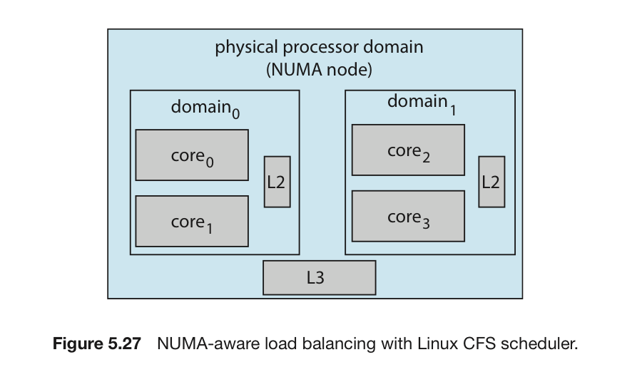
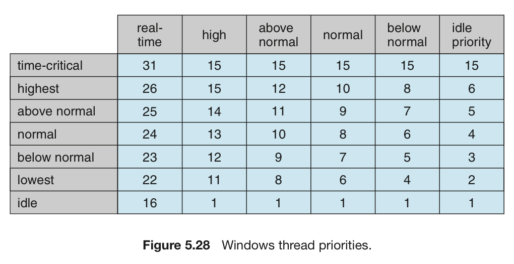

# CPU 스케쥴링 : OS별 예시

태그: 5장
숫자: 파트7

# 리눅스

각 클래스별로 특정 우선순위를 부여받는 스케쥴링 클래스에 기반을 두고 동작

- 스케쥴링 클래스는 리눅스를 쓰는 장치마다 다르게 선택할 수 있다.
- 크게 2가지의 클래스가 있다.

## CFS 스케쥴러

SMP 스케쥴링을 개선시킨 것이라고 생각하면 된다.

1. 작동 방식 : 각 태스크에 CPU 처리시간의 비율을 할당.
    - 각 태스크에 할당된 nice 값에 기반해 계산
        - Nice 값 : -20 ~ 19 까지 있음.
    - Nice 값이 적을수록, CPU 처리시간이 길어짐.
    - Nice 값이 높다 = 우선순위를 양보
        - 목적 지연시간을 찾음.
    - 목적 지연 시간: 모든 수행 태스크가 적어도 1번씩을 실행할 수 있는 시간간격
    - 디폴트 값과 최솟값을 가지며, 시스템 상에 활성 태스크 수가 일정 값보다 많아지면 증가할 수 있음.
2. 특징 : 직접 우선순위를 할당하지 않음.
    - 각 task별 가상 실행시간(vruntime)을 기록.
    - 이는 태스크의 우선순위에 기반을 둔 감쇠지수와 연관이 있음.
3. 부하 균등 vs 쓰레드 이주
    - 부하 균등을 지원.
    - 그러나 이에 따른 쓰레드 이주 문제 해결을 위해 스케쥴링 도메인의 계층적 시스템을 결정.
    - 캐시의 레벨을 결정함으로써 메모리를 다시 써야하는 문제를 최대한 해결.

## 실시간 스케쥴러

SCHED_FIFO나 SCHED_RR을 이용해 스케쥴링.

# 윈도우

윈도우의 CPU 스케쥴러 : 가장 높은 순위의 쓰레드가 항상 실행되도록 보장

스케쥴링을 담당하는 파트 = 디스패처

## 디스패처의 특징

- 32단계의 우선순위를 가지고 잇음.
- 이를 두 가지의 클래스로 나눔.
    - 가변 클래스 : 1 ~ 15
    - 실시간 클래스 : 16 ~ 31
    - 0번 우선순위 = 메모리 관리
- 준비 상태의 쓰레드가 없으면 idle 쓰레드라고 부르는 특수한 쓰레드를 실행

## 우선순위 정하기

1. 쓰레드를 우선순위 클래스 안에 넣는다.
2. 우선순위 클래스는 쓰레드를 6가지로 구분한다.
3. 우선순위 클래스들은 6개이다.
4. 결국 36가지 조합을 만들어 낼 수 있다.

이러한 우선순위가 고정은 아니고, `SetThreadPriority()` 로 바꿀 수 있다.

쓰레드의 시간 할당량이 끝나면, 쓰레드는 인터럽트 된다.

- 가변 우선순위 클래스에 속하면 우선순위가 낮아진다.
- 그렇지만, 기본 우선순위 클래스보다 낮아지지는 않는다.
- 이 방식으로 특정 쓰레드의 독점을 막는다.

## 기타 특징

1. 대화형 프로그램
- 우선순위 클래스 중 NORMAL_PRIORITY_CLASS 에 속해 있는 경우.
- 특별한 스케쥴링 알고리즘을 적용.
- 선택된 프로세스에게 시간 할당량을 3배까지 늘려준다.

1. 사용자 모드 스케쥴링
- 커널과 독립적으로 쓰레드를 생성 & 관리 가능
- 훨씬 효율적이다.

1. 멀티코어 시스템 스케쥴링
- 논리 프로세서 집합을 만듬.
- 쓰레드를 최대한 같은 논리 프로세서 집합에서 실행
    - 캐시 메모리 액세스 불이익을 피하기 위함.