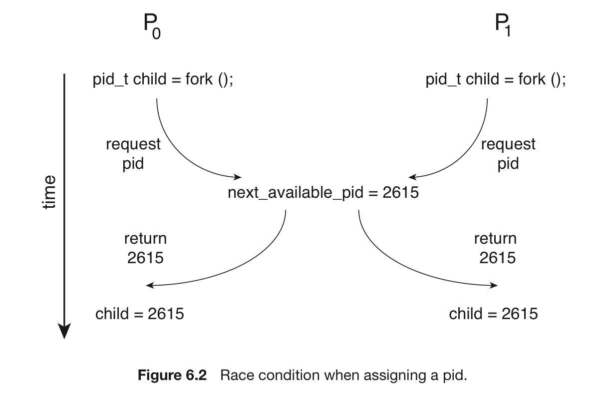

# 임계구역 문제

## 임계구역?

- 일종의 코드. 다른 프로세스와 공유하는 데이터에 접근하고 갱신하는 역할.
- 임계구역으로 진입하려면, 각 프로세스는 입장→ 접근 → 퇴장 의 과정을 거쳐야 함.

```c
while (1) {
	// entry section (입장)
		// critical section (접근)
	// exit section (퇴장)

	// remainder section (나머지 코드)
}
```

- **임계구역 = 한 번에 1개의 프로세스만 진입 가능.**
- 이러한 임계구역을 짜는 것을 **임계구역 문제라고 한다.**

## 3가지 조건

**임계구역의 3가지 조건을 알아보자.**

<aside>
💡 상호 배제, 진행, 한정된 대기

</aside>

1. 상호 배제 : 임계구역에서는 프로세스 1개만 실행될 수 있다.
2. 진행 : 어떤 프로세스도 임계구역을 건드리지 않는 상황에서, 어떠한 프로세스가 들어가고 싶어한다고 치자. 이때 그 프로세스는 나머지 부분(remainder section)에서 진행되지 않아야 들어갈 수 있다. 이 결정은 무한정 연기되지 않는다.
3. 한정된 대기 : 프로세스가 자기의 임계구역에 진입하려는 요청을 한 후부터 그 요청이 허용될 때까지 다른 프로세스들이 그들 자신의 임계구역에 진입하도록 허용되는 횟수에 한계가 있어야 한다.

각 프로세스가 0이 아닌 속도로 실행되는 것을 가정.

# 경쟁 조건

한순간에 많은 커널 모드 프로세스가 활성화될 수 있다.

- 그 결과 운영체제를 구현하는 코드는 경쟁 조건이 발생하기 쉽다.
- 이때, 상호 배제가 없으면 동일한 프로세스 식별자 번호가 두 개의 다른 프로세스에 배정될 수 있다.



→ 서로 다른 프로세스들이 새로운 pid 2615를 가지겠다고 경쟁을 벌이는 모습.

다음은 경쟁조건이 발생하기 쉬운 커널 자료구조의 종류다.

- 메모리 할당 관리 자료구조
- 프로세스 리스트 유지 자료구조
- 인터럽트 처리를 위한 자료구조.

이러한 경쟁조건이 발생하지 않는 조건은 커널 개발자의 책임!

## 다중 코어

- 단일코어 = 공유 변수 수정할 동안 인터럽트가 발생하는 것을 막으면 됨.
- 하지만 다중 코어에서는 이러한 방식을 쓸 수 없다.
    - 메시지가 모든 프로세서에 전달
    - 따라서 인터럽트를 막으면(=메시지 전달) 시간이 많이 걸림
    - 각 임계구역으로의 진입을 막을 뿐만 아니라 효율성도 떨어진다.
    

## 커널과 경쟁조건

그래서 선점형/비선점형 커널을 이용한다.

> **복습!**
선점형 : 한 프로세스가 기존 프로세스의 실행을 뺏을 수 있다.  
비선점형 : 기존 프로세스가 끝나야 새 프로세스가 들어온다.  
SMP : 대칭형 다중처리
> 

얼핏 들어보면..

- 비선점형 커널 : 프로세스가 하나씩 실행되니 경쟁조건이 없어보인다.
- 선점형 커널 : 이 프로세스 저 프로세스가 막 실행될 수 있으니 조심해야 한다.
    - 특히 SMP 구조에서는 서로 다른 코어의 두 프로세스가 동시에 커널 모드에 있을 수 있기 때문에…

**그럼에도 불구하고, 선점형 커널이 선호된다!**

- 커널 모드 프로세스가 오랫동안 실행될 위험이 적다.
- 실시간 프로세스가 현재 커널에서 실행 중인 프로세스를 선점 가능.
    - 실시간 프로그래밍에 적당.