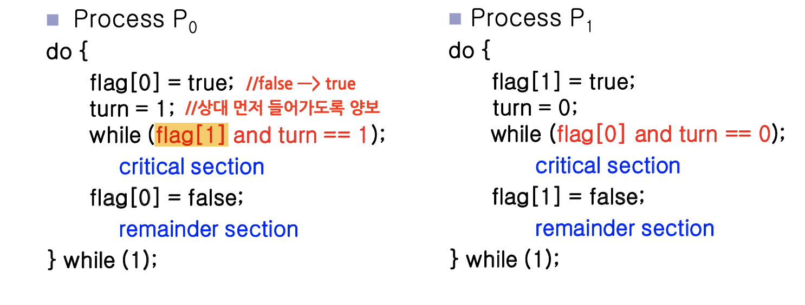

# 피터슨 알고리즘

설명: 임계구역 해결책 1 - 고전 소프트웨어

임계구역 문제의 첫 번째 해결책, 피터슨 알고리즘을 알아보자.

## 개요 : 피터슨 알고리즘

- 개리 피터슨이라는 사람이 제시한 방법.
- 임계구역과 나머지 구역을 번갈아 가며 실행하는 2개의 프로세스가 있다고 가정.
    
    이 프로세스를 $P_i$ 와 $P_j$라고 한다. (i가 0번, j가 1번)
    

## 피터슨 알고리즘 : 구조

`turn`과 `flag`라는 변수로 **critical section에 들어갈 프로세스/스레드를 결정하는 방법**

`flag[]` : **공유 자원을 쓰고 싶다라는 것을 표현하기 위한 변수**

`turn` : **어떤 프로세스/스레드가 critical section에 들어갈 차례**인지 나타내는 변수

프로세스 P0과 P1이 있다. 

먼저 P0는 flag를 true로, turn은 1로 설정한다. 

`while(flag[1] && turn == 1);`을 보면, flag[1] = true이고, turn == 1이면 기다려야 함을 알 수 있다. 

이는 P1의 flag가 true라면, P1이 먼저 실행되도록 대기하겠다는 것을 의미한다. 

P1의 flag가 false라면, P0이 critical section을 실행하게 된다.

## 3가지 요구조건 살펴보기

**1번 조건 → 상호배제가 제대로 지켜지는가?**

- P0과 P1이 동시에 임계 영역에 들어간다는 것은 flag[0] = flag[1] = true라는 것
- 그런데 turn은 0또는 1의 값을 가질 수밖에 없으므로 둘이 동시에 임계 영역에 진입하지 못한다.
- 따라서 상호배제를 보장한다.

**2번 & 3번 조건 → 진행에 대한 요구 조건을 만족하는가? 대기 시간이 한 없이 길어지지는 않는가?**

- Pj가 임계 영역에 들어갈 준비가 되지 않았을 경우, flag[j] == false이다
    
    → **Pi가 임계 영역에 들어갈 수 있다.**
    
- Pj가 while문에서 기다리고 있을 때, turn은 i이거나 j이다.
- 만약 **turn이 i이면, Pi가 임계영역에 들어갈 수 있으며, turn이 j이면 Pj가 임계 영역에 들어가게** 된다.
- Pj가 임계 영역을 종료하면, Pj는 flag[j]를 false로 설정하고, pj가 turn을 i로 전환하기 때문에 **Pi가 임계 영역에 들어갈 수 있게** 된다.
- 그러므로, Pi는 임계영역에 들어갈 수 있으며(진행), 최대 1개의 프로세스만 기다리면 된다.(대기 시간)

## 피터슨 알고리즘 : 단점

- 시스템 성능을 향상하기 위해 프로세서나 컴파일러가 읽기 작업이나 쓰기 작업을 재정렬할 수 있기 때문이다.
- 단일쓰레드 APP = 최종 결과가 예상한 것과 일치
    - 재정렬이 중요하지 않다.
- 멀티쓰레드 App = 명령 순서가 바뀌면 최종 결과가 달라질 수 잇다.
    - 데이터의 일관성이 깨지거나 다른 결과가 나옴.

위의 예시를 보면 알겠다시피, cpu가 2개의 스레드가 서로 dependency가 없다고 판단하여 순서를 바꿔 실행되게 하면, 예기치 못한 상황이 발생하여 버그로 이어진다.