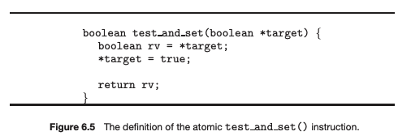
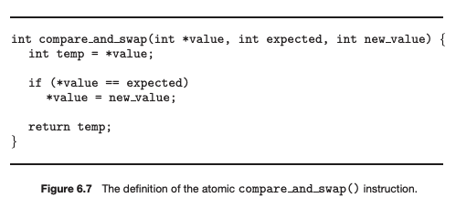
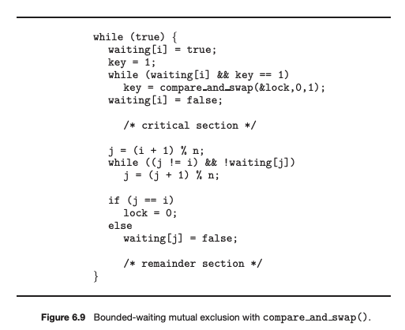
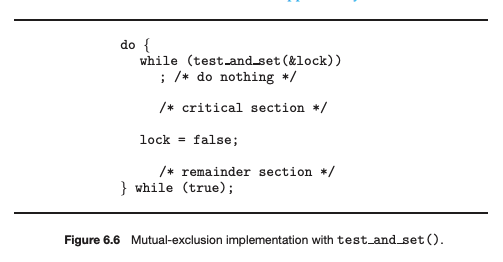

# 하드웨어 도구

설명: 임계구역 해결책 2 - 하드웨어

피터슨 알고리즘의 단점 = 최신 컴퓨터에서 작동하지 않을 수도 있다.

그래서 임계구역 문제의 2번째 해결책인 하드웨어 지원을 알아보자.

하드웨어 지원에는 크게 3가지가 있다.

## 메모리 장벽

<aside>
💡 메모리의 모든 변경사항을 다른 모든 프로세서로 전파하는 명령어.

</aside>

### 메모리 모델

컴퓨터 아키택쳐가 App에게 제공하는 메모리 접근 시 보장되는 사항을 결정한 방식

1. 강한 순서 : 메모리 변경 결과가 다른 모든 프로세서에 즉시 보임.
2. 약한 순서 : 메모리 변경 결과가 다른 모든 프로세서에 즉시 보이지 않음.

메모리 모델은 프로세서 유형마다 다르므로, 커널 개발자는 이를 해결해야 한다.

그래서 메모리 장벽을 도입해 명령어 순서 재정렬을 막는다.

### 메모리 장벽 : 예시

피터슨 알고리즘의 단점으로 제시되었던 부분에 memory_barrier()를 넣어주자.

쓰레드 1에 메모리 장벽을 추가했더니…

```c
while (!flag)
	memory_barrier();
print x;
```

flag값이 x값보다 먼저 적재된다.

마찬가지로 쓰레드 2에 메모리 장벽을 추가했더니

```c
x = 100;
memory_barrier();
flag = True;
```

flag값이 x값보다 먼저 적재된다.

### 메모리 장벽 : 특징

- 매우 낮은 수준의 연산
- 일반적으로 커널 개발자만 사용한다.

## 하드웨어 명령어

**많은 현대 기계들은 한 워드(word)의 내용을 검사하고 변경하거나, 두 워드의 내용을 원자적으로 교환(swap)할 수 있는, 즉 인터럽트 되지 않는 하나의 단위로서, 특별한 하드웨어 명령어들을 제공한다.** 

우리는 이들을 사용하여 간단한 방식으로 임계영역 문제를 해결할 수 있다.

이 명령어들을 추상적으로 표현하자면 `test_and_set()`과 `compare_and_swap()`이 있다.

### `test_and_set()`

**test_and_set()** 명령어는 원자적(atomically)으로 실행된다. 

원자적(atomically)이란? : 

- 명령어들로 구성된 함수 또는 액션으로 더 이상 분할할 수 없는 단위
- 어떤 프로세스도 중간 상태를 볼 수 없고 연산을 중단할 수 없다
- 이 명령어들은 수행되거나 되지 않거나 둘 중 하나다.



이를 활용한 상호 배제 해결 알고리즘은 다음과 같다.



위의 알고리즘은 lock이라는 공유 변수가 한 프로세스에서 false일 경우 lock을 true로 만들고 자신은 임계 영역으로 들어간다.

임계 영역에서 빠져나온 프로세스가 lock을 false로 만들면 다른 프로세스가 임계 영역에 들어가고 이러한 과정이 반복되는 알고리즘이다.

## `compare_and_swap()`

`test_and_set()` 명령어와 마찬가지로 두 개의 워드에 원자적인 연산을 하지만 두 워드의 내용 교환에 기반을 둔 다른 기법을 사용한다.



해당 기능을 이용한 알고리즘이다.



Pi가 임계구역에 진입하는 경우는 오직 waiting[i] == false 이든지 key == 0 이 되어야 한다. 

lock이 0일 때에만 key가 0 이되고 lock이 1로 바뀌면서 무한 루프에서 빠져나올 수 있다.

waiting[i]를 false로 바꾸고 임계 구역을 실행한 뒤 i를 순차적으로 증가시켜 자신과 같을 때까지 또는 i가 기다리고 있을 때 까지 무한 루프를 돌고, 선택된 프로세스를 Ciritical Section에 진입할 수 있도록 해주는 알고리즘이다.

위의 알고리즘은 Ciritical Section 해결안이 만족해야 하는 요구조건인 Mutual Exclusion, Progress, Bounded Waiting를 모두 만족한다.

## 원자적 변수

`compare_and_swap()` 를 직접 쓰지 않고, 이를 가공한 도구.

- 정수 및 부울과 같은 기본 데이터 유형에 대한 원자적 연산을 제공한다.
- 카운터가 증가할 때와 같이 갱신되는 동안 단일 변수에 대한 데이터 경쟁이 있을 수 있는 상황에서 상호 배제를 보장하는데 사용할 수 있다.
- 원자적 변수를 지원하는 대부분의 시스템은 원자적 변수에 접근하고 조작하기 위한 기능뿐만 아니라 특별한 원자적 데이터 유형을 제공한다.

### 특징

- 모든 상황에서 경쟁 조건을 완벽히 해결하지 않는다.
- 운영체제 및 병행 App에서 일반적으로 사용.
- 공유 데이터 1개의 갱신에만 제한되는 경우가 많다.