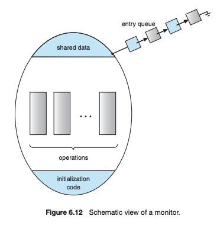

# 세마포어

설명: 임계구역 해결책 4 - 세마포어

# 세마포어란?

- 뮤택스 락와 유사하지만, 프로세스들이 자신들의 행동을 더 정교하게 동기화할 수 있는 방법을 제공하는 도구.
- semaphore = 수기 신호라는 뜻.
- 네덜란드의 컴퓨터 과학자 다익스트라가 고안.

## 세마포어 : 구조

- 세마포어 변수 S와 wait(), signal()로 구성됨.
- wait()과 signal()은 반드시 원자적 연산으로 구성
    - 즉, 1번에 1쓰레드만 값 변경 가능!

wait()과 signal()의 정의는 다음과 같다.

```
wait(S) {
    while (S <= 0)
        ; // busy wait
    S--;
}
```

```
signal(S) {
    S++;
}
```

## 세마포어 : 사용법

운영체제는 종종 카운팅(counting)과 이진(binary) 세마포를 구분한다. 

- **카운팅 세마포의 값은 제한 없는 영역을 갖는다.**
- **이진 세마포의 값은 0과 1사이의 값만 가능하다.**

**카운팅 세마포는 유한한 개수를 가진 자원에 대한 접근을 제어하는데 사용될 수 있다.** 

세마포는 가용한 자원의 개수로 초기화된다. 

각 자원을 사용하려는 프로세스는 세마포에 wait() 연산을 수행하며, 이때 세마포의 값은 감소한다. 

프로세스가 자원을 방출할 때는 signal() 연산을 수행하고 세마포는 증가하게 된다. 

**세마포의 값이 0이 되면 모든 자원이 사용중임을 나타낸다.** 

이후 자원을 사용하려는 프로세스는 세마포 값이 0보다 커질 때까지 봉쇄된다.

## 세마포어 : 구현

**Busy Waiting을 피하기 위해 세마포 S를 대기하면서 일시 중지된 프로세스는 다른 프로세스가 signal() 연산을 실행하면 재시작되어야 한다.** 프로세스는 sleep() 연산에 의해서 일시 중지되고 wakeup() 연산에 의하여 재시작된다. (대기상태 <-> 준비 완료 상태)

세마포를 활용한 Critical Section 문제 해결 알고리즘을 구현하기 위해 세마포의 정의는 다음과 같다.

```
typedef struct {
    int value; 
    struct process *list;
}semaphore;
```

wait()과 signal() 연산의 정의는 다음과 같다.

```
wait(semaphore *S) {
    S->value--;
    if (S->value < 0) {
        add this process to S -> list;
        sleep();
    }
}
```

```
signal(semaphore *S) {
    S->value ++;
    if (S->value <= 0) {
        remove a process P from S -> list;
        wakeup(P);    
    }
}
```

wakeup()과 sleep()은 프로세스를 일시 중지 or 재실행시키는 운영체제의 기본적인 시스템 콜이다.

세마포의 프로세스 리스트는 Bounded Waiting를 보장하도록 잘 구현해야만 한다.

단일 Processor 환경에서는 wait()와 signal() 연산들이 원자적으로 실행되는것을 보장하기 위해 실행되는 동안 인터럽트를 금지함으로써 해결할 수 있지만, 다중 코어 환경에서는 모든 처리 코어에서 인터럽트를 금지하여야만 한다. 

이는 매우 어려울 수 있으며 성능을 심각하게 감소시킬 수 있음으로 많은 부분을 고려해야만 한다.

# 모니터

mutex lock 혹은 세마포를 사용할 때에도 타이밍 오류는 여전히 발생할 수 있다.

- wait()과 signal() 연산의 순서가 뒤바뀌는 경우
- 임계영역에서 퇴장한 후 signal() 대신 wait()이 호출되는 경우

이러한 오류를 처리하기 위한 한 가지 전략은 간단한 동기화 도구를 통합하여 고급 언어 구조물을 제공하는 것이다. 

이번엔 고급 언어 구조물 중 하나인 **모니터(monitor)**를 살펴보자!!

## 모니터 사용법

**모니터 형은 모니터 내부에서 프로그래머가 정의한 상호 배제가 보장되는 일련의 연산자 집합을 포함하는 ADT이다.** 

모니터 형은 인스턴스의 상태를 정의하는 변수들과 이를 조작할 수 있는 프로시저 또는 함수들의 본체도 같이 포함하고 있다.

따라서 모니터 내에 정의된 함수만이 오직 모니터 내에 지역적으로 선언된 변수들과 형식 매개변수들에만 접근할 수 있다. 

(객체의 캡슐화와 매우 비슷한 구조)



**모니터 구조물은 모니터 안에 항상 하나의 프로세스만이 활성화되도록 보장해 준다.** 그러나 지금까지 정의한 모니터 구조물은 어떤 동기화 기법을 모델링하는 데에는 충분한 능력을 제공하지 않는다.

condition이라는 구조물로 동기화 기법들을 제공해 보자. 자신의 동기화 기법을 작성할 필요가 있는 프로그래머는 하나 이상의 condition 형의 변수를 정의할 수 있다.

```
condition x,y;
```

이 condition 형 변수에 호출될 수 있는 연산은 오직 wait()와 signal()이다. x.wait()은 이 연산을 호출한 프로세스는 다른 프로세스가 x.signal()을 호출할 때까지 일시 중지 되어야 한다는 것을 의미한다.

Java와 C# 등을 포함한 많은 프로그래밍 언어들은 이 절에서 설명한 모니터의 개념을 편입 시켰다.

## 세마포를 이용한 모니터 구현

각 모니터마다 mutex라는 이진 세마포가 정의되고 그 초기 값은 1이다. 프로세스는 모니터로 들어가기 전에 wait(mutex)를 실행하고 모니터를 나온 후에 signal(mutex)을 실행해야 한다.

모니터 구현 시 signal-and-wait 기법을 사용한다. Signaling 프로세스는 실행 재개되는 프로세스가 모니터를 떠나는지 아니면 wait() 할 때까지 그 자신이 다시 기다려야 하므로 next라는 이진 세마포가 추가로 필요하게 되고 0으로 초기화된다.

signaling 프로세스는 자신을 중단시키기 위해 next를 사용할 수 있다. 정수형 변수 next_count에서도 next에서 일시 중지 되는 프로세스의 개수를 세기 위해 제공된다. 따라서 각 외부 프로시저 F는 아래로 대체된다.

```
wait(mutex);

    ...
    body of F
    ...

if (next_count > 0) // 일시 중지된 프로세스가 존재한다면
    signal(next);   // next 프로세스를 실행 재개한다.
else
    signal(mutex);
```

## 모니터 내에서 프로세스 수행 재개

“조건 변수 x에 여러 프로세스가 일시 중지 되어 있을 때 어떠한 프로세스를 수행 재개시킬 것인가??”에 대해서 논의해 보면 가장 간단한 방법은 FCFS 순이다. 하지만 많은 경우 이러한 간단한 스케줄링 기법은 충분하지 않다.

이를 위해서 아래와 같은 형식의 **conditional-wait 구조**를 사용할 수 있다. 이 구조물은 다음과 같은 형태를 가진다.

`x.wait(c);`

여기서 c는 정수이고, 우선순위 번호(priority number)라고 불리며 일시 중지 되는 프로세스의 이름과 함께 저장된다. 즉, x.signal()이 수행되면 가장 작은 우선순위 번호를 가진 프로세스가 다음번에 수행 재개 된다.

이 새로운 기법을 설명하기 위해 아래와 같은 구조를 가진 ADT인 ResourceAllocator 모니터를 예로든다.


이 모니터는 한 개의 자원을 여러 프로세스 사이에 할당해 준다. 각 프로세스는 자원을 할당받기를 원하면 그 자원을 사용할 최대 시간을 지정한다. 모니터는 이 중 가장 적은 시간을 희망한 프로세스에 자원을 할당해 준다. 이 자원을 액세스하려는 프로세스는 아래의 순서를 따라야 한다.

`R.acquire(t);   // R은 ResourceAllocator형 인스턴스이다....
    access the resource;
    ...

R.release();`

time을 사용해서 한 개의 자원을 접근하는데 무리없이 동작하는 것 처럼 보이지만 사실 다음과 같은 문제가 발생할 수 있다.

- 프로세스가 자원에 대한 허락을 받지 않고 자원을 액세스 할 경우
- 프로세스가 자원에 대한 허락을 받은 다음 그 자원을 방출하지 않을 경우
- 프로세스가 자원에 대한 허락을 받지 않았는데도 그 자원을 방출할 경우
- 프로세스가 자원에 대한 허락을 받은 다음 방출하지 않은 상태에서 또 그 자원을 요청할 경우

사실 위와 동일한 문제들은 모니터를 사용할 때 뿐만 아니라 세마포를 사용할 때도 동일하게 발생한다.

이 문제를 해결하기 위해서 **자원 액세스 연산 자체를 ResourceAllocator 모니터 내부에 두는 방법**이 있고, 프로세스들이 올바른 순서를 지키도록 보장하기 위해서 **ResourceAllocator 모니터와 모니터가 관리하는 자원을 사용하는 모든 프로그램을 검사**하는 방법이 있다.