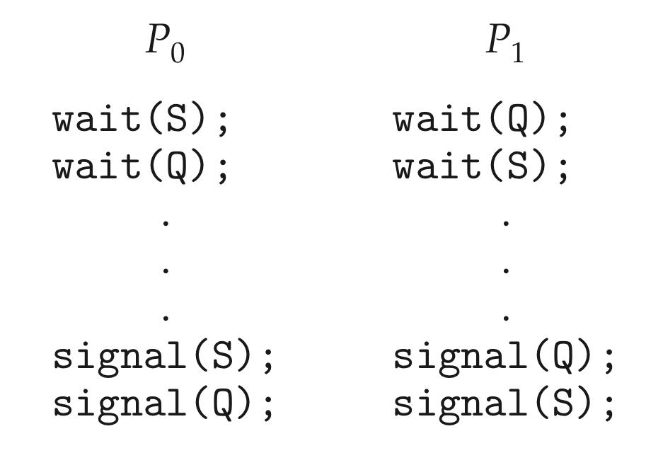

# 라이브니스

설명: 임계구역 관련 프로세스 지속 실패

## 라이브니스(Liveness)란?

<aside>
💡 프로세스가 실행 수명주기 동안 진행되는 것을 보장하기 위해 시스템이 충족해야 하는 일련의 속성

</aside>

이걸 못 지킨 것을 **라이브니스 실패**라고 한다.

- 모두 성능과 응답성이 나쁜 것이 특징
- ex. 임계구역에 들어가려고 프로세스가 무한히 대기하는 경우
- ex. 무한 루프

바쁜 대기 루프는 라이브니스 실패의 가능성이 있다.

- 특히 프로세스가 오랫동안 루프를 도는 경우!
- mutex 락과 세모포어 같은 도구를 사용하여 상호 배제를 제공하다가 이 상황에 빠질 수도 있다.

## 라이브니스 실패 (1) : 교착상태

<aside>
💡 여러 개의 대기 중인 프로세스들이 그들 자신들 중 하나에 의해 일어날 수 있는 이벤트를 무한정 기다리는 상황.

</aside>

- P0이 wait()을 실행하고, P1이 wait()을 실행.
- 서로 각자 Signal()을 기다리는 중
- 아무것도 할 수 없는 상태 = 교착상태.

## 라이브니스 실패 (2) : 우선순위 역전

<aside>
💡 **상대적으로 우선순위가 가장 높은 프로세스인 'A'가 마치 우선순위가 가장 낮은 프로세스처럼 실행이 되는 현상**

</aside>

우선순위가 가장 높은 프로세스 A, 중간인 B, 가장 낮은 C가 존재한다고 가정해보자.

가장 먼저, C가 작업을 수행하기 위해서 CPU를 할당받고 공유자원을 사용하러 들어간다. 그럼 이 때, 공유자원에 대한 lock()이 걸려서 다른 프로세스는 이 공유자원에 접근을 할 수 없게 된다.

이 후, 공유 자원을 필요로 하는 A가 작업을 수행하기 위해서 왔지만 이미 C가 공유자원을 사용하고 있으므로 lock()에 걸려 있는 상태라서 A가 작업을 수행하지 못하고 대기 상태에 들어가게 된다.

이 타이밍에 공유자원을 필요로 하지 않는 B가 작업을 수행하기 위해서 오게 된다. B는 C보다 우선순위가 더 높은 프로세스이고 공유자원 또한 필요로 하지 않는 프로세스 이기 때문에 C는 하던 작업을 멈추고 B에게 CPU를 내어주게 된다.

결국 B가 작업을 모두 완료한 후, 다시 C가 작업을 진행하게 되고 최종적으로 A가 진행되어 진다.

### 해결책

- 우선순위 상속 프로토콜로 해결
- 더 높은 우선순위를 가진 프로세스가 필요로 하는 자원에 접근하는 모든 프로세스는 문제가 되는 자원의 사용이 끝날 때까지 더 높은 우선순위를 상속.
- 자원 사용이 끝나면 원래 우선순위로 돌아감.