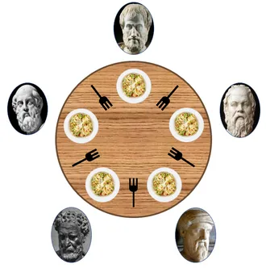

# 1. 고전적 예제

이 문제들을 해결하기 위해 전통적으로는 세마포어 사용.

- 다만, 가끔씩 이진 세마포어 대신 뮤택스 락을 사용할 수도 있음.

# 1. 유한 버퍼 문제

<aside>
💡 유한 버퍼문제란? (복습)
- 생산자 프로세스와 소비자 프로세스가 서로 충돌하는 상황
- 버퍼의 count 변수가 부정확하게 지정됨.

</aside>

소비자와 생산자는 다음과 같은 자료구조를 공유한다.

```c
int n;
semaphore mutex = 1;
semaphore empty = 1;
semaphore full = 0;
```

이 자료구조는 다음을 가정한다.

- n개의 버퍼로 구성된 pool이 있다.
- 각 버퍼는 한 항목(item)을 저장할 수 있다.
- mutex 변수는 버퍼 풀에 접근하기 위한 상호 배제 기능을 제공.
- empty, full 변수는 비어있는 버퍼 수와 꽉 찬 버퍼 수를 기록.
    - 초기에 empty는 n, full은 0으로 초기화된다.

생산자와 소비자는 다음과 같다.

```c
// 생산자
while (true) {
	// 아이템 생산
	wait(empty);
	wait(mutex);

	// 다음 버퍼에 아이템 추가
	signal(mutex);
	signal(full);	
}
```

```c
// 소비자
while (true) {
	wait(full);
	wait(mutex);
	// 아이템을 버퍼 -> next_consumed로 옮김
	
	signal(mutex);
	signal(empty);
	// next_consumed의 아이템을 사용.
}
```

생산자 = 소비자를 위해 꽉 찬 버퍼를 생산한다.

소비자 = 생산자를 위해 빈 버퍼를 생산한다.

# 2. Readers - Writers 문제

하나의 데이터베이스(DB)가 다수의 병행 프로세스에 의해 공유된다고 하자.

- Readers 프로세스는 DB를 읽을 수만 있다.
- Writers 프로세스는 DB를 읽고 쓸 수 있다.

Readers 끼리 동시에 접근 ⇒ 별 문제가 안 생긴다.

Writers와 어떤 다른 스레드가 동시에 접근 ⇒ 혼란 야기.

그래서, Writers가 DB에 접근할 경우 공유 DB에 대한 배타적 접근 권한을 가지게 해야 한다.

이 동기화 문제를 **Readers - Writers 문제**라고 한다.

- 거의 모든 새로운 동기화 프리미티브를 시험하기 위해 사용되었다.

## 문제의 변형

이 문제의 다양한 변형이 존재하며, 모두 우선순위와 연관되어 있다.

<aside>
💡 변형 1 : writer가 공유 객체를 사용할 허가를 받지 못한다면, 어느 reader도 기다리게 해선 안 된다.

- 단순히 기다리고 있는 writer 때문에, 어떠한 reader가 다른 readers들이 끝날 때 까지 기다려선 안 된다.

변형 2 : 일단 writer가 준비되면 가능한 한 쓰기를 수행해야 한다.

- writer가 객체에 접근하려고 기다리면, 새 reader는 읽기를 시작하지 못한다.
</aside>

이 문제들의 해결안이 전부 기아를 낳을 수 있다.

- 변형 1의 해결책 : writer가 기아에 빠질 수 있다.
- 변형 2의 해결책 : reader가 기아에 빠질 수 있다.

## 1번째 해결책

```c
semaphore rw_mutex = 1; // 
semaphore mutex = 1;    // 
int read_count = 0;     // 
```

# 3. 식사하는 철학자 문제

> 다섯 명의 철학자가 하나의 원탁에 앉아 식사를 한다. 

각각의 철학자들 사이에는 포크가 하나씩 있고, 앞에는 접시가 있다. 식사를 하려면 동시에 두 개의 젓가락이 
필요하다.

각각의 철학자는 다른 철학자와 대화할 수 없고, 번갈아가며 각자 식사하거나 생각하는 것만 가능하다. 
따라서 식사를 위해서는 왼쪽과 오른쪽의 인접한 철학자가 모두 식사를 하지 않고 생각하고 있어야만 한다. 

또 식사를 마치고 나면, 왼손과 오른손에 든 젓가락을
다른 철학자가 쓸 수 있도록 내려놓아야 한다. 
이 때, 어떤 철학자도 굶지 않고 식사할 수 있도록 하는 방법은 무엇인가?
> 



여기서 철학자는 프로세스, 식사하기는 자원 공유로 생각하면 된다.

## 해결책 1 : 세마포어

각 젓가락을 세마포어로 표현한다.

이때, 철학자의 행동을 함수로 표현하면 다음과 같다.

- wait() 연산으로 젓가락을 집으려고 시도.
- signal() 연산으로 자신의 젓가락을 놓는다.

그러므로, 공유 자료는 `semaphore chopsticks[5]` 라고 할 수 있다.

이때, 젓가락의 모든 원소들은 모두 1로 초기화된다.

이 해결책은…

1. 인접한 두 철학자가 동시에 식사하지 않음을 보장한다.
2. 교착상태에 빠져들 가능성이 있다.
    
    교착상태 = 모든 철학자가 자신의 왼쪽 젓가락을 잡으려고 할 경우.
    
    왜? 서로 언제 오른쪽 젓가락을 들지 계속 쳐다보기만 할꺼라.
    

교착상태는 다음과 같이 해결할 수 있다.

- 최대 4명의 철학자만 테이블에 동시에 앉을 수 있도록 한다.
- 한 철학자가 젓가락 2개를 모두 집을 수 있을 때만 젓가락을 집게 허락
    - 이는 철학자(=프로세스)는 임계구역 안에서만 젓가락을 집게 한다는 뜻
- 비대칭 해결안 사용
    - 철학자별로 돌아가면서 번호를 매긴다.
    - 홀수 번호 : 먼저 왼쪽 젓가락을 집고, 나중에 오른쪽을 집는다.
    - 짝수 번호 : 먼저 오른쪽으로 집고, 나중에 왼쪽을 집는다.

다만, 이러한 해결책은 기아 상태를 낳을 수도 있다.

## 해결책 2 : 모니터

교착 상태가 없는 해결안.

철학자는 양쪽 젓가락을 모두 얻을 수 있을 때만 젓가락을 집을 수 있음.

그래서, 다음의 자료구조를 도입한다.

```c
enum { Thinking, Hungry, Eating } state[5];
```

- 철학자 i는 양 쪽 철학자들이 식사하지 않을 때만 상태를 `Eating`으로 할 수 있다.
- 또한 `condition self[5]` 를 선언한다.
    - 이를 통해 철학자 i가 배고프지만 젓가락을 집고 싶을 때, 젓가락 집기를 미룰 수 있다.

### 모니터 : 실제 코드

```java
monitor DinigPhilosophers
{
    enum {Thinking, Hungry, Eating} state[5];
    condition self[5];

    void pickup(int i)
    {
        state[i] = Hungry;
        test(i);
        if (state[i] == Eating)
            self[i].wait();
    }

    void putdown()
    {
        state[i] = Thinking;
        test((i + 4) % 5);
        test((i + 1) % 5);
    }

    void test(int i)
    {
        if ((state[(i + 4) % 5] != Eating) && 
            (state[(i + 1) % 5] != Eating) &&
            (state[i] == Hungry) ) 
        {
            state[i] = Eating;
            self[i].signal();
        }
    }

    initialization_code() {
        for (int i = 0; i < 5; i++)
            state[i] = Thinking;
    }
}
```

- 각 철학자는 식사하기 전 반드시 `pickup()`을 호출해야 한다.
    - 이 행동이 철학자 프로세스의 일시중지를 낳을 수도 있다.
    - 연산이 성공적으로 끝나면, 철학자는 식사할 수 있다.
- 식사를 마친 후, 철학자는 putdown() 연산을 호출
- 따라서 철학자 i는 반드시 다음과 같은 순서로 pickup()과 putdown() 연산을 호출해야 함.