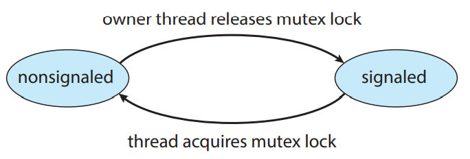

# 2. 커널 내부 동기화

윈도우와 리눅스는 커널을 동기화하기 위한 서로 다른 접근법은 좋은 예를 보여줌.

두 시스템은 서로 비슷하면서도, 다른 점을 가지고 있음.

# 윈도우의 동기화

윈도우OS = 실시간 응용과 멀티 프로세서를 지원하는 다중 쓰레드 커널.

## 전역 정보 액세스

싱글코어에서 전역 정보를 액세스할 때

→ 인터럽트를 잠시 동안 못 걸리게 막음.

멀티코어에서 전역 정보를 액세스 할 때

→ 스핀락을 걸어서 통제.

→ 그런데, 스핀락은 짧은 코드에 대해서만 사용

→ 효율성을 위해서 쓰레드가 스핀락을 가지고 잇는 경우 선점되지 않도록 보장.

## 커널 외의 스레드 동기화

dispatcher 객체를 제공한다.

- 쓰레드는 이를 이용해 다양한 기법(뮤택스 락, 세마포어, 이벤트, 타이머 등등)에 맞춰 동기화할 수 있다.
- 시스템은 데이터에 접근하기 위해서 쓰레드가 뮤택스의 소유권을 획득한 후, 필요한 작업이 끝난 후에는 다시 반납하게 함으로써 공동으로 사용하는 데이터를 보호한다.
- 세마포어 = 기존의 방식대로 동작
- 이벤트 = 조건변수와 유사
    - 기다리고 있는 조건을 만족 시 해당 쓰레드에 통지 가능
- 타이머 = 지정된 시간이 만료되면 쓰레드에게 통지.

dispatcher 객체는 2가지 상태가 있다.

1. Signaled 상태 → 객체가 사용 가능하고, 그 객체를 얻을 때 쓰레드가 봉쇄되지 않음.
2. Nonsignaled 상태 → 객체가 사용 불가능하고, 그 객체를 얻으려고 하면 쓰레드가 봉쇄됨.



dispatcher 객체의 상태와 쓰레드 상태 간에는 관련성이 있다.

- 쓰레드가 non-signaled 상태에 있는 dispatcher 객체 때문에 봉쇄되면
    - 그 쓰레드의 상태는 준비 → 대기로 바뀜.
    - 쓰레드는 객체의 대기 큐에 넣어지게 됨.
- 추후 dispatcher 객체의 상태가 signaled로 바뀌면..
    - 커널은 그 객체를 기다리는 쓰레드가 있는지 검사
    - 있으면 그 하나의 쓰레드를 대기 → 준비로 바꿈.
    - 커널이 대기 큐로부터 선택하는 쓰레드의 수는 dispatcher 객체 유형에 따라 다름.
    - ex) 뮤택스 객체 : 오직 하나의 쓰레드만 선택.
    - ex) 이벤트 객체 : 모든 쓰레드를 선택.

뮤택스 락을 예로 들어 dispatcher 객체의 상태와 쓰레드 상태를 설명.

- 한 쓰레드가 nonsignaled 상태에 있는 mutex dispatcher 객체를 얻으려고 하면.
    - 그 쓰레드는 일시정지, mutex 객체의 대기 큐에 넣어진다.
    - 이후 signaled 상태로 바뀌면 쓰레드가 대기 → 준비로 바뀌고, mutex 락을 얻음.

Critical-section 객체

- 커널의 개입 없이 획득하거나 방출할 수 잇는 사용자 모드 뮤택스
- 멀티코어에서 → 처음에는 스핀락을 걸어 타 쓰레드가 객체를 방출하길 기다림
    - 이후 스핀이 길어지면, 락을 획득하려는 프로세스는 커널 뮤택스를 할당하고, cpu를 양도
    - Critical-section 객체에서 커널 뮤택스는 객체에 대한 경쟁이 발생할 때만 할당
    - 좀 더 효율적임.

# 리눅스의 동기화

2.6 버전 이전까지는 비선점적 커널. 이제는 완전히 선점적.

## 원자적 정수

수많은 기법 중 가장 간단한 기법이다.

차단된 데이터 형인 `atomic_t`를 사용한다.

```c
atomic_t counter;
int value;

atomic_set(&counter, 5);        // 초기화
atomic_add(&counter, 10);       // 덧셈
atomic_sub(&counter, 10);       // 뺄샘
atomic_inc(&counter);           // 덧셈 (counter++)
value = atomic_read(&counter);  // 반환
```

원자적 정수는 정수형 변수가 갱신되어야 하는 상황에서 효율적

- 이는 오버헤드가 필요 없기 때문.
- 그러나, 정수형 변수를 쓸 때만 유용.

## 뮤택스 락

커널 안의 임계구역을 보호하기 위한 수단

태스크는 임계구역에 들어가기 전 : `mutex_lock()`

태스크는 임계구역에 나오고 난 후 : `mutex_unlock()`

## 기타 수단

- 커널 안 락킹을 위해 세마포어, 스핀락, reader-writer 버전도 제공
- SMP 기계에서 기본적인 락킹 기법은 스핀락.
- 또한, 스핀락이 짧은 시간 동안만 소유되도록 커널이 설계됨.

|  | 싱글코어 | 멀티코어 |
| --- | --- | --- |
|  | 커널 선점을 불가능하게 한다. | 스핀락을 획득 |
|  | 커널 선점을 가능하게 한다. | 스핀락을 방출 |

리눅스 커널에서 스핀락과 뮤택스락은 재귀적이지 않음.

- 즉, 쓰레드가 이러한 락 중 하나를 획득했다면 획득한 락을 해제하지 않고는 같은 락을 다시 획득할 수 없음.
- 해제하지 않으면 락을 획득하려는 2번째 시도는 봉쇄.

## 실제 코드

- 리눅스는 `preempt_disable()`과 `preempt_enable()` 이라는 시스템 콜 제공
- 커널에서 실행 중인 태스크가 락을 소유하고 있으면 커널은 선점 가능하지 않음.
- 이를 강제하기 위해 시스템의 각 쓰레드는 thread_info 라는 구조체를 가지고 있음.
    - 이 안에는 `preempt_count` 라는 변수 존재.
    - 락 획득 ⇒ `preempt_count` 증가
    - 락 방출 ⇒ `preempt_count` 감소
- 현재 수행 중인 테스크의 `preempt_count > 0` 이면 커널을 선점하는 것은 안전하지 않는데, 이는 현재 이 태스크가 락을 소유하고 있기 때문임.
- 만약 카운트가 0이고 대기 중인 `preempt_disable()` 호출이 없다고 가정하면 커널은 안전하게 인터럽트 될 수 있음.

스핀락과 커널 선점 불능 및 가능은 오직 락이 짧은 시간동안 유지될 때 사용.

락이 오랜 시간동안 유지되어야 하면 세마포어나 뮤택스를 사용하는 것이 적당.