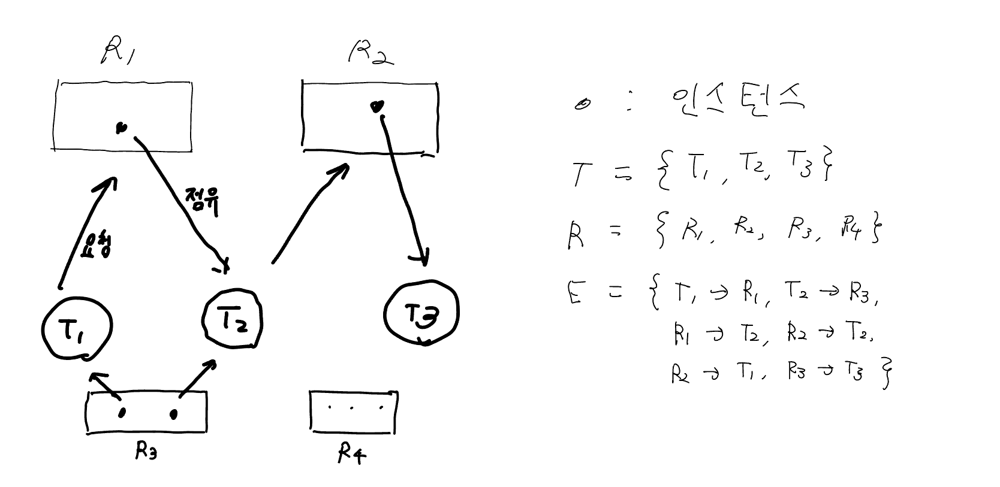
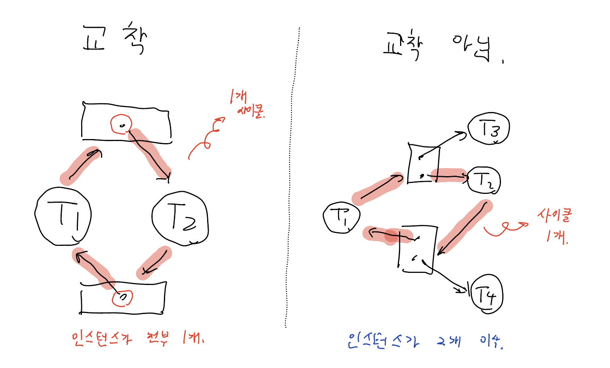

# 3. 교착 상태의 특성

## 일어나는 조건

흔히 1971년 코프만 교수가 저서에서 공개한 코프만 조건(Coffman conditions)을 기준으로 하며, 아래의 4가지 조건이 모두 만족하는 상태를 교착 상태로 정의한다.

1. 상호 배제 (Mutual exclusion) : 최소한 1개의 자원이 비공유모드로 점유되어야 함. 
    - 비공유모드 : 오직 1개의 쓰레드만 쓸 수 있는 상태.
2. 점유 상태로 대기 (Hold and wait) : 자원을 1개라도 가진 쓰레드는 따른 쓰레드가 가진 자원을 추가로 얻기 위해 무조건 대기해야 함.
3. 선점 불가 (No preemption) : 자원들을 선점할 수 없어야 함. 쓰레드가 자원을 강제로 뺏길 수 없다는 이야기.
4. 순환성 대기 (Circular wait) : 쓰레드의 집합 $\{T_0, \cdots, T_n\}$ 이 있다고 할 때 $T_{i + 1}$은 $T_{i}$의 자원을 얻기 위해 대기한다.
    
    0번째 쓰레드는 맨 마지막 쓰레드의 자원을 얻기 위해 대기한다.
    

## 자원할당 그래프

교착상태를 그래프, 즉 간선과 노드로 이뤄진 그림으로 표현할 수 있다.

- 사각형 노드 = 쓰레드
- 원형 노드 = 자원
- 쓰레드 → 자원 인 간선 : 자원을 기다리는 상태
- 자원 → 쓰레드 인 간선 : 자원을 가지고 있는 상태

### **책에 나온 예시**

### 그래프의 특징

쓰레드 두 개가 서로 다른 자원을 요청, 공유하는 경우가 있다.

이를 그림으로 그리면, 밑의 그림과 같이 어떠한 원이 만들어진다. 

이를 **사이클(cycle)**이라고 한다.

- 그래프 내부에 **사이클이 없으면** 시스템 내 어떤 쓰레드도 교착상태가 아니다.
    - **사이클이 있다면** 교착상태가 존재할 수 있다.
- 각 자원이 인스턴스를 1개만 가진다면, 사이클 1개는 교착상태가 발생했음을 의미
- 사이클 내부에서 자원이 인스턴스 1개만을 가진다면, 교착상태 발생

- 자원이 여러개의 인스턴스를 가지면 교착상태의 가능성은 낮아짐.