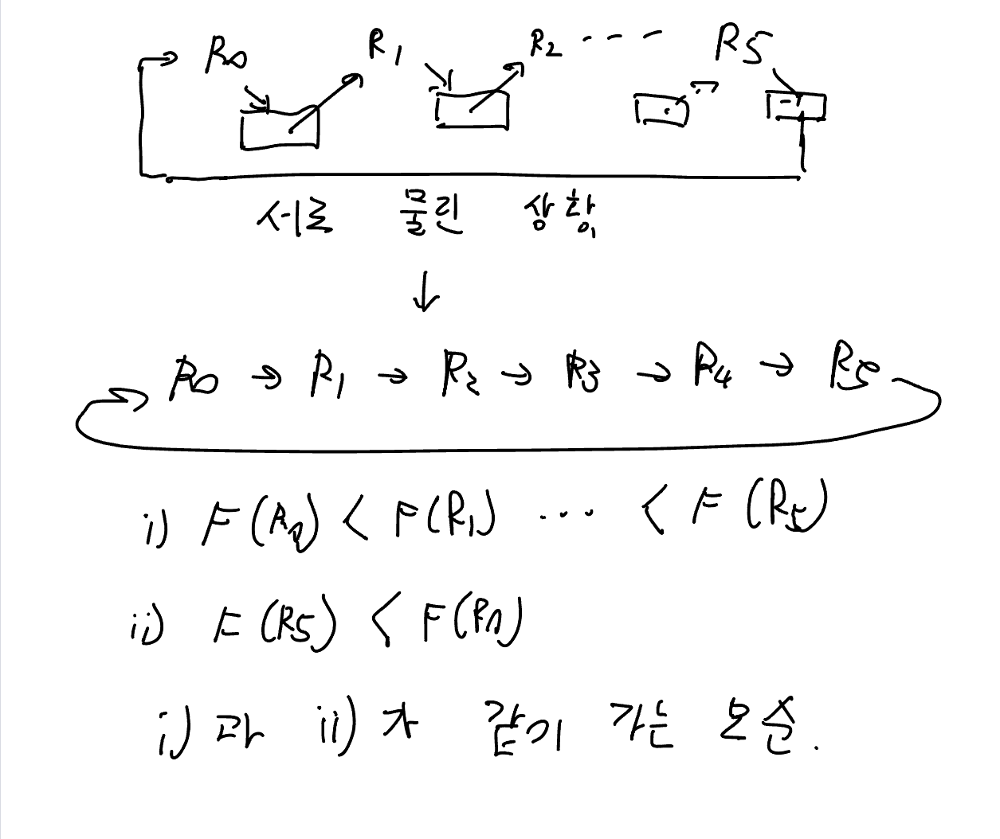

# 5. 교착 상태의 예방

> **교착상태가 일어나는 조건 4가지 : 복습**
> 
> 1. 상호 배제 (Mutual exclusion) : 최소한 1개의 자원이 비공유모드로 점유되어야 함. 
>     - 비공유모드 : 오직 1개의 쓰레드만 쓸 수 있는 상태.
> 2. 점유 상태로 대기 (Hold and wait) : 자원을 1개라도 가진 쓰레드는 따른 쓰레드가 가진 자원을 추가로 얻기 위해 무조건 대기해야 함.
> 3. 선점 불가 (No preemption) : 자원들을 선점할 수 없어야 함. 쓰레드가 자원을 강제로 뺏길 수 없다는 이야기.
> 4. 순환성 대기 (Circular wait) : 쓰레드의 집합 $\{T_0, \cdots, T_n\}$ 이 있다고 할 때 $T_{i + 1}$은 $T_{i}$의 자원을 얻기 위해 대기한다.
> 0번째 쓰레드는 맨 마지막 쓰레드의 자원을 얻기 위해 대기한다.

## 상호 배제 막기

- 일반적으로는 힘들다.
    - 특정 자원들은 무조건 비공유모드로 점유되기 때문이다.
    - 뮤택스 락 : 무조건 1개 쓰레드만 점유 가능.

## 점유 중 대기 막기

이미 자원을 1개라도 가지고 있는 쓰레드는 다른 자원에 욕심을 낼 수 없게 만들어야 함.

- 방법 1 : 각 쓰레드는 실행할 때 자기가 필요한 자원을 **미리 다 챙겨야 함.**
    - 쓰레드의 자원 요청은 필요할 때마다 이뤄지기 때문에 좀 비현실적이다.
- 방법 2 : 쓰레드가 **가진 자원을 이미 다 쓰고 방출한 상태에서만 추가 요청 허용.**

이 두 방법은 두 가지 주요 단점이 있다.

1. 장기간 사용을 안하는 경우, 이미 쓰레드가 가진 자원의 이용률이 낮을 수 있다. 
    - 쓰레드에 뮤택스 락이 필요할 수는 있지만, 짧게 사용
2. 기아가 발생할 수 있다. 
    - 어떤 쓰레드가 인기 있는 자원만 요구한다면, 처음부터 다 챙길 수도 없고(방법 1), 가진 자원을 다 쓰고 요청할려고 해도 타이밍을 놓친 상태(방법 2)일 수 있다.

## 비선점 막기 (?)

쉽게 상태를 저장하고, 복원될 수 있는 자원에 적용. 세마포어 같은 자원에는 적용 불가.

- 방법 1 : 이미 어떤 자원을 가진 쓰레드가 즉시 줄 수 없는 다른 자원을 요청하면, 현재 가진 모든 자원을 선점하게 한다.
    
    선점된 자원들은 그 쓰레드가 기다리고 잇는 자원들의 리스트에 추가된다.
    
    쓰레드는 선점한 자원 + 요청한 자원을 모두 가질 때 다시 시작.
    
- 방법 2 : 이미 어떤 자원을 가진 쓰레드가 즉시 줄 수 없는 다른 자원을 요청하면, 자원의 사용여부를 검사한다.
    
    사용 가능하다면 할당하고, 그렇지 않으면 대기 중인 쓰레드 중 어떤 것에 할당되었는지 검사.
    
    - 다른 쓰레드가 자원을 가지고 있다면, 이를 선점한 뒤 요청을 넣은 쓰레드에게 줌.
    - 그렇지 않으면 자원을 이용할 수 있을 때까지 대기.

## 순환 대기 막기

가장 실용적인 방법. (앞의 3개는 좀 비현실적인 부분이 많다.)

**방법 1 : 오름차순 요구**

1. 자원을 선형으로 분류하여 고유 번호를 할당.
2. 각 프로세스는 현재 점유한 자원의 고유번호보다 앞이나 뒤 한쪽 방향으로만 자원을 요구하도록 함

ex) 쓰레드A = 1번, 쓰레드B = 3번, 쓰레드C = 5번

쓰레드A는 쓰레드B, 쓰레드C에게 자원 요청 가능.

쓰레드B는 쓰레드C에게만 자원 요청 가능

**방법 2 : 내림차순 방출**

- 자원 $R_i$번을 요청할 때, $R_i$번 보다 낮은 번호를 가진 모든 자원을 방출
- $R_i$가 여러개 필요한 경우, 한번의 자원 요청으로 모든 $R_i$를 다 받아야 한다.

만약, 순환 상황이라고 가정하면…

따라서 이론적으로 순환대기를 막을 수 있다.

단, 순서만 정하는 걸 가지고는 교착 상태를 예방할 수 없다.

- 순서를 지키도록 프로그램을 짜는 것 역시 중요하다.

또한 동적으로 할당되는 자원(ex. 락)의 경우 순서를 부여하고, 규칙을 할당한다고 교착 상태 예방을 100% 보장하지는 않는다.