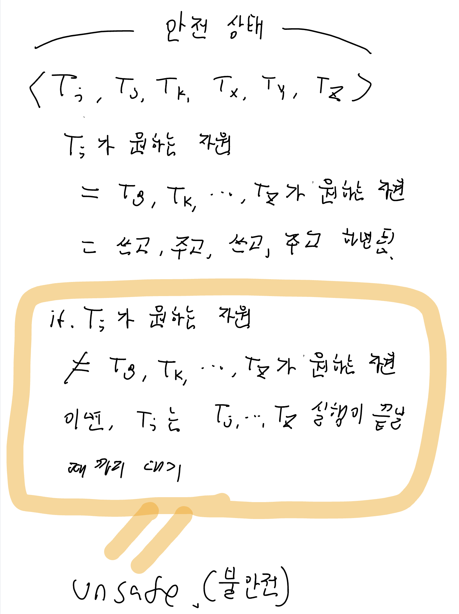
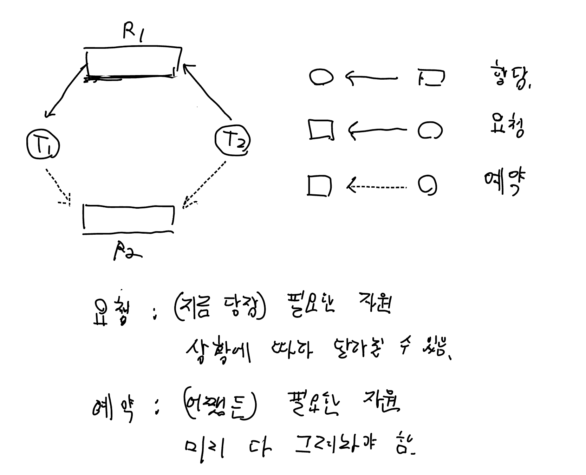
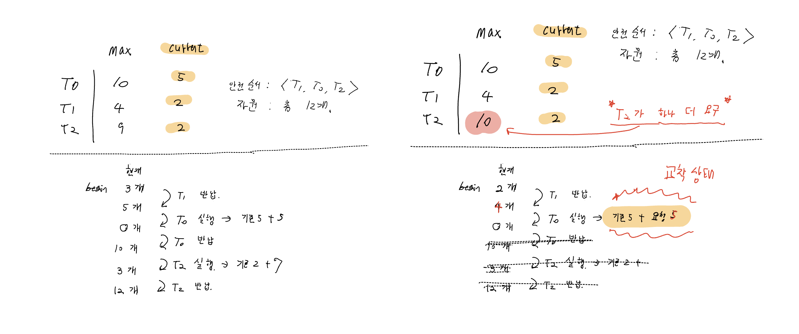
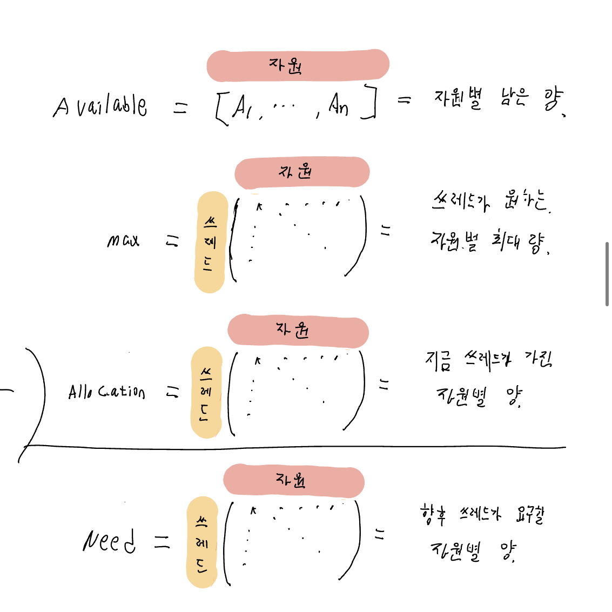
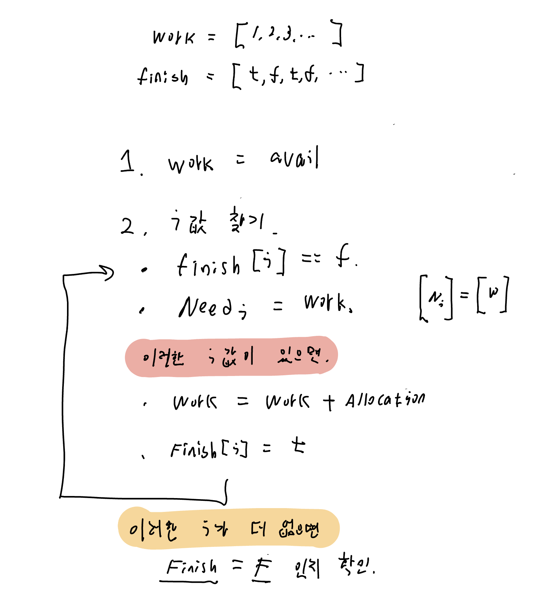
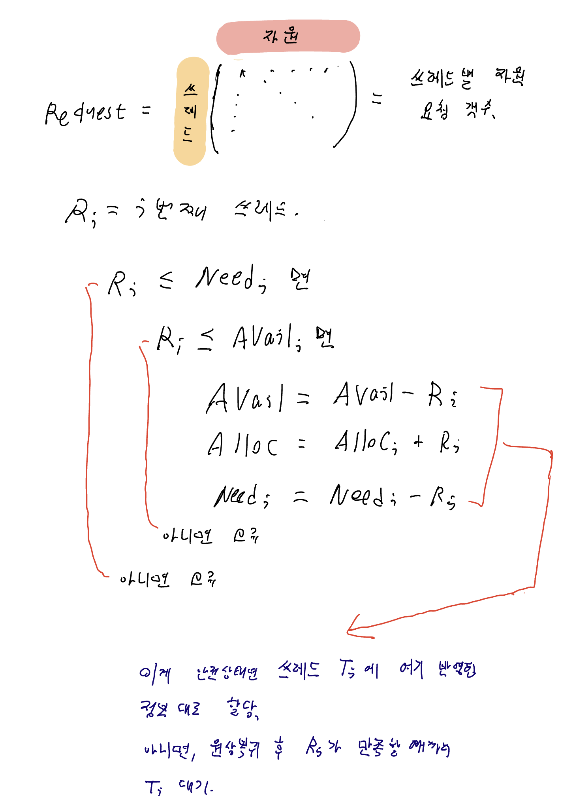

# 6. 교착 상태의 회피

# 회피가 필요한 상황

교착 상태 예방의 특징

- 교착상태를 만드는 4가지 조건 중 하나라도 없애본다.
- 장치의 이용률이 저하되고, 시스템 총처리율이 감소한다.

그래서 교착상태를 회피하려는 시도를 쓴다.

- 쓰레드가 무슨 자원을 어떻게 요청될지 알려줄 것을 요구
- 이 방법을 쓰는 알고리즘은 쓰레드의 정보의 양과 유형에 따라 차이가 있음.

가장 단순한 알고리즘을 먼저 알아보자

- 쓰레드가 요구할 최대의 자원을 알아내기.
- 이를 가지고 자원할당 상태를 점검하는 알고리즘을 만들 수 있다.
    - 자원 할당 상태 = 가용자원의 수, 할당된 자원의 수, 쓰레드의 최대 요구 수
- 여기서 파생되는 2가지 알고리즘이 있다.

## 회피 알고리즘 1 : 안전상태

<aside>
💡 안전상태란? 
= 시스템 상태가 안전하다는 뜻.
= 시스템이 어떠한 순서로든 쓰레드들이 원하는 모든 자원을 교착 상태 없이 차례차례 줄 수 있음.
= **안전 순서**를 찾음.

</aside>

## 안전 상태와 불안전 상태

## 안전상태 알고리즘 : 특징

- 모든 불안전상태 ≠ 교착상태 but 모든 교착상태 = 불안전상태
- 시스템은 안전상태 → 불안전상태로 바뀔 수도 있음.
- 따라서 알고리즘은 안전상태를 유지할 수 있을 경우에만 자원을 달라는 쓰레드의 요청을 즉시 들어줌.
- 쓰레드가 기다리는 상황이 발생. 자원의 이용률은 낮아질 수 있음.

## 회피 알고리즘 2 : 그래프 알고리즘

각 자원이 인스턴스를 하나씩 가지고 있을 때 적용가능한 알고리즘.

앞에서 보았던 그래프에 예약 간선(=점선으로 표기한다)를 넣어 보자.

여기서 사이클이 없다면 안전상태라고 할 수 있다.

책에서 소개된 예시도 한번 보자.

## 회피 알고리즘 3 : 은행원 알고리즘

<aside>
💡 은행과 예금주들이 있을 때, 얼마를 저금하든 고객들이 원하는 요청을 모두 들어줄 수 있기 때문에 붙은 이름.

</aside>

각 자원이 인스턴스를 여러 개 가지고 있을 때 적용 가능한 알고리즘.

단, 효율성은 그래프 알고리즘 보다 많이 떨어지는 편이다.

쓰레드가 원하는 자원들의 최대 양을 종류별로 신고. 물론 이 숫자가 가지고 있는 자원을 초과할 순 없음.

위와 마찬가지로 알고리즘은 안전상태를 유지할 수 있을 경우에만 자원을 달라는 쓰레드의 요청을 즉시 들어줌.

은행원 알고리즘은 벡터와 행렬을 이용해서 구현할 수 있음.  (그냥 표를 벡터와 행렬로 쓴 것. 수학적 지식이 필요하지는 않음)

**기본적인 벡터와 행렬은 다음과 같다.**

### 안전성 알고리즘

시스템이 안전한지 알아보는 파트.

### 자원 요청 알고리즘

