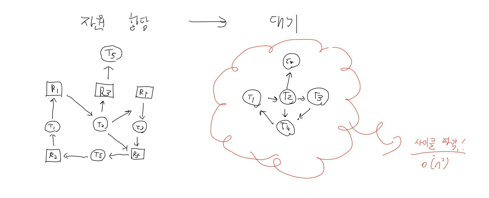
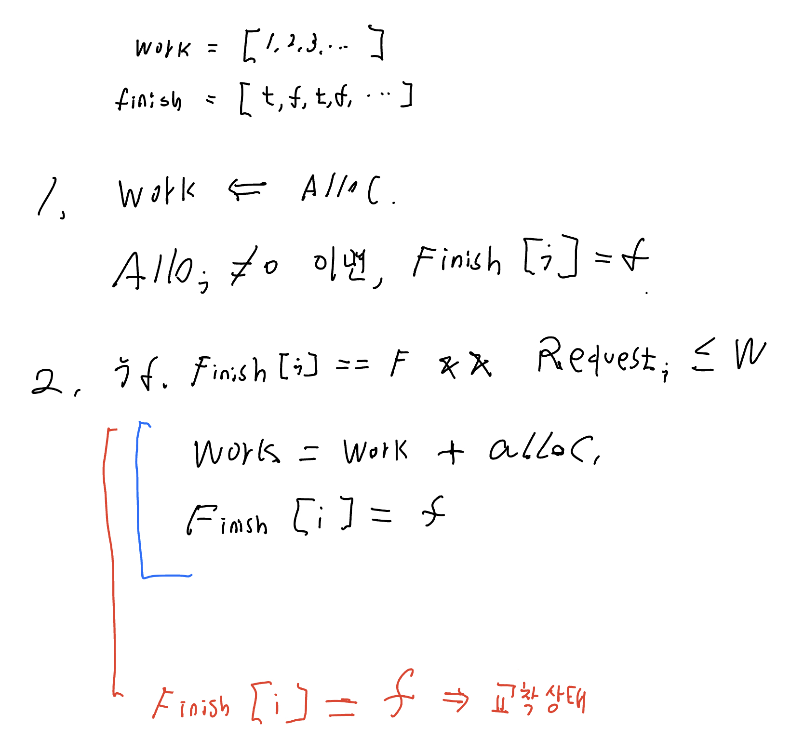

# 7. 교착 상태의 탐지

시스템이 교착 상태를 예방하거나 회피하지 않는다면, 교착상태가 발생할 가능성이 높다.

이를 위해 시스템은 다음 2가지를 갖춰놔야 한다.

1. 교착 상태 탐지 알고리즘
2. 교착 상태 회복 알고리즘

# 탐지 알고리즘 : 인스턴스 1개

그래프를 이용해 탐지할 수 있다.

이와 관련해서 BCC 툴킷이 Pthreads 헤더를 이용하는 뮤택스 관련 락과 관계된 잠재적 교착상태를 감지할 도구를 제공한다.

- deadlock_detector : 검사점을 삽입하여 작동
- dead_detector : 사이클을 감지해 교착상태라고 보고.

# 탐지 알고리즘 : 인스턴스 여러 개

벡터와 행렬을 이용해 탐지할 수 있다.

왜 2번 가정에서 $T_i$의 자원을 회수하는가?

- 더 이상 자원 필요없다고 판단
- 이러한 가정이 틀렸다면, 그 다음에 교착 상태에 봉착.

# 탐지 알고리즘 : 언제 쓰는가?

이는 다음 2가지 질문과 관련이 있다.

1. 교착 상태가 얼마나 자주 일어나는가?
2. 교착 상태에 연루된 쓰레드는 몇 개인가?

교착 상태가 자주 일어나면, 탐지 알고리즘도 자주 돌려야 함.

- 교착 상태가 오래가면, 자원은 쓰이지 못한 채 계속 묶여 있음.
- 교착 상태가 오래갈수록, 연루된 쓰레드도 많아질 수 있음.

방법 1 : 쓰레드의 자원요청이 즉각 일어나지 않을 때마다 돌린다.

- 해당 요청이 연속된 교착상태의 시작일 수 있기 때문에, 이걸 잡을 수 있다.
- 그렇지만, 오버헤드가 너무 심해질 가능성이 있다.

방법 2 : 시간 당 CPU 이용률로 판단

- 1시간마다 확인해서 CPU 이용률이 40%로 떨어질 때마다 탐지 호출.
- 문제는, 여러 개의 사이클을 포함하는 경우가 있음.
- 이 경우에는 원인이 되는 쓰레드를 찾기 힘듬.