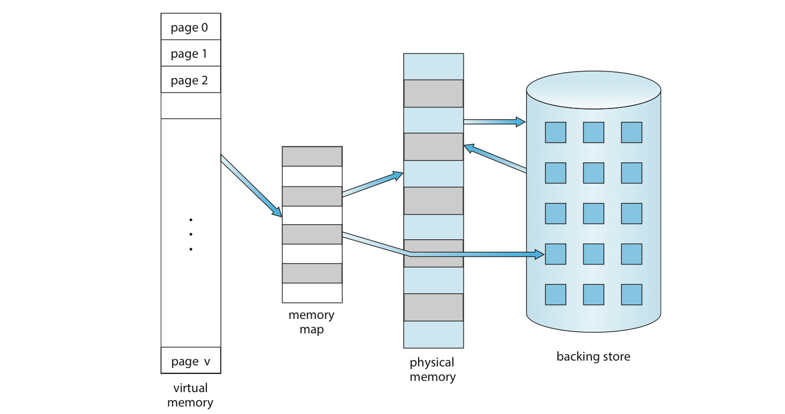

# 1. 가상 메모리란?

# 왜 가상 메모리인가?

## 이전의 논의

9장에서 나왔던 메모리 관리의 특징을 잘 살펴보자.

- 실행되는 프로그램 = 프로세스는 반드시 물리 메모리 위에 올라가 있어야 한다.
- 동적 적재 = 프로그램의 특정 부분(예: 함수 또는 모듈)이 실제로 필요할 때까지 그 부분을 메모리에 로드하지 않는 기법
    - 이 기법은 코드 또는 데이터가 실제로 필요한 시점에만 메모리에 로드한다는 것.
    - **어쨌든 전체 프로세스가 메모리에 올라간다는 아이디어는 변함이 없음. 올라가는 시점만 달라질 뿐.**

그런데, 꼭 프로그램 전체가 메모리에 올라갈 필요는 없다.

- 프로그램 중 잘 안 쓰는 부분
- 프로그램 중 필요 이상으로 공간을 많이 차지하는 부분 (ex. 배열, 리스트, 테이블 등등)
- 프로그램 중 잘 발생하지 않는 오류를 처리하는 부분

그래서 프로그램을 일부만 메모리에 올려놓고 실행하는 것을 생각하게 된다.

이 경우 다음과 같은 이점이 존재한다.

- 프로그램이 물리 메모리(=RAM)의 크기의 제약을 받지 않게 됨
- 각 프로그램이 더 작은 메모리를 차지하므로, 더 많은 프로그램을 동시에 돌릴 수 있게 됨
    - 응답시간은 늘어나지 않으면서도 CPU 이용률과 처리율이 높아짐
- 프로그램을 메모리에 올리고 스왑하는데 필요한 I/O 횟수가 줄어들어 시간이 줄어듬

## 가상 메모리 : 개요

물리 메모리와 논리 메모리의 개념을 분리한 것.

작은 메모리를 통해서도 얼마든지 큰 가상 주소 공간을 프로그래머에게 설명할 수 있음.

## 가상 메모리 : 장점

1. 표준 C 라이브러리와 같은 시스템 라이브러리가 여러 프로세스들에 의해 공유될 수 있다.
    
    라이브러리가 실제로 있는 물리 메모리 페이지를 모든 프로세스가 공유.
    
2. 프로세스들이 메모리를 공유할 수 있다.
    
    앞에서 보았던 공유 메모리 통신이 가능.
    
3. 페이지는 `fork()` 시스템 콜을 통한 프로세스 생성 과정에서 공유됨.
    
    프로세스 생성 속도가 더 높아짐.