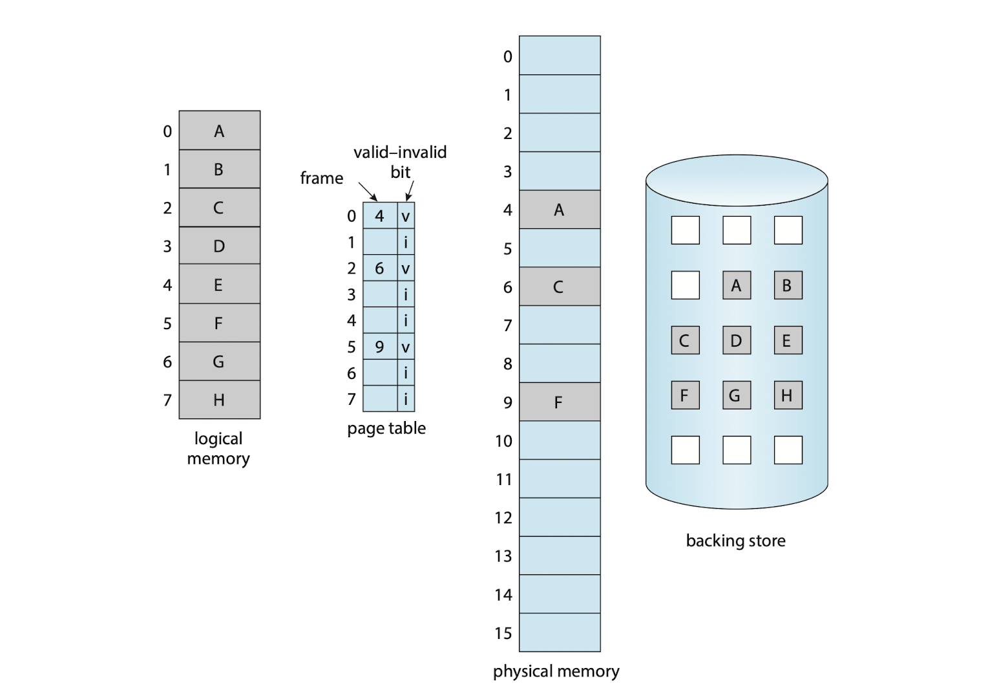
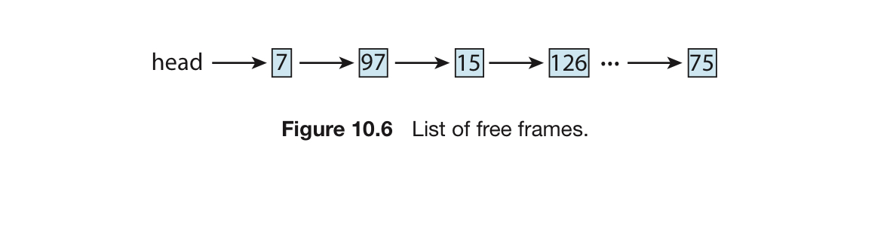

# 2. 요구 페이지

# 기본 개념

페이지 = 논리 메모리를 쪼갠 단위.

실행 프로그램을 보조 저장장치 ⇒ 메모리로 올릴 때, 필요한 페이징만 올리는 것.

- 필요할 때만 페이지가 적재됨.
- 적재되지 않은 페이지는 물리 메모리로 올려지지 않음.
- 프로세스가 보조 저장장치에 올라가는 스와핑과 비슷.

## 유효 / 무효 비트

**이 경우 한 프로세스 내부의 페이지들을 구분할 필요성이 생김.**

- 메모리에 올라간 페이지 ⇒ 유효 비트를 준다.
- 메모리에 올라가지 않은 페이지 ⇒ 무효 비트를 준다.



## page-fault trap

**프로세스가 메모리에 없는 페이지에 접근하려고 하면?**

- 페이지 테이블 항목이 무효로 되어 있으므로, page-fault trap을 발생
    - 페이지 테이블을 이용한 주소 변환 과정에서 무효 비트를 찾아낸 후, 트랩 발생
    - 운영체제가 필요한 페이지를 적재하는데 실패했기 때문에 발생.

- page-fault trap 발생 과정
    1. 프로세스에 대한 내부 테이블을 검사 : 메모리 참조가 유효/무효 인지 검사
    2. 무효한 페이지에 대한 참조면 프로세스 중단.
        
        유효한 페이지인데 아직 메모리에 없으면, 보조 저장장치에서 가지고 옴.
        
    3. 빈 공간, 즉 가용 프레임을 찾는다.
    4. 해당 페이지를 새로 가져온 프레임으로 연결 (= 읽기)
    5. 읽기가 끝나면 이 페이지가 인제 메모리에 있다는 것을 선언.
        
        즉, 페이지 테이블을 갱신하고 프로세스가 가진 내부 테이블을 수정
        
    6. 트랩에 의해 중단되었던 명령어를 다시 수행.
        
        프로세스는 마치 그 페이지가 항상 메모리에 있던 것처럼 해당 페이지에 접근
        

**메모리에 페이지가 하나도 없으면?**

- 운영체제에서 명령 포인터의 값을 프로세스의 첫 명령으로 설정하는 순간, page-fault를 일으킴.
- 프로세스가 사용하는 모든 페이지가 올라올 때까지, 필요할 때마다 page-fault 발생
- 이것을 순수 요구 페이징이라고 함.

**한 프로세스를 실행할 때 page-fault가 너무 많이 발생하지 않을까?**

- 모든 프로그램은 실행 시 자기 자신의 코드 중 일부분만 한동안 집중적으로 참조.
- 따라서, 코드 한 개 데이터 한 개마다 page-fault가 일어나지는 않음.

## 요구 사항

**요구 페이징을 위한 하드웨어**

```
1. 페이지 테이블 : 유효/무효 비트를 통해 특정 페이지의 존재 여부를 알려야 함.
2. 보조 저장장치 : 메인 메모리에 없는 모든 페이지를 가지고 있어야 함. 스왑 장치라고도 함.
```

**요구 페이징을 위한 명령어 처리**

- page-fault가 일어난 이후 **다시 명령어를 시작할 수 있어야 한다.**
- page-fault가 일어난 당시의 프로세스 상태를 저장해 놨다가, 같은 위치에서 다시 시작

예시를 들면 다음과 같다.

```
1. 명령어 f(x, y)를 인출, 해독
2. A를 인출
3. B를 인출
4. f(A, B)를 C에 저장

4번에서 C가 아직 없는 페이지에 속해 page-fault가 발생했다고 치자.
- C가 속한 페이지를 가지고 온다.
- 1,2,3,4를 전부 재 실행.
```

또 다른 예시를 보자. 

이는 한 명령어가 많은 기억 장소를 변경하는 것이 어려울 수 있음을 보여준다.

```
A(=원천 블록)에서 B(=목적 블록)로 256바이트를 옮기는 명령어.
어느 블록이라도 페이지 경계에서 양쪽에 걸쳐 있는 상황이라고 보자.
--------------------------------------------------
<	   page 1    >||<   page 2   >
[       ][  A  ]||[   B   ][   ]
--------------------------------------------------

아니면 이렇게 A와 B가 서로 겹쳐져 있는 상황이라면?
--------------------------------------------------
<	   page 1    >||<   page 2   >
[       ][  A   ||  ][        ]
[					   ][	||   B   ][   ]
--------------------------------------------------
이러면 이동이 다 끝나지 않은 상황에서 page-fault 발생 가능.

이 경우...
1. 마이크로코드로 양 블록의 두 끝을 계산
	- 겹치지 않는 것을 확인
	- 겹치는 것 같으면 page-fault 발생
	- 이후 코드 실행.
2. 이동으로 인해 이전의 내용이 지워질 기억장소의 값을 보존.
	- 임시 레지스터를 사용하면 가능.
	- page-fault 발생 시, 이전 값 전부가 다시 복원
  - 다시 복구 후 명령어 실행.
```

# 가용 프레임 리스트

page-fault 발생 = 필요한 페이지를 어쨌든 가지고 와야 한다.

운영체제는 사용할 수 있는 프레임을 모아둔 리스트를 준비한다.

이 리스트를 **가용 프레임 리스트**라고 한다.



운영체제가 시작되면, 모든 가용 메모리가 가용 프레임 리스트에 들어간다.

여기 있는 각 메모리는 모두 0으로 채워진다. (zero-fill-on-demand)

- 혹시라도 내용이 지워지지 않으면, 보안 취약점이 될 수 있다.

# 요구 페이징의 성능

요구 페이징의 성능을 측정해보자.

## 실질 접근 시간

```
p = 페이지 폴트가 날 확률
(memory access) = 메모리 접근 시간
(page-fault time) ****= 페이지 폴트 시간

실질 접근 시간 = (1-p) * (memory access) + p * (page-fault time)
```

페이지 폴트 시간 = 페이지 폴트가 일어나는 시간

- 페이지 폴트는 다음 순서로 처리된다. (총 12단계)
    1. 운영체제에 트랩 요청
    2. 레지스터와 프로세스 상태를 저장
    3. 인터럽트 원인이 페이지 폴트임을 알아냄
    4. 페이지 참조가 유효한지 확인. 보조 저장장치에 있는 페이지의 위치를 알아냄
    5. 저장장치에 가용 프레임으로의 읽기 요구를 냄
        1. 읽기 찰계가 돌아오기까지 대기 큐에서 기다린다.
        2. 디스크에서 찾는 시간과 회전 지연 시간 동안 기다린다.
        3. 가용 프레임으로 페이지 전송을 시작한다.
    6. 기다리는 동안 CPU 코어를 다른 사용자 프로세스에게 할당한다.
        
        (항상 필요한 단계는 아님)
        
    7. 저장장치가 다 읽었다고 인터럽트를 건다
    8. 다른 사용자 프로세스의 레지스터와 프로세스 상태를 저장한다.
    9. 인터럽트가 보조 저장장치에서 왔음을 알아낸다.
    10. 새 페이지가 메모리로 올라왔다는 것을 페이지 테이블과 다른 테이블들에 기록한다.
    11. CPU 코어가 자기 차례로 올 때까지 기다린다.
    12. CPU 차례가 오면 위에서 저장시켜 두었던 레지스터, 프로세스 상태, 새 페이지 테이블을 복원시키고 인터럽트 되었던 명령어를 다시 실행한다.
- 위 12개 단계가 항상 필요한 건 아니지만….
- 어쨌든 다음 3가지는 무조건 포함된다.
    1. 인터럽트 처리
    2. 페이지 읽기
    3. 프로세스 재시작
- 1번째와 3번째는 코딩을 잘 해서 줄일 수 있다.

**이 경우 실질 접근 시간은 페이지 폴트가 날 확률(p)에 비례한다.**

그래서 페이지 폴트를 줄이는 것이 필요하다.

## 스왑 공간의 관리

스왑 공간의 입출력은 일반적으로 파일 시스템의 입출력보다 빠르다.

이러한 특성을 이용해, 더 나은 페이징 처리량을 얻는 방법은 크게 4가지가 있다.

1. **프로세스 시작 시 전체 파일 이미지를 스왑 공간에 복사**
    
    이후 다음 스왑 공간에서 요구 페이징 수행
    
    - 단점 : 프로그램 시작 시 파일 이미지를 복사해야 함. (cost가 있다는 뜻)
2. **프로그램을 처음 시작 : 파일 시스템으로부터 요구 페이징 처리**
    
    이후 페이지 교체 시 스왑 공간에 페이지 기록
    
    - 파일 시스템에선 꼭 필요한 페이지만 읽어오고
    - 그 페이지를 다시 읽어올 땐 스왑 공간에서 읽어옴을 보장.
3. **실행 파일을 스왑 공간에 넣지 않음.**
    - 스왑 공간의 크기를 줄이는 기법
    - 실행 파일으로부터 요구 페이지가 요청되면, 파일 시스템에서 직접 가지고 옴
    - 교체가 필요하면, 기존 페이지에 새 페이지 내용을 그대로 overwrite
    - 그래도 파일과 관련없는 페이지 때문에 스왑 공간은 여전히 필요
        - 파일과 연관이 없는 부분을 익명 메모리라고 한다.
        - 익명 메모리에 대해서만 스왑공간을 매핑한다
        - 프로세스의 스택과 힙이 대표적.
    - 가장 좋은 방법
4. **모바일 시스템**
    - 스와핑을 지원하지 않음
    - 파일 시스템으로부터 요구 페이징을 하고, 메모리가 부족하면 App에서 읽기 전용 페이지를 방출
    - 이 데이터들은 필요 시 파일 시스템으로부터 요구 페이징될 수 있음.