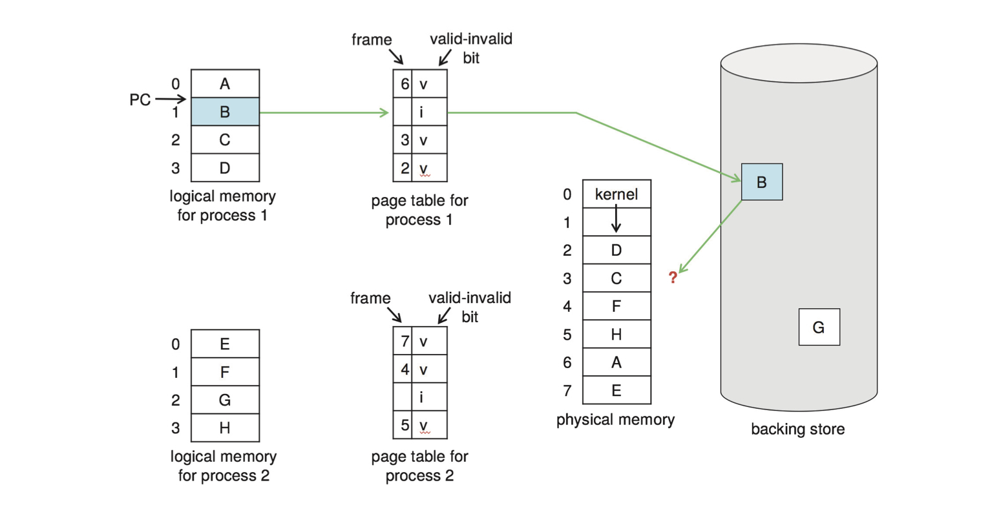
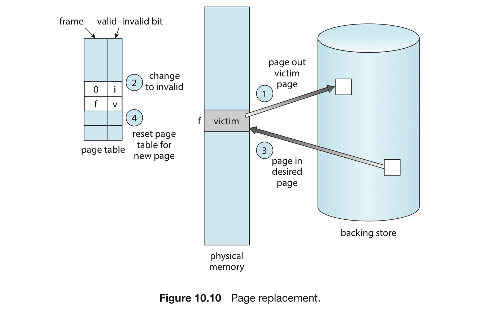
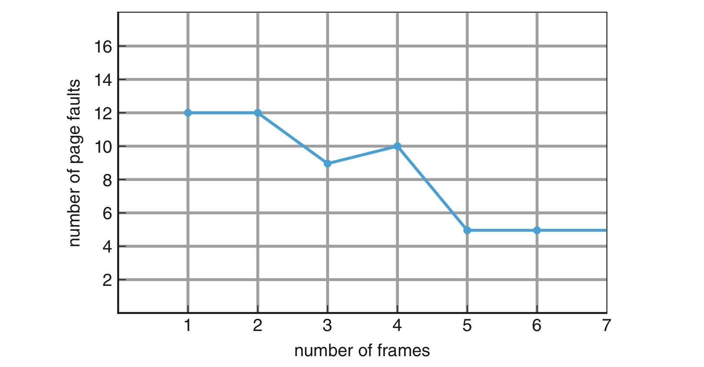
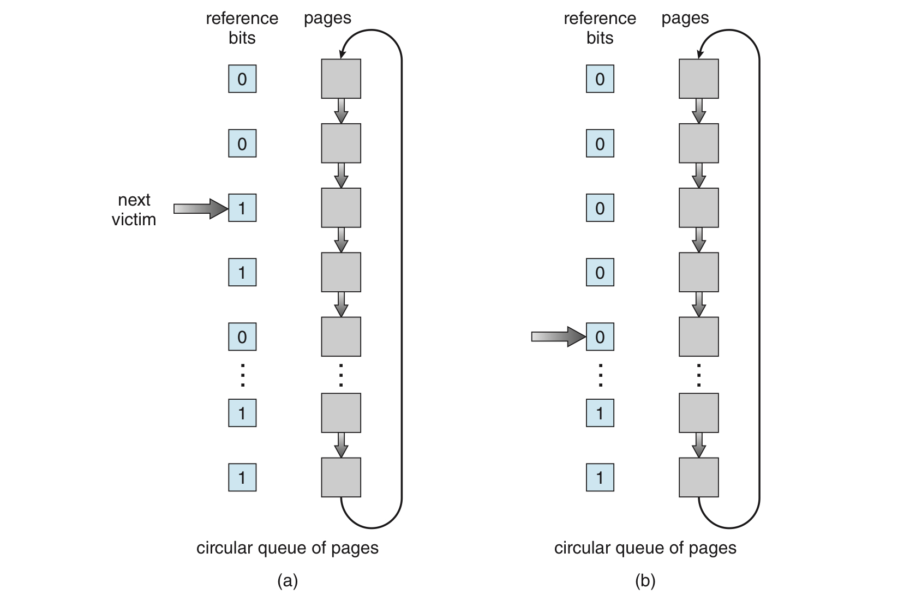

# 4. 페이지 교체

# 페이지 교체 : 개요

## 다중 페이지 폴트

- 프로세스 1개 = 10 페이지
- 10 페이지 중 실제 5페이지만 사용하는 경우
- 요구 페이징을 통해 사용 안되는 5페이지 적재를 피함

**이러한 프로세스가 여러 개 돌아간다면?**

- 처음에는 괜찮겠지만, 나중에는 메모리 과할당이 발생
- **안 쓰는 부분을 갑자기 쓸 경우 물리 메모리가 부족해짐**

**시스템 속 메모리의 용도는 다양하다.**

- 프로그램을 위해서만 쓸 순 없다.
- I/O 버퍼에도 필요하다.

**이때 운영체제는…**

1. 프로그램을 강제로 꺼버린다. → 페이징 과정이 사용자에게 들어나게 된다.
2. 표준 스와핑을 사용한다. → 너무 오버헤드가 심하다.
3. **그래서 페이지 교체와 페이지 스와핑을 사용한다.**

# 페이지 교체 : 개요

왜 필요한가?



## 기본 교체 기법



1. 희생할 페이지를 선택, 스왑 공간에 쓴다.
2. 페이지 테이블 변화
3. 원하는 페이지를 가져온다.
4. 페이지 테이블 변화

이를 고려해서 페이지 폴트가 일어날 때의 루틴을 수정해보자.

1. 보조 저장장치에서 필요한 페이지 위치를 알아낸다.
2. 빈 페이지 프레임을 찾는다.
    - 비어 있는 프레임이 있으면 그걸 쓴다.
    - 없으면 페이지 교체 알고리즘을 쓴다. (위의 항목)
3. 새롭게 얻은 프레임에 새 페이지를 읽어오고, 테이블 수정
4. 페이지 폴트가 발생한 지점에서부터 프로세스를 계속한다.

빈 프레임이 없는 경우에는 디스크를 두 번 접근

- 프레임 비울 때 1번, 읽어드릴 때 한번.
- 실질 접근 시간이 2배로 증가

**이를 감소하기 위해서 변경 비트를 사용.**

- CPU가 페이지 내의 어떠한 바이트라도 쓰게 되면 페이지가 변경되었음을 나타내기 위해 설정됨.
- 희생될 페이지가 선정되면 변경 비트 설정 여부를 확인한다.
    - 설정되어 있으면 ⇒ 현재 내용을 기록.
    - 설정되어 있지 않으면 ⇒ 현재 내용을 기록하지 않음.
- 불필요한 시간을 줄일 수 있다.

**페이지 교체 = 요구 페이징의 기본**

- 요구 페이징을 하지 않아도 논리 주소를 물리 주소로 매핑은 할 수 있음
- 그러나 모든 프로세스의 페이지는 물리 주소에 존재해야만 함
- 요구 페이징은 논리 주소 공간의 크기가 물리 메모리의 제약에서 벗어나게 해줌

## **요구 페이징 시스템의 두 가지 문제**

1. 프레임 할당 알고리즘 : 여러 프로세스가 존재할 경우 얼마나 많은 프레임을 할당해야 하는가?
2. 페이지 교체 알고리즘 : 페이지 교체가 필요할 때 어떤 페이지를 교체해야 하는가?
    - 어떠한 기준으로 페이지를 교체할 것인가?
    - 일반적으로 페이지 폴트율이 가장 낮은 것을 선정

## 페이지 교체 알고리즘의 성능 측정

크게 두 가지 방법이 있다.

1. 특정 메모리 참조 나열 (=참조열)에 알고리즘을 적용해 페이지 폴트 발생 횟수를 측정
2. 프로세스가 현재 쓸 수 있는 페이지 프레임의 수를 알아 낸다.

**참조열은 다음과 같이 만든다.**

1. 인공적으로 생성
2. 주어진 시스템을 추적, 매 메모리 참조 시의 주소를 기록

- 먼저 페이지 크기가 주어졌을 때, 주소 전체를 고려하기보다 페이지 번호만을 고려하면 된다.
- 다음으로 페이지 p에 대한 참조가 발생하면, 직후에 p에 접근하는 모든 참조는 페이지 폴트를 발생시키지 않는다.
- 1번째 참조 후 페이지는 메모리에 존재. 따라서 다음 참조들은 부재 오류를 발생시키지 않음.

**페이지 프레임의 수**

- 많을수록 페이지 폴트 횟수가 감소

# 페이지 교체 : 기법

페이지를 어떻게 교체할지 생각해보자!

## FIFO 페이지 교체

<aside>
💡 메모리에 올라온 지 가장 오래된 페이지를 교체

</aside>

- 시간을 페이지마다 기록하거나, 올라온 순서대로 큐를 만든다.
- 이해하기도, 구현하기도 쉽다
- 그러나 항상 성능이 좋지는 않다.
    - 교체된 페이지가 자주 사용되는 것이면 성능이 떨어질 수 있다.
    - 메모리 → 보조 저장장치로 갔다가 다시 페이지 폴트가 뜨고, 올리는 현상이 반복될 수 있기 때문이다.
- 벨레디의 모순 (Belady’s anomaly)
    - 프레임을 더 할당했는데 오히려 페이지 폴트가 증가하는 현상
    - 위의 현상과 연관이 있음.



## 최적 페이지 교체

<aside>
💡 앞으로 가장 오랫동안 사용되지 않을 페이지를 교체

</aside>

- 벨레디의 모순을 극복할 수 있는 알고리즘
- 할당된 프레임의 수가 고정된 경우, 가장 낮은 페이지 폴트율을 보장.
- 프로세스가 앞으로 메모리를 어떻게 참조할지를 알아야 함.
    - 따라서 실제 구현하기가 굉장히 어려움
    - 비교 연구 목적을 위해 사용.

## LRU 페이지 교체

<aside>
💡 가장 최근에 사용되지 않은 페이지가 가장 오래된 페이지라고 생각하고, 이걸 교체하자.

</aside>

- 일종의 근사 알고리즘 = FIFO와 최적의 중간점.
    - LRU = Least Recently Used
- 페이지마다 마지막 사용 시간을 유지.
- 구현방법은 크게 2가지가 있다.
    1. 계수기 : 각 페이지마다 사용시간 필드를 넣고, CPU에 시계나 계수기를 추가.
        
        메모리가 페이지에 접근할 때마다 시간이 증가. 페이지에 대한 참조가 일어날 때마다 페이지의 사용 시간 필드에 시간 레지스터 값이 복사.
        
        이 기법에서는 LRU인 페이지를 찾기 위해 페이지 테이블을 탐색해야 함.
        
        또한 메모리 참조 때마다 메모리 쓰기 작업을 필요로 함.
        
    2. 스택 : 페이지 번호의 스택을 유지하는 방법
        
        페이지가 참조될 때마다 페이지 번호는 스택 중간에서 제거되어 스택 꼭대기에 놓이게 됨.
        
        스택의 꼭대기는 항상 가장 최근에 사용된 페이지. 밑바닥은 가장 오랫동안 이용되지 않은 페이지.
        
        스택의 중간에 항목을 제거해야 하므로, 보통 이중 연결리스트로 구현
        
        어떠한 페이지를 참조해서 그것을 중간에서 꼭대기로 이동한다고 하면, 최악의 경우 6개의 포인터 값을 바꿔야 함.
        
- Belady의 모순을 일으키지 않음.
    - 이러한 알고리즘을 스택 알고리즘이라고 함.
    - n개의 프레임에 수록되는 페이지의 집합이 항상 n+1개의 프레임에 수록되는 페이지 집합의 부분집합이 되는 알고리즘.
    - 메모리 상의 페이지는 항상 n개의 가장 최근에 접근한 페이지. 프레임 수가 증가 해도 n개의 페이지는 언제나 가장 최근에 접근한 페이지.
- 양쪽 LRU 구현 방법 반드시 표준적인 TLB 레지스터 이상의 하드웨어 지원이 있어야 함.
    - 계수기 값과 스택을 갱신하는 일은 메모리 참조 때마다 수행되어야 함
    - 소프트웨어로 이걸 하면, 10배 이상 메모리 속도가 느려짐

문제는 이걸 할 수 있는 하드웨어가 드물다는 점. 그래서…

## LRU 근사 페이지 교체

<aside>
💡 참조 비트의 형태로 LRU를 따라해보자!

</aside>

모든 참조비트 = 0으로 채워짐.

프로세스가 실행되면서, 참조되는 페이지의 비트는 1로 세팅.

시간이 지나면, 어떠한 페이지가 사용되었는지 확인 가능.

### 부가적 참조 비트 알고리즘

<aside>
💡 참조비트 중 가장 최근 8비트를 확인

</aside>

- 일정한 간격(보통 8비트)마다 참조비트를 기록, 선후관계 정보를 얻음
- 일정 시간이 지나면(보통 100밀리초) 인터럽트를 건다.
- 참조 비트를 8비트 정보의 최상위 비트로 이동
    - 최상위 비트 (쉬프트 레지스터) 값에 따라 LRU 페이지인지 판단

### 2차 기회 알고리즘

<aside>
💡 FIFO + LRU 근사 (참조비트)

</aside>

1. FIFO처럼 간다.
2. 참조비트가 0이면 교체, 1이면 다시 기회를 준다.

구현은 보통 순환 큐를 이용한다.



좀 더 알고리즘을 보완하려면 참조비트와 변경비트 2개를 동시에 쓴다.

```
(참조비트, 변경비트)
(0, 0) = 사용도 안되고, 변경도 안됨 = 교체 1순위
(0, 1) = 사용은 안되지만, 변경은 됨 = 다시 가져오려면 디스크에 기록해야 함.
(1, 0) = 사용이 되었지만, 변경이 안됨 = 다시 사용할 가능성이 높음.
(0, 0) = 사용도 되고, 변경도 됨 = 다시 사용할 가능성도 높고, 가져오려면 디스크에 기록.
```

## 세기 기반 페이지 교체

페이지를 참조할 때마다 그 횟수를 세어서 판단.

물론, 최적은 아니라서 자주 쓰이지는 않는다.

### LFU 알고리즘

<aside>
💡 참조횟수가 가장 적은 페이지를 교체

</aside>

- LFU = Least Frequently Used
- 참조횟수가 높다 = 활발하게 사용된다.
- 프로세스가 특정 시점에서만 한 페이지를 집중적으로 사용할 경우 판단이 빗나갈 수 있다.
    - 참조 횟수를 일정시간마다 오른쪽으로 시프팅하면 개선할 수 있다.

### MFU 알고리즘

<aside>
💡 가장 작은 참조횟수를 가진 페이지 = 가장 최근에 참조됨.

</aside>

- MFU = most frequently used

# 페이지-버퍼링 알고리즘

페이지 교체 알고리즘과 병행해서 여러가지 버퍼링 기법을 쓸 수 있음.

1. 가용 프레임의 풀(pool) 만들기
    - 페이지 폴트가 발생하면, 교체될 페이지 내용을 디스크에 기록하기 전에 가용 프레임에 새 페이지를 먼저 읽어드림
    - 교체될 페이지가 쓰이길 기다리지 않고 프로세스가 가능한 한 빨리 시작할 수 있게 해줌
2. 변경된 페이지 리스트 유지
    - 1번 방식을 확장시킨 방법.
    - 페이징 장치에 아무 일이 없으면, 그 때마다 변경된 페이지들을 차례로 보조 저장장치에 기록.
    - 페이지 변경 비트를 0으로 돌려 놓음.
    - 페이지가 실제 교체될 때, ‘변경되지 않음’ 상태이기 때문에 쓰기 작업이 불필요.
3. 풀 속에 프레임의 원래 임자 페이지 기록
    - 풀 속의 프레임 내용 : 보조 저장장치에 썼다고 해도 수정되지 않을 확률이 높음
    - 프레임이 사용되기 전까지는 다시 사용될 수 있음.
    - 따라서, 페이지 폴트가 일어날 때 찾는 페이지가 아직도 풀에 훼손되지 않은 채로 남아 있는지 검사한 후, 만약 없으면 그때 페이지를 읽어 들임.

# 앱과 페이지 교체

## 데이터 베이스

- 나름의 메모리 관리와 I/O 버퍼링을 수행하는 중
- 운영체제가 버퍼링 기능을 사용하면, 하나의 I/O에 대해 메모리를 2배로 사용.

## 데이터 웨어하우스

- 자주 연속적으로 대량의 읽기 및 쓰기 작업 시행
- 오래된 페이지를 읽을 가능성이 더 높음.
    - 그래서 이럴 때는 MFU가 더 효과적.

## raw disk

- 이러한 문제 때문에, 몇몇 OS는 특별한 프로그램에 한해 보조 저장장치 파티션을 파일 시스템 구조가 아닌 단순한 논리적인 블록들의 순차적 배열로 쓰게 해줌.