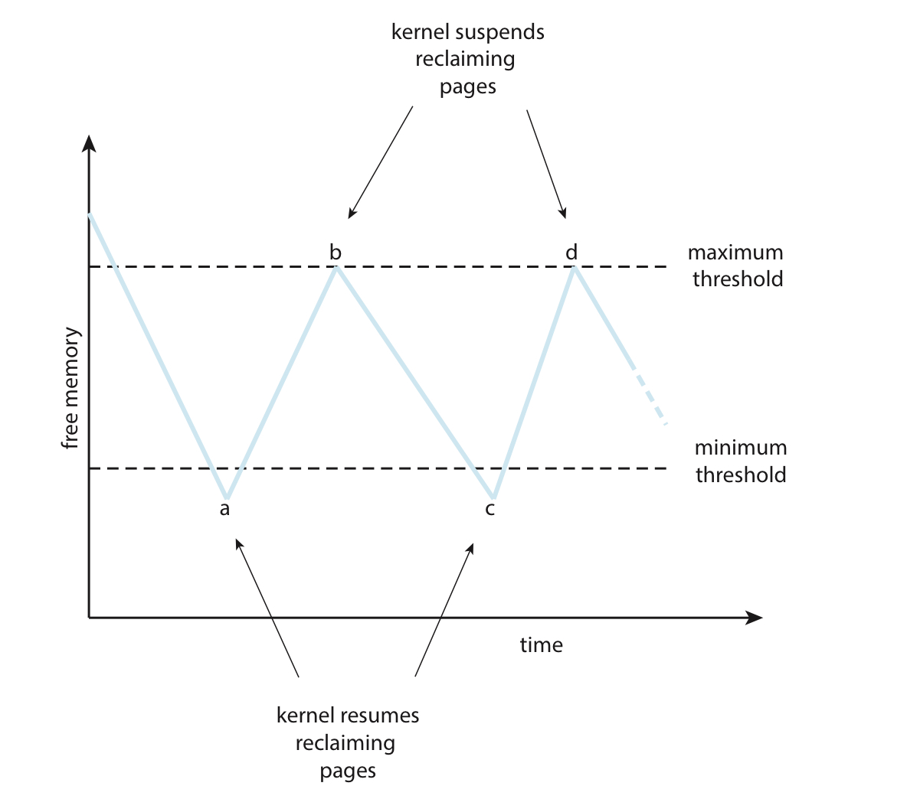

# 5. 프레임의 할당

여러 개 프로세스가 존재하고, 93개의 가용 프레임이 있다고 하자.

어느 프로세스에게 몇 개의 프레임을 할당해야 하는가?

프레임이 다 떨어질 경우를 대비해서 예비 프레임을 남겨둬야 하는가?

# 최소 할당량

메모리 할당의 제한을 알아보자.

1. 가용 프레임 수보다 더 많은 수를 할당할 순 없다.
2. 최소한 몇 페이지는 할당해야 한다.

**두 번째 제한이 필요한 이유**

1. 프레임 수가 줄면 페이지 폴트율이 증가한다.
2. 명령어 수행 중 페이지 폴트가 발생하면, 이를 재실행해야 한다.
    
    그래서 하나의 명령어가 참조하는 모든 페이지는 동시에 메모리에 올라와 있어야 그 명령어의 수행이 끝날 수 있게 된다.
    

## 최소 할당량 (프레임 수) 정하기

- 컴퓨터 아키택처에 의해 정의된다.
- 최소 할당량이 제한되는 여러가지 상황을 살펴보자.

```
주어진 아키텍쳐에서 이동 명령에 몇가지 제한을 내렸다고 가정하자.
이 경우 프레임 수의 제한이 걸릴 수 있다.

1. 이동명령 = 주어진 아키텍처에서 데이터를 이동하거나 복사하는 명령
	* 명령어에는 주소지정 모드, 어떻게 피연산자를 지정하는지 결정하는 방식이 있음.
	* 특정 주소지정 모드에서는 하나 이상의 워드(= 데이터 표현 단위)를 포함
	* 즉 이동 명령이 여러 개의 데이터를 다룰 수 있음.
=> 위와 같은 케이스에선 이동 명령이 최소 2개의 프레임에 걸쳐 있을 수 있음.

2. 간접 참조를 사용하는 경우 6개 프레임이 필요
	* 이동 명령에서 피연산자들이 간접 참조를 사용할 수 있음.
	* 이 경우 피연산자의 주소를 읽어오기 위해서 두번의 메모리 액세스 필요.
	* 따라서 최소 6개의 프레임 필요.

3. 인텔 32 / 64비트 아키텍처의 이동명령
	* 레지스터와 메모리 사이에서만 데이터를 이동할 수 있음.
	* 따라서 메모리 간 데이터 이동을 위해서는 메모리 -> 레지스터 -> 메모리로 이동.
	* 그래서 최소 프레임 수를 제한.
```

# 할당 알고리즘

n개의 프로세스, m개의 프레임이 있다고 쳐보자.

1. 균등 할당 : 각 프로세스마다 m/n개씩 프레임을 준다.
    - 프로세스별 필요한 값이 다를 수 있음
2. 비례 할당 : 각 프로세스의 크기 비율에 맞추어 프레임을 준다.
    
    ```
    프로세스 a가 있다고 해보자.
    
    a의 프레임 할당량 = (가용프레임 갯수) * (a의 크기) / (전체 프로세스의 크기)
    ```
    

두 방식 모두 다중 프로그래밍 정도에 따라 할당량이 달라진다.

- 높아지면 각 프로세스는 모두 덜 받게 된다.
- 낮아지면 각 프로세스는 모두 넉넉하게 받게 된다.

단, 이 방식 모두 우선순위와 상관 없이 배분한다

- 우선순위가 높은 프로세스에 더 많은 프레임을 분배할 수도 있다.
- 그래서 프레임 비율을 프로세스의 크기가 아닌 우선순위에 맞추거나 둘을 섞는 방법도 존재한다.

# 전역 할당 vs 지역 할당

## 정의 보기

> 
> 
> 1. **전역 할당 (Global Allocation)**:
>     - 전역 할당은 모든 프로세스가 하나의 공용 메모리 공간을 사용하는 방식입니다.
>     - 메모리는 하나의 큰 공용 메모리 풀로 관리되며, 모든 프로세스는 이 메모리 풀에서 필요한 만큼의 메모리를 할당 받습니다.
>     - 프로세스들은 서로 독립적인 메모리 공간을 가지지 않으며, 이로 인해 메모리 관리가 비교적 간단해지는 장점이 있습니다.
>     - 하지만 프로세스들이 메모리를 공유하므로, 한 프로세스의 오류가 다른 프로세스에 영향을 미칠 수 있고, 메모리 사용 충돌 등의 문제가 발생할 수 있습니다.
> 2. **지역 할당 (Local Allocation)**:
>     - 지역 할당은 각 프로세스가 독립적인 메모리 공간을 가지는 방식입니다.
>     - 메모리는 각 프로세스별로 별도의 공간을 할당하여 사용됩니다.
>     - 프로세스들이 서로의 메모리 공간에 직접 접근하는 것이 불가능하므로, 프로세스들은 서로 독립적으로 실행될 수 있습니다.
>     - 하지만 메모리 할당 및 관리에 있어서 프로세스별로 별도의 메모리 공간을 관리해야 하므로, 전역 할당에 비해 더 많은 메모리 관리 오버헤드가 발생할 수 있습니다.
- 전역 할당 상에서 페이지를 교체하는 것을 전역 교체라고 한다.
- 지역 할당 상에서 페이지를 교체하는 것을 지역 교체라고 한다.

## 전역 교체 시의 전략



1. 가용 메모리의 최대 임계값과 최소 임계값을 정한다.
2. 최소 임계값보다 떨어지면 페이지 회수를 시작하는 커널 루틴이 촉발
    - 이러한 루틴은 리퍼라고 함
    - 모든 페이지 알고리즘을 적용할 수 있음.
3. 최대 임계값에 도달하면 리퍼 루틴 중지.

만약 리퍼 루틴이 가용 프레임 리스트를 최소 임계값 이상으로 유지 할 수 없는 경우라면?

- 리퍼 루틴이 좀 더 공격적인 알고리즘을 사용할 수 있다.
- 메모리 부족(Out Of Memory, OOM) 킬러를 사용
- 프로세스별 OOM 점수를 기록, 가장 큰 것을 죽임.

# 비균등 메모리 접근

여러 개의 CPU가 있는 상황에서는 메인 메모리는 동등하게 접근되지 않는다.

특정 CPU는 메인 메모리의 일정 영역을 다른 영역보다 더 빠르게 접근할 수 있다.

이러한 시스템을 Non-uniform Memory Access, NUMA라고 한다.

NUMA는 균등 메모리 접근보다는 그 속도가 느리다.

그러나 더 많은 CPU를 수용할 수 있으므로 더 높은 처리량과 병렬처리를 달성한다.

**어느 페이지를 어느 프레임에 할당하지에 대한 정책이 NUMA의 성능에 영향을 미친다.**

- 이러한 시스템에서 메모리를 동등하게 대우하면 CPU가 메모리에 접근할 때 대기 시간이 매우 길어지게 된다.
- 이러한 모든 수정의 목표는 프로세스에게 실행 중인 CPU에 “가능한 가장 가까운” 메모리 프레임을 할당하기 위한 것
    - 가까운 = 최소 지연 시간을 가진
    - CPU와 같은 보드에 장착된 메모리를 의미

**NUMA를 고려하면, 스케쥴러는 프로세스가 마지막으로 실행된 CPU를 추적해야 한다.**

- 가상 메모리 시스템은 이때 스케쥴 된 CPU와 가까운 프레임을 할당한다.
- 그 결과 캐시 적중률이 높아지고 메모리 접근 시간이 감소한다.

**쓰레드까지 고려하면 더 복잡해진다.**

- 리눅스 커널은 스케쥴링 도메인의 계층 구조를 형성해 이 문제를 해결한다.
- 각 NUMA 노드는 별도의 가용 프레임 리스트가 있다.
    - 쓰레드는 자신이 실행 중인 노드에 대해서 메모리를 할당받는 것을 보장받는다.
- 그룹 간의 지연시간을 기반으로 하는 Igroup 계층 구조 존재.