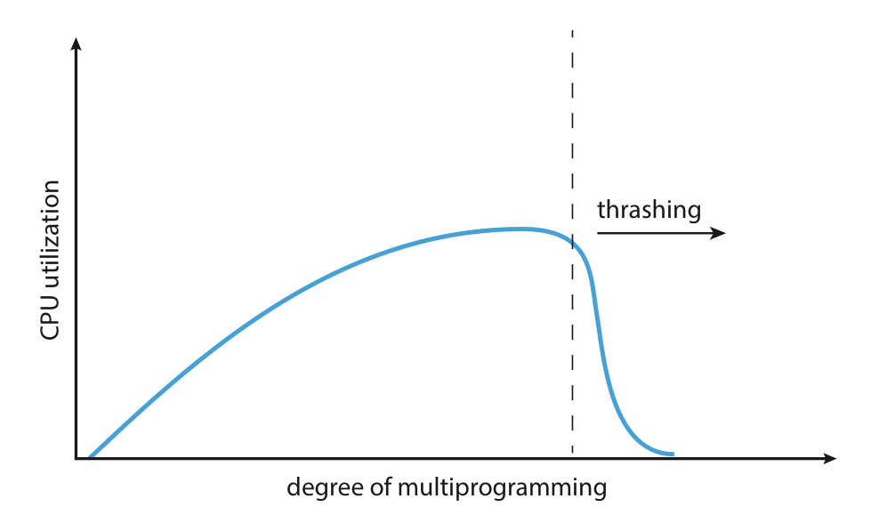
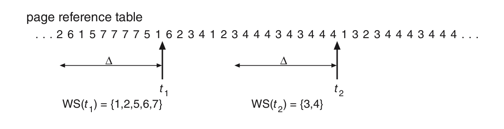
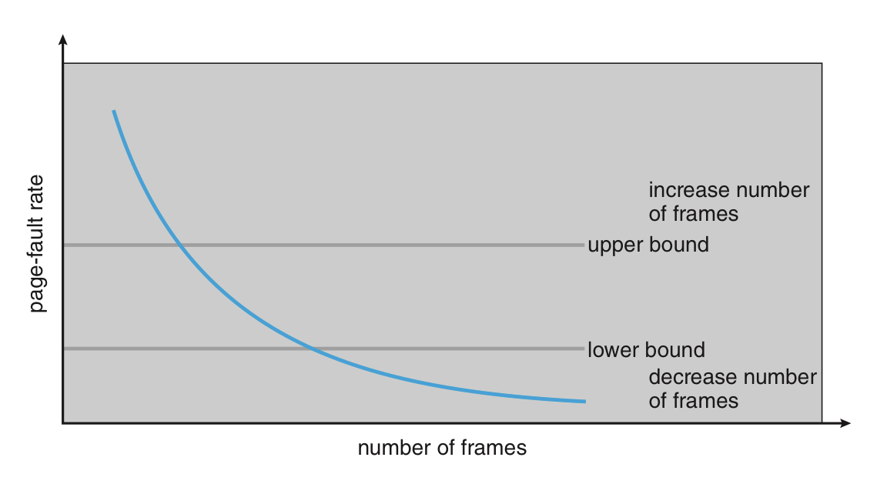

# 6. 쓰레싱

<aside>
💡 운영체제에서 발생하는 성능 문제로, 컴퓨터의 리소스가 부족한 상태에서 실행되는 프로세스들이 경쟁적으로 메모리와 스왑 공간을 점유하려고 페이지 폴트를 반복적으로 일으키는 현상.

</aside>

# 쓰레싱의 원인

프로세스는 느는데, 프레임은 부족해서 발생.

- 프로세스의 프레임 요구량이 적을 때
    - 전역 페이지 교체 알고리즘으로 망설임 없이 교체
    - 다중 프로그래밍으로 늘린다.
- 프로세스의 프레임 요구량이 많을 때
    - 타 프로세스에서 프레임을 가지고 온다.
    - 얼마 지나지 않아 타 프로세스가 페이지 폴트를 일으키고, 프레임을 가지고 온다.
    - 페이징 장치의 큐잉 진행 ⇒ 준비 큐가 비게 됨
    - CPU 이용률은 떨어짐 → 멀티 프로세싱을 더 하려고 함 → 악순환의 반복.

⇒ **실질 메모리 접근시간은 느는데, 프로세스들은 페이징에 시간을 다 써버리게 됨.**

# 작업 집합 모델



다중 프로그래밍 정도에 따른 CPU 이용률 그래프

- 어느 순간 까지는 비례하다가 쓰레싱이 일어나 반비례로 바뀜.

지역 교체 알고리즘을 이용해 쓰레싱의 영향을 제한시킬 수 있음.

- 단, 문제가 완벽히 해결되는 것은 아님
- 페이징 장치의 평균 대기열이 길어져서 페이지 폴트의 평균 시간이 늘어남.

쓰레싱을 완전히 막으려면 각 프로세스가 필요로 하는 최소한의 프레임 갯수를 보장해야 한다.

- 어떻게 각 프로세스가 필요로 하는 최소 프레임 갯수를 아는가?
- 1가지 전략으로, 프로세스가 실제로 쓰는 프레임 갯수를 아는 것이 있다.
- 이는 프로세스 실행의 지역성 모델을 기반으로 한다.

## 지역성 모델

<aside>
💡 프로세스가 실행될 때, 항상 어느 특정 지역에서만 메모리를 집중적으로 참고함을 의미

</aside>

- 지역 = 집중적으로 함께 참조되는 페이지들의 집합.
- 지역은 프로그램 구조나 그 자료구조에 의해 정의
- 지역 모델은 모든 프로그램이 지역으로 이뤄질 것이라고 가정
- 캐싱 기법의 기본 원리.
    - 특정 데이터의 참조가 어떠한 패턴도 없이 무작위적이면 캐싱은 의미가 없음.

프로세스는 현재 지역의 모든 페이지가 메모리로 올라올 때까지 페이지 폴트 발생.

이후 모두 올라오면 현재 지역이 변경되기 전까지 페이지 폴트를 발생시키지 않음.

- 지역에서 필요한 프레임보다 적은 양을 할당하면 쓰레싱이 일어남.

## 작업 집합 모델

<aside>
💡 최근 n만큼의 페이지 참조를 관찰,

</aside>

한 프로세스가 최근 n번 페이지를 참조했다고 하자.

그 안에 들어있는 서로 다른 페이지의 집합을 **작업 집합**이라고 함.



이미지에서 나와있듯, n(그림에선 델타) = 10이라고 보자.

- t1 시간에서의 작업집합은 1,2,5,6,7
- t2 시간에서의 작업집합은 3,4

**작업 집합의 정확도는 n이 결정**

- n이 너무 작으면 전체 지역을 포괄할 수 없음
- n이 너무 크면 여러 지역을 과도하게 포괄
- 그래서 집합의 크기가 중요하다.

```

전체 프로세스의 요구량 = sum(각 프로세스 별 작업 집합의 크기)

전체 프로세스의 요구량 > 총 메모리양 인 경우, 쓰레싱이 일어난다.
```

**작업 집합 모델의 특징**

- n값을 잘 설정해두면 다중 프로그래밍과 쓰래싱 방지의 조화를 맞출 수 있다.
- 그치만 작업 집합을 추적하는 것이 어렵다.
    - 작업 집합은 메모리 참조마다 한쪽에서는 새 페이지가 추가되고, 다른 쪽에서는 오래된 참조가 제외된다.
    - 작업 집합 창 내의 어디에서라도 참조되는 페이지는 작업 집합에 속한다.
- 일정 간격 타이머 인터럽트와 참조비트로 근사한 모델을 만들 수 있다.
    - 인터럽트를 걸 때마다 각 페이지의 현재 참조 비트 값을 저장. 이후 참조 비트를 0으로 재설정
    - 페이지 폴트 발생 시, 바로 앞 참조 사이에 현재 참조 비트와 앞서 저장한 2개의 참조 비트 값을 비교해봄.
        - 만약 그 페이지를 사용했다면 어느 한 비트라도 1일 것.
    - 단 완전히 정확한 것은 아님. 일정 간격 사이 어디에서 참조가 일어났는지는 알 수 없음.

# 페이지 폴트 빈도

쓰레싱 빈도를 좀 더 줄어보려는 시도.

1. 페이지 폴트율을 조사한다.
2. 너무 높으면 프로세스에 프레임을 더 준다.
    
    너무 낮으면 프로세스의 프레임을 뺏는다.
    



# 현재 관행

쓰레싱과 스와핑을 피하는 가장 좋은 방법은 결국 충분한 물리 메모리 장착!