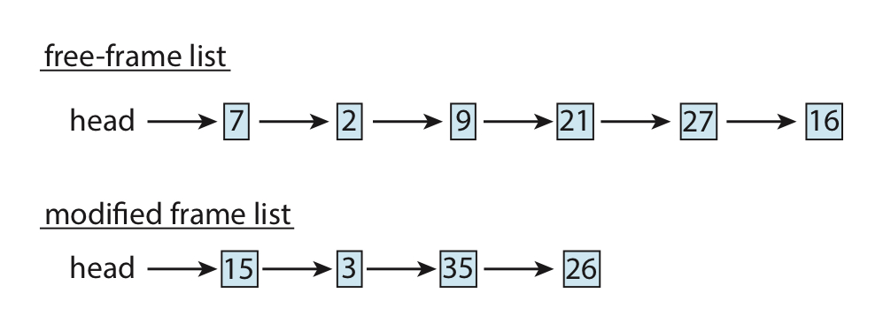
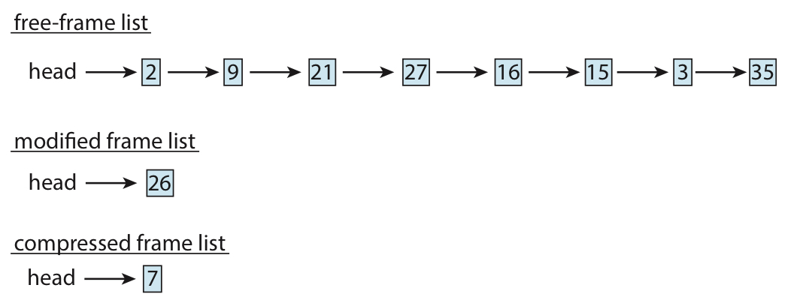

# 7. 메모리 압축

## 메모리 압축이란?

<aside>
💡 페이지 스와핑 대신, 여러 페이지들을 하나의 페이지로 압축하는 기법

</aside>

스와핑을 하지 않고도, 메모리 사용량을 줄일 수 있다.

압축 전 메모리의 모습

압축 후 메모리의 모습

## 모바일 시스템

일반적으로 스와핑 대신 메모리 압축을 쓴다.

- 최신 윈도우 ⇒ UWP에서 메모리 압축을 지원
- macOS ⇒ 먼저 압축을 시도 후 안되면 스와핑(LRU)
    - 메모리 압축이 페이징보다 더 빠르다고 함.

압축된 페이지를 위한 새 프레임을 마련해야 하긴 함.

그럼에도 메모리량이 상당히 줄어듬.

압축에 쓰는 알고리즘의 속도와 감소량 상의 경합 (서로 반비례하다)을 잘 체크해서 설계.

현재 알고리즘은 두 요소의 균형을 맞추어서 높은 앞축비율을 달성.