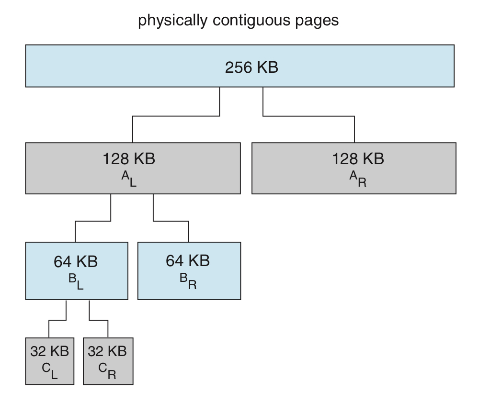
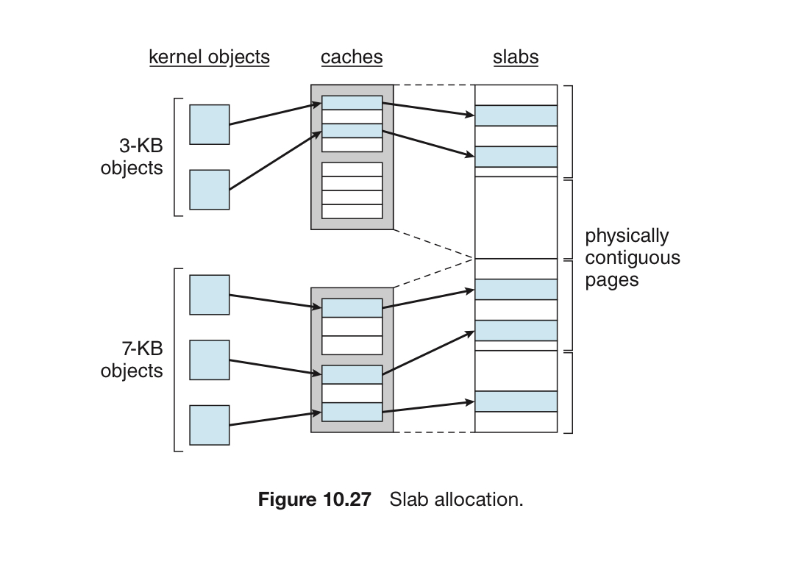

# 8. 커널 메모리의 할당

# 커널 메모리의 할당

지금까지 봤던 대로 사용자 모드의 프로세스는 다음과 같이 동작한다.

- 부족하면 더 달라고 한다.
- 물리 공간 상에 흩어진 페이지로 채워진다
- 내부 단편화가 생긴다.

그러나 커널 모드의 프로세스는 사용자 모드의 프로세스와 다르게 할당받는다.

1. 커널은 다양한 크기의 자료구조를 위해 메모리를 할당받는다.
    
    이 자료구조는 페이지보다 작을 수도 있음. 그 때문에 커널은 메모리를 조심히 다뤄야 하고 단편화에 대한 낭비를 최소화하고자 함.
    
    많은 운영체제가 커널 코드나 데이터를 페이징하지 않기 때문에 더 중요.
    
2. 커널 속 특정 하드웨어 장치는 물리적으로 연속된 메모리가 필요할 수 있다.

## 버디 시스템

연속된 페이지로 이어진 고정된 크기의 세그먼트로부터 메모리를 할당

- 이러한 세그먼트를 버디라고 함.
- 메모리는 이 세그먼트로부터 2의 거듭제곱 만큼 할당됨.
- 2의 거듭제곱이 아닌 경우에는 올림해서 할당

버디 시스템의 장점 = 합병이 쉽다. 속도가 빠르다

- 서로 인접한 버디 끼리 쉽게 합칠 수 있다.

버디 시스템의 단점 = 단편화에 의한 낭비가 발생한다.

## 슬랩 할당

- 슬랩 = 하나 또는 그 이상의 연속된 페이지.
- 캐시 = 슬랩이 모인 단위.

각 커널 자료구조마다 하나의 캐시가 존재함.

- 프로세스 디스크립터용 캐시, 파일 객체를 위한 캐시 등등…

초기에는 free 객체들이 캐시에 할당

객체가 필요하면 free를 캐시로부터 할당. 할당된 캐시는 used로 표시

**슬랩은 3가지 상태로 구성.**

1. full : 슬랩 내 모든 객체가 used
2. empty : 슬랩 내 모든 객체가 free
3. partial : used와 free가 섞임

**슬랩 할당기의 장점**

1. 단편화에 의해 낭비되는 메모리가 없음.
    
    각 커널 자료구조가 그에 해당하는 캐시를 가지고, 각 캐시는 그에 의해 처리되는 객체의 크기로 나눠진 덩어리들로 구성됨. 단편화 걱정을 할 필요가 없음.
    
2. 메모리 요청이 빠르게 처리됨.
    
    할당과 해제가 빈번한 자료구조 객체를 관리할 때 특히 효율적임.