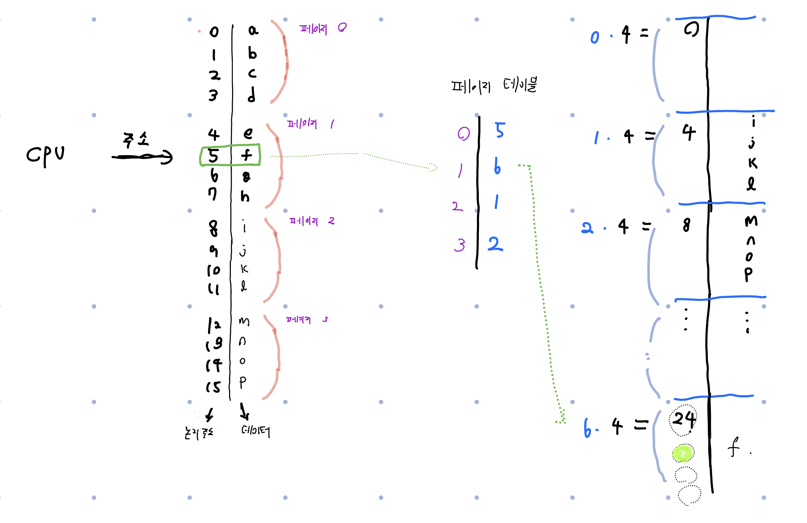

# 3. 페이징 (paging)

설명: 프로세스의 메모리 할당 방식 (2)

# 기본 방법

기존의 연속 메모리 할당 구조는 다음과 같다.


- hole 중에서 안 쓰는 부분이 많아진다 : 외부 단편화
- hole 하나하나 마다 남는 부분이 생긴다 : 내부 단편화

## 페이징 : 전체 구조

이를 극복하기 위해 세부적인 구조를 추가한 것이 **페이징.**


일단 그림을 보고 이해해 보자.

1. CPU가 내보내는 모든 주소는 **페이지 번호 p와 페이지 오프셋 d**로 나눠진다.
2. MMU는 페이지 테이블에서 **페이지 번호 p를 프레임 번호 f로 바꾼다.**
3. 물리 메모리에서 올바른 주소를 프레임 번호와 오프셋으로 찾는다.

오프셋 : 각 프레임 내에서 주소를 표현해 줄 때 쓰는 요소.

## 페이징 : 이론 보기

우선적으로 몇 가지 용어를 정리해 보자.

- 논리 메모리를 쪼갠 것을 페이지
- 물리 메모리를 쪼갠 것을 프레임

페이지는 파일 시스템 또는 예비 저장장치로부터 사용 가능한 메인 메모리 프레임으로 적재.

이를 통해 논리 주소 공간을 물리 주소 공간으로부터 완전히 분리할 수 있음.

그래서, 32비트 운영체제에서도 64비트 프로세스로 이뤄진 논리 주소 공간을 사용 가능.

각 페이지의 크기는 하드웨어에 의해 정해짐.

- 2의 거듭제곱이 기준. 일반적으로 4KB ~ 1GB 사이.
- 2의 거듭제곱으로 크기를 지정함으로써 논리 주소를 페이지 번호 및 오프셋으로 쉽게 변환 가능.
    - 논리 주소 공간 크기 : $2^m$ 이고, 페이지 크기 : $2^n$ 라고 쳐보자.
    - 이 경우 논리 주소의 상위 m - n 비트는 페이지 번호를 지정.
    - n 하위 비트는 페이지 오프셋을 지정.


## 페이징 : 예시



다음과 같은 상황에서 논리 주소 5가 어떻게 실제 주소 24로 바뀌는지 보자.

```c
논리 주소 5
- 큰 단위 (페이지 -> 프레임) 으로 바꾸는 것은 5 / 4 를 이용.
- 작은 단위 (오프셋)을 결정하는 것은 5 % 4 를 이용.

페이지 번호가 m - n 비트라는 것을 생각해보자.
그리고 n 하위 비트가 오프셋이라는 것을 생각해보자.
```

1. 논리 주소가 주어진다.
2. 페이지 번호를 구한다. `공식 = (논리 주소) / (페이지 크기)`
3. 오프셋을 구한다. `공식 = (논리 주소) % (페이지 크기)`
4. 페이지 번호 ⇒ 프레임 번호로 바꾼다.
5. 프레임 번호 + 오프셋 = 물리 주소.

## 페이징의 특징

- 모든 놀고 있는 프레임이 프로세스에 할당된다.
    - 남아도는 프레임 (=외부 단편화) 이 없다.
- 그러나, 각 프레임 안에 빈 부분 (= 내부 단편화) 은 생길 수 있다.
    - 할당이 항상 프레임의 정수배로 이뤄지기 때문
    - ex. 72766 바이트의 프로세스, 1페이지 = 2048바이트
        
        35개 페이지 할당 후 1개의 페이지 추가 할당. 이때 추가된 1개는 그 공간이 남음.
        
- 프로세스의 크기가 페이지와 상관없다면, 평균 프로세스 당 반 페이지의 내부 단편화가 예상
    - 작은 페이지 크기가 나아보인다.
    - 다만, 이 경우 페이지 테이블의 크기가 커지며, 이 테이블이 공간을 많이 차지한다.
    - 디스크의 입장에서는 페이지의 크기가 클수록 효율적.
- 페이지 크기는 컴퓨터의 발전과 함께 커져 옴.
    - 어떠한 운영체제는 여러가지 페이지 크기를 허용하는 경우도 있음.
    - 일반적으로 32비트 CPU에서는 4바이트라고 보면 됨.
    - 32비트 엔트리면 2^32개의 물리 페이지 프레임을 가리킬 수 있음.
    - 프레임 크기가 4KB = 2^12 비트면, 4바이트 크기의 엔트리는 2^44비트 개의 물리 주소를 저장할 수 있음.
    - 물리 메모리의 크기는 프로세스의 최대 논리적인 크기와는 다르다는 것을 주의해야 함.
- 다시 프로세스가 실행되는 과정을 살펴보면…
    1. 프로세스의 크기가 페이지 몇 개 분량인지 검사
    2. n개가 필요할 때, n개를 할당할 수 있으면 n개를 할당
    3. 프로세스의 처음 페이지가 할당된 프레임 중 하나에 적재.
    4. 프레임 번호가 페이지 테이블에 기록
    5. 3번 → 4번을 끝날 때까지 반복.
- 페이징으로 인해 메모리에 대한 사람의 인식과 컴퓨터의 인식이 서로 다름.
    - 사람 : 메모리가 하나의 연속적 공간. 메모리에는 프로그램이 있음.
    - 기계 : 프로그램 = 여러 곳에 프레임 단위로 분산.
    - 논리 주소 ⇒ 물리 주소를 통해 사용자 프로세스는 자기가 가진 공간만 접근.

## 프레임 테이블

운영체제가 결국 물리 메모리를 관리.

- 따라서 물리 메모리의 상태를 저장할 공간이 필요
- 이를 프레임 테이블이라고 함. (시스템 당 1개)

운영체제는 모든 프로세스의 주소를 실제 주소로 바꿀 수 있어야 함.

- 각 프로세스의 페이지 테이블 사본을 저장.
- 해당 사본으로 논리 주소에 대응하는 물리주소를 직접 사상해야 할 때마다 이용
- CPU 디스패처가 하드웨어 디스패처 테이블을 설정하는데 사용
    - 즉 페이징은 문맥 교환 시간을 늘림.

# 하드웨어 지원

페이지 테이블 = 자료구조

- 페이지 테이블에 대한 포인터는 각 프로세스의 프로세스 제어 블록에 다른 레지스터 값과 함께 저장.
- 프로세스 선택 ⇒ 사용자 레지스터를 다시 적재 ⇒ 저장된 사용자 페이지 테이블로부터 적절한 하드웨어 페이지 테이블값을 적재.

## 페이지 테이블의 구현

CPU 안에 넣을수도, 메모리에 넣을 수도 있다.

1. 레지스터를 사용한다.
    - 각각의 레지스터가 문맥 교환 중에 교체되어야 하므로 문맥 교환시간을 증가시킨다.
2. 페이지 테이블을 메인 메모리에 저장하고, PTBR로 하여금 페이지 테이블을 가리키게 한다.
    - PTBR = page-table base register (페이지 테이블 기준 레지스터)

## 구현 1 : PTBR


- 다른 페이지 테이블을 사용하려고 하면, 단지 PTBR을 변경하기만 하면 된다.
- 그런데, 이 구조에서는 페이지 테이블이 메모리에 있다.
    - 페이지 테이블을 참조하기 위해 메모리를 1번 접근
    - 페이지를 참조하기 위해 또 메모리를 1번.
- 즉, 메모리에 접근하는 시간이 2배로 늘어난다.


## 구현 2 : TLB

<aside>
💡 TLB = translation look-aside buffer (**변환 색인 버퍼)**

</aside>

이러한 문제를 해결하기 위해 TLB라는 캐시 메모리를 활용한다.

TLB 내부는 key(=페이지 번호)와 value(=프레임 번호)로 구성되어 있음.

작동 방식은 다음과 같다.

1. 어떠한 페이지를 찾아달라는 요청이 들어온다.
2. 동시에 여러 개의 key와 요청을 비교한다.
3. 발견 시 그에 대응되는 value를 알려준다.

**TLB를 좀 더 빠르게 만들 순 없을까?**

- TLB의 크기를 작게 유지. 32~1024개의 항목을 유지.
    - **즉, 전체 테이블 중 일부만 TLB에 들어간다.**
- 명령어와 데이터의 주소를 저장하기 위한 개별적인 TLB를 만든다.
- 여러 층의 TLB를 가진 시스템을 만든다.
- 결국 CPU 기술의 발달과 연관되어 있다.

**페이지 번호가 TLB가 없으면?**

- 이를 TLB 미스라고 함. (있으면 TLB 히트라고 함.)
- 그냥 기존에 하듯 페이지 테이블을 이용함.


**TLB가 꽉 차면?**

- 기존 항목 중 일부를 교체
    - 라운드 로빈, 무작위 등 다양한 정책 사용
- CPU 중 일부는 운영체제가 교체를 허용하기도 하고, 자신이 직접 할 수도 있다.

**TLB에 프로세스의 정보를 담을 순 없을까?**

- 이를 ASID(address-space identifiers, 주소공간 식별자)라고 함.
- ASID로 해당 TLB 항목이 어느 프로세스에 속한지를 할 수 있음.
    - ASID가 맞지 않으면, TLB 미스로 처리함.
- 이를 통해 한 TLB 안에 여러 프로세스의 정보를 동시에 한 번에 보관할 수 있다.
- ASID가 없다면, 새 프로세스가 실행될 때마다
    - 새 페이지 테이블을 선택하고
    - TLB를 전부 비워줘야 한다. (=flush)

**TLB를 쓸 때 실제 메모리 접근시간은 얼마일까?**

- 우선 **적중률(hit ratio)**를 생각해 보자.
- 만약 TLB에 있다면 : TLB에서만 찾으면 된다.
- TLB에 없다면 : 페이지 테이블에 접근 + 메인 메모리에서 읽기

```bash
적중률 = 80% 라고 하자.
이때, 실제 메모리 접근 시간은...

0.8 * (TLB 접근 시간) + 0.2 * (페이지 테이블 접근 + 메인 메모리 읽기)
```

물론 실제 현대의 CPU는 더 많은 TLB를 가지고 있기 때문에 더 계산이 복잡.

**근데 TLB는 하드웨어 아닌가? 왜 신경써야 하지?**

- 당연히 운영체제와 설계자에게는 영향을 안 미침
- 그치만 최적의 동작을 위해서 운영체제는 이에 다른 설계를 구현해야 함.
- **TLB에 따라 운영체제의 페이징 기법이 달라짐.**

# 메모리 보호

페이징 환경에서 메모리를 보호하는 방법

## 1. 보호 비트

- 각 페이지에 붙어있는 비트. 페이지 테이블에도 속해 있음.
- 읽기 & 쓰기 / 읽기 전용을 각각 정의할 수 있음.
- 쓰기 허용 같은 부분을 검사할 수 있음.
    - 쓰기가 안되는데 쓰기를 시도하면 운영체제가 트랩을 걸어줌.

## 2. 유효/무효 비트


페이지 테이블의 각 엔트리에 하나씩 더 붙어있는 비트

- 비트가 유효 : 관련된 페이지가 프로세스와 연관이 있음.
- 비트가 무효 : 관련된 페이지가 프로세스와 연관이 없음.
- 이를 이용해 접근 허용을 결정.

## 3. 페이지 테이블의 길이

페이지 테이블의 길이를 제공하는 PTLR이라는 레지스터가 있다.

프로세스가 제시한 주소가 이 범위 안에 들어가는지 PTLR을 이용해 검사한다.

# 공유 페이지

페이징의 장점 = 공통의 코드를 공유 가능.

**페이징이 없다면?**

- 프로세스 5개가 있고, 전부 C언어로 만들어졌다고 보자.
- 각 프로세스는 C언어 라이브러리인 `libc`를 사용한다.
- 각 프로세스가 `libc` 사본을 가지고 있어야 한다.

**페이징이 있다면?**


코드가 재진입 코드일 경우 그림과 같이 설계를 할 수 있다.

재진입 코드는 실행 중에는 절대 변경되지 않음.

- 따라서 2개 이상의 프로세스를 실행 가능

표준 라이브러리 = 물리 메모리에 하나의 사본만 저장

각 프로세스의 페이지 테이블을 여기에 매핑.

라이브러리 사본 1개로 프로세스 5개가 `libc`를 쓸 수 있음.