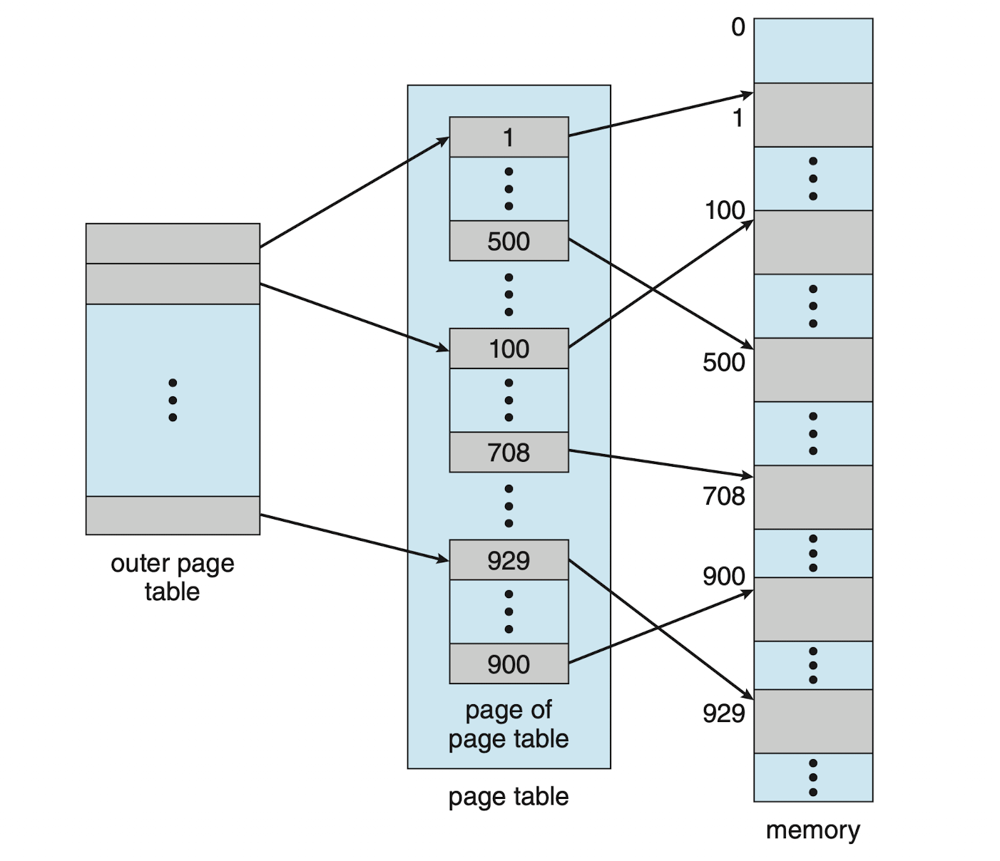
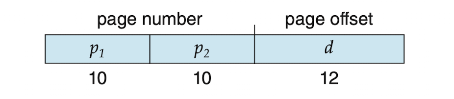
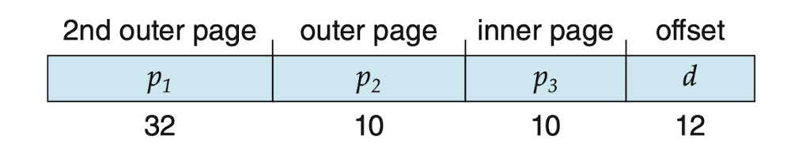
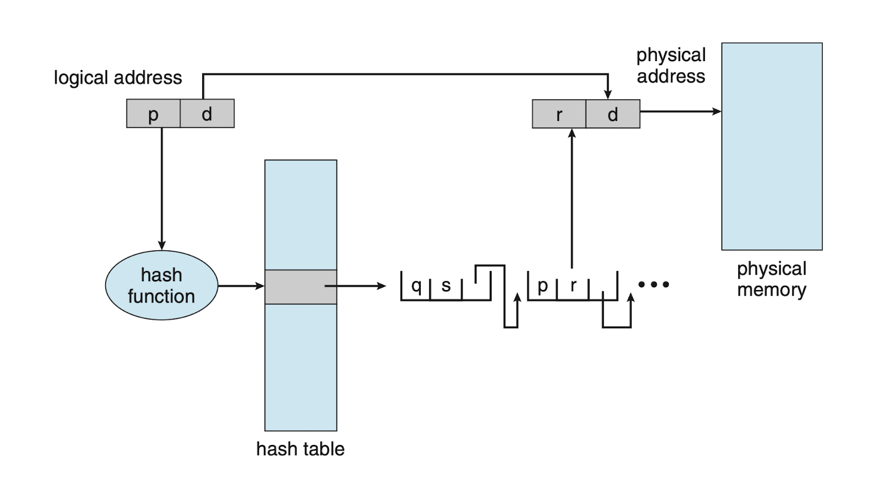
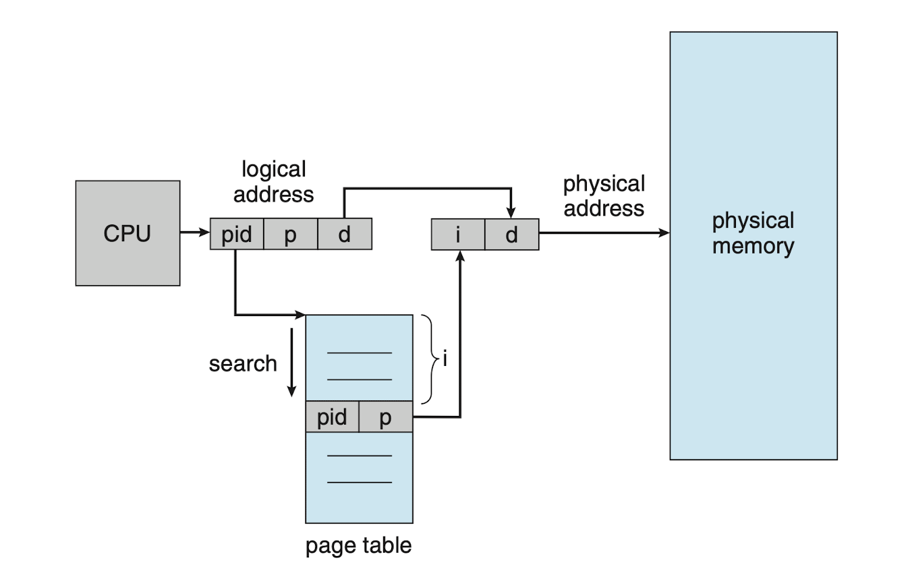

# 4. 페이지 테이블의 구조

설명: 페이지 테이블의 구조

페이지 테이블의 구조에 대해서 알아보자.

# 계층적 페이징

⇒ 페이지 테이블 안에 또 페이지 만들기



## 왜 생겼는가?

- 현대 컴퓨터 메모리(RAM)의 크기가 너무나도 커졌기 때문에 페이지 테이블도 이에 맞추어야 하는데, 이를 위해 나온 여러가지 구조 설계법이라고 할 수 있다.
- ex. 한 페이지 = 4KB, 전체 RAM = 2^32 라고 치자.
    
    전체 페이지는 100개, 페이지 테이블은 4바이트 * 100.
    
    페이지 테이블을 위해서라도 4MB가 필요하다.
    
- 그래서 페이지 테이블을 여러가지 작은 조각으로 나눈다.

## 작동방식

32비트 시스템이라고 가정해보자.

다음과 같이 페이지 테이블이 2개가 있다고 가정한다.


이때 하나의 논리 주소는 다음과 같이 구성된다.



- p1 : 바깥 페이지 테이블의 인덱스
- p2 : 안쪽 페이지 테이블의 인덱스
- d : 페이지 테이블의 offset

주소 변환을 바깥에서 안쪽으로 진행하는 방식이라 forward-mapped 페이지 테이블이라고도 부른다.

## 한계점

64비트를 가정해보자.

1. 페이지 테이블을 2개 만든다.

```
하나의 페이지 = 2^12 = 4KB
페이지 테이블 = 2^52

안쪽 페이지 테이블 = 1페이지 or 2^10개의 4바이트 항목.
바깥 페이지 테이블 = 2^42 항목, 2^44 바이트
--> 바깥 페이지 테이블을 작게 나눠야 한다.
```

1. 페이지 테이블을 3개 만든다. (1차 → 2차 → 3차)



바깥 테이블은 여전히 2^34 바이트를 요구한다.

그런데, 점점 페이징 횟수가 늘어나는 것을 볼 수 있을 것이다.

이는 너무 많은 메모리 접근을 요구하며 비현실적이다.

# 해시 페이지 테이블

⇒ 해시함수를 이용해서 연결하는 방법



## 작동 원리

해시 페이지 테이블의 각 항목은 연결리스트를 가지고 있음.

각 원소는 3개의 필드를 가진다.

1. 가상 페이지 번호
2. 대응되는 페이지 프레임 번호
3. 연결 리스트 상의 다음 원소 포인터

알고리즘은 다음과 같이 작동한다.

1. 페이지 번호를 해싱한다.
2. 연결리스트를 따라가며 1번째 원소와 가상 페이지 번호를 대조한다.
3. 일치되면 그에 대응하는 페이지 프레임 번호를 가져온다.
    
    일치되지 않으면 다음 원소로 넘어간다.
    

64비트에서는 클러스터 페이지 테이블 사용

- 가리키는 페이지의 갯수가 늘어남.
- 즉, 한 개의 페이지 테이블이 여러 페이지 프레임에 연결됨.

메모리 액세스가 비연속적이면서 전 주소 공간으로 넓게 퍼져 나가는 주소 공간에서 유용.

# 역 페이지 테이블

⇒ 메모리에 고정된 크기를 가진 1개의 테이블만 두는 방법. 



## **왜 생겼는가?**

- 보통 프로세스는 페이지 테이블을 가짐.
- 페이지 테이블은 프로세스가 사용하는 페이지마다 하나의 항목을 가짐.
- 문제는 이 페이지 테이블 항목의 갯수가 수백만 개가 넘을 수 있다는 것.
- 물리 메모리를 너무 많이 사용할 수 있음.

그래서, 페이지 테이블의 크기를 줄이기 위해 나온 기법이다.

## 작동방식

- 논리 주소를 pid, 페이지 번호, 오프셋으로 구성
- 물리 주소는 메모리 프레임 번호와 오프셋으로 구성.

논리 페이지마다 항목을 가지는 대신 물리 프레임에 대응되는 항목에만 테이블을 저장.

이렇게 페이지 테이블의 크기를 줄인다.

## 치명적인 단점

1. 메모리 공유 불가
    - 모든 페이지와 프레임은 일대일 대응
    - 따라서 같은 프로세스 안에서도 페이지가 다르면, 데이터 공유가 불가.
2. 페이지 테이블 참조 : 오버헤드
    - 주소를 매핑(=사상)하는 것은 굉장히 빈번하게 일어남
    - 매핑을 할 때마다 ‘pid / p’ 값을 찾아야 함.
        - 인덱스가 프레임 위치 그 자체
        - 따라서 논리적 주소로 바로 접근할 수 없음.