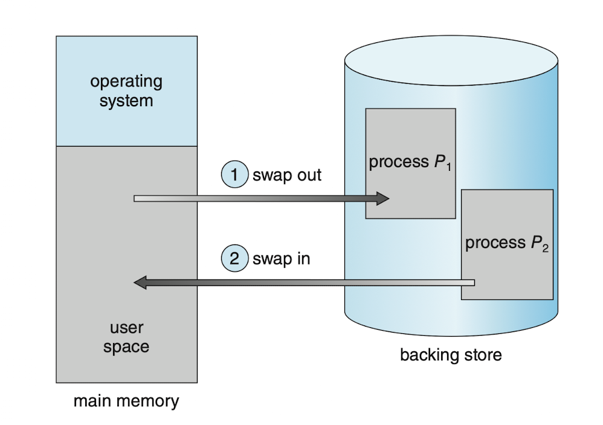

# 5. 스와핑

# 스와핑이란?

프로세스끼리 왔다갔다 하는 것을 **스와핑**이라고 함!

이때, 프로세스의 일부(또는 전체)는 임시로 백업 저장장치로 보내졌다가 다시 메모리로 돌아올 수 있음.

위 그림과 같은 방식의 스와핑을 **표준 스와핑**이라고 함.

**백업 저장장치**

- 보조 저장장치 중 일반적으로 속도가 빠른 것.
- 프로세스의 크기에 상관없이 커야 함
- 메모리 이미지에 직접 액세스 할 수 있어야 함.

**스와핑의 장점**

- 실제 물리 메모리보다 더 많은 프로세스를 수용가능
- 대부분의 시간을 유휴 상태로 있는 프로세스가 스와핑의 대상

# 페이징에서의 스와핑

표준 스와핑 : 이동의 대상이 프로세스 전체. 너무 느림.

그래서, 프로세스 중 일부 = 페이지를 스와핑하는 방법을 생각해 보게 됨.

(이러한 변형 스와핑 자체를 페이징이라고도 함.)

페이지를 메모리 → 백업 저장장치 : 페이지 아웃

페이지를 메모리 ← 백업 저장장치 : 페이지 인

# 모바일에서의 스와핑

스마트폰과 태블릿에서는 스와핑을 지원하지 않는다.

- 보통 플래시 메모리를 쓰기 때문
- 플래시 메모리는 쓰기 횟수가 제한적임.
- 플래시 메모리의 양도 제한적임.

## iOS의 대안

가용 메모리가 정해진 임계값보다 떨어지면, App에게 메모리를 반환하라고 요청

App은 주어진 메모리 중 줄 것과 주지 않을 것을 구분.

- 읽기 전용 데이터(ex. 코드) : 반환 가능
    - 나중에 플래시 메모리로부터 적재될 수 있음.
- 변경된 데이터(스택) : 절대 제거 불가.

메모리를 줘도 가용메모리가 부족하면, 아예 App을 꺼 버림.

## Android의 대안

가용 메모리가 부족하면, 강제로 App 종료 가능

종료 전 App 상태를 플래시 메모리에 저장, 나중에 빠르게 재시작 가능.