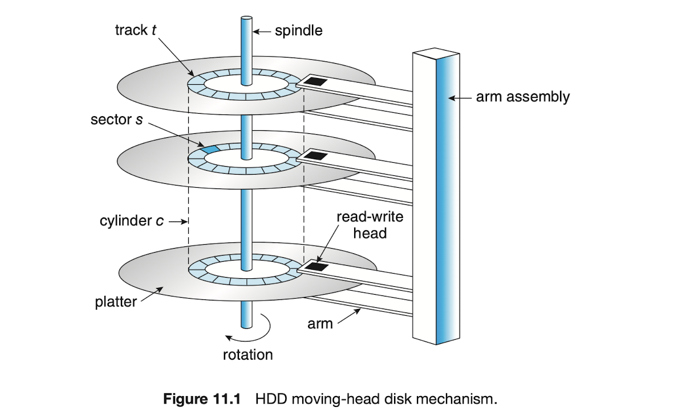
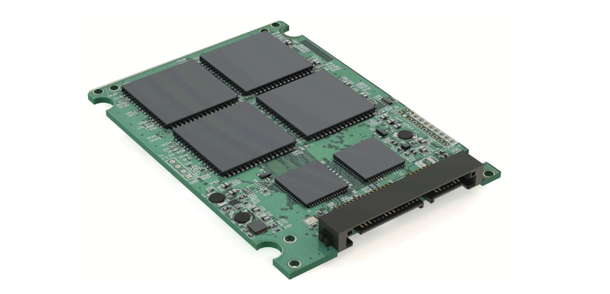

# 1. 대용량 저장장치

대용량 저장장치의 구조에 대해서 알아보자.

주로 하드디스크(HDD)와 비휘발성 메모리(NVM)에 대한 이야기.

# 하드디스크

다음과 같이 생겼다.

- CD처럼 생긴 부분은 **플래터**라고 한다.
    - 플래터는 자기 물질로 덮여있다.
    - 정보를 플래터에 자기적으로 기록하여 저장하고, 패턴을 감지해 정보를 읽는다.
- CD를 긁을 것 같은 바늘을 **암(arm)**이라고 한다.
    - 검은색 부분을 **읽기-쓰기 헤드**라고 한다.
    - **암(arm)**들이 걸려있는 부분을 **암 어셈블리**라고 한다.
- CD를 고정하는 부분을 **스핀들**이라고 한다.

플래터의 구조를 자세히 파보자.

- 플래터를 껍질처럼 나눠놓은 것을 **트랙**이라고 한다.
- 트랙을 쪼개 놓은 것을 **섹터**라고 한다.
    - 하나의 트랙은 수백 개의 섹터를 포함할 수 있다.
    - 1섹터의 크기: 과거 512byte, 이후 4kb.
- 동일한 암(arm)위치에 있는 **같은 반지름의 트랙들**을 **실린더**라고 한다.
    - 하나의 디스크 드라이브에는 수천 개의 동심원 실린더가 존재할 수 있다.

## 작동방식 & 성능측정

**작동방식** : 디스크 드라이브 모터를 고정으로 회전해서 데이터를 읽음.

- 대부분의 드라이브 : 분당 회전수(RPM)으로 표현
- 초당 60~250회 회전. RPM 5400, 7200, 10000, 15000
- 이러한 회전 속도는 전송 속도와 관련이 있음.

일부 드라이브는 사용하지 않을 때 전원이 꺼지고, I/O 요청을 받으면 회전.

**성능을 측정하는 단위**

1. 전송 속도 : 드라이브와 컴퓨터 간 데이터 흐름의 속도
2. 위치 지정 시간 (=임의 액세스 시간)
    1. 탐색 시간 : 디스크 암을 원하는 실린더로 이동하는데 필요한 시간
    2. 회전 지연 시간 : 원하는 섹터가 디스크 헤드 위치까지 회전하는 데 걸리는 시간

일반적인 디스크는…

- 초당 수백 메가바이트의 데이터를 전송
- 수 밀리초 정도의 탐색 시간 & 회전 지연 시간을 가짐.

성능을 향상시키기 위해 DRAM 버퍼를 사용.

## 이외 특징

- 읽기-쓰기 헤드가 디스크(플래터) 표면에 직접 닿지는 않음.
    - 이 사이에 공기나 헬륨과 같은 가스가 미세하게 얇은 층을 이루고 있음.
- 만약 닿을 경우 디스크 표면에 손상이 일어나며 이를 **헤드 충돌**이라고 함.
    - **헤드 충돌** 발생시에는 전체 디스크를 교체해야 함.
    - 디스크의 데이터는 RAID나 타 저장장치로 보호하지 않는 이상 무조건 손상됨.
- 하드디스크 자체는 밀봉되어 있음.
    - 일부 섀시(뼈대)는 시스템 또는 저장장치 섀시를 종료하지 않고도 제거 가능

> **디스크 전송률**

디스크에 써 있는 성능 수치 ≠ 실제 성능 수치
ex. 명시된 전송률 > 실질 전송률

전송률 = 읽기-쓰기 헤드가 플래터에서 비트를 읽는 비율
그치만 실제 전송률은 운영체제에 블록이 전달되는 비율도 포함.
따라서 두 값이 달라질 수 밖에 없음.
> 

# 비휘발성 메모리

**non-volatile memory(nvm)**

## 모양, 구조, 예시

이렇게 생겼다.

**NVM의 구조**

- 하드디스크의 섹터 = 페이지.
- 페이지를 모은 것 = 블록.

**NVM의 사용예시**

- 하드디스크를 대체할 용도로 쓰이면 = SSD
- 들고 다닐 수 있게 만들면 = USB 드라이브 또는 DRAM 스틱
- 스마트폰의 저장장치 = 마더보드에 표면 부착

## 여러가지 특징

1. 전기식이다
    - 컨트롤러 + 저장용 플래시 낸드(NAND) 반도체 칩
    - 움직이는 부품이 없다 = 안정성이 높다
    - 전력 소모량도 적다.
2. 속도가 빠르다.
    - 움직이는 부품이 없기 때문.
    - 탐색 시간이나 회전 지연시간이 없다.
3. 좀 가격이 비쌌다.
    - 초기 가격은 상당히 높았음.
    - 지금은 대중화 된 편.
4. 시스템 버스에 직접 연결한다.
    - 하드디스크보다 더 빠르므로, 표준 버스 인터페이스가 오히려 속도를 제한할 수 있다.
    - 따라서 시스템 버스(ex. PCIe)에 직접 연결하도록 설계
5. 자체적인 저장 및 신뢰성 문제를 가짐.
    - 읽고 쓰기는 되도 덮어쓰기가 안된다.
        - 덮어쓰기 : NAND 셀을 먼저 지워야 함.
    - 삭제가 읽고 쓰기보다 시간이 더 걸린다.
        - 연산이 병렬로 이뤄지는 점을 이용해 보통 이 시간을 줄인다.
        - NVM 플래시 장치가 각 다이에 대한 여러 경로로 이뤄진 여러 개의 다이로 이뤄져 있기 때문.
    - 삭제를 할 때마다 힘이 약해진다.
        - 특정 횟수 이상으로 삭제를 하면 데이터가 날라간다.
        - 이러한 제한을 막을 개선 알고리즘이 고안됨. 단, 운영체제 단에서는 신경 쓸 필요 없음.
6. 수명 측정 단위 = DWPD
    - Drive Writes Per Day의 약자
    - 하루에 몇 번이나 드라이브 용량에 해당하는 데이터를 쓸 수 있는지
    - ex. 5 DWPD 등급의 1TB NAND 데이터 = 보증 기간 내 장애 없이 5TB 쓰기 가능.

## 컨트롤러 알고리즘

NVM 저장장치는 NAND 반도체로 만들어진 경우가 많다.

앞서 보았듯, NAND 반도체는 읽고 쓰기는 되도 덮어쓰기가 안된다.

그럼, 어떻게 삭제하고 어떻게 유효한 데이터를 찾는가?

1. 어떻게 삭제하는가?
    - 1번째 페이지 = 유효하지 않은 데이터
    - 2번째 페이지 = 유효한 데이터
    - 이 경우 유효한 데이터를 포함하는 논리 블록을 추적하기 위해 컨트롤러가 플래시 변환 계층을 유지.
        - 이 테이블은 현재 유효한 논리 블록을 포함하는 물리 페이지를 매핑
        - 또한 물리 블록 상태(= 유효하지 않은 페이지)만 포함하고 있음.
        - 이를 통해 삭제할 수 있는 블록을 추정
2. NVM이 가득 찬 경우
    - 가비지 수집을 한다.
        - 유효한 데이터 ⇒ 삭제 후 특정한 저장 공간에 보냄.
        - 무효한 데이터 ⇒ 그냥 삭제
    - 이러한 특정한 저장공간을 **과잉 공급 공간**이라고 한다.
        - 언제나 쓸 수 있도록 마련해 놓는 공간.
        - 전체 용량의 약 20% 정도 된다.

과잉 공급 공간은 마모 평준화에도 도움이 된다.

- 위에서 언급되었듯, 모든 NVM = 삭제 횟수에 제한이 있음.
- 따라서 일부 블록만 계속 지워진다면 해당 블록이 마모됨(=수명이 단축됨).
- 삭제 횟수가 적은 블록에 데이터를 배치 → 삭제
- 블록들의 마모 횟수를 어느 정도 평준화 시켜줌.

데이터 보호의 측면에서 NVM은 오류 수정 코드 제공.

- 기록될 때 계산되어 데이터와 함께 저장됨.
- 읽을 때 데이터와 함께 읽어 오류를 감지 & 가능한 경우 오류 수정
- 오류가 자주 발생하면 해당 페이지는 불량으로 표기

일반적으로 NVM 1개를 사용할 경우 데이터가 오염되는 등 치명적인 오류 발생 가능

이때, RAID 보호가 사용되어 데이터 복구 가능.

# 휘발성 메모리

RAM 드라이브는 보조저장장치처럼 작동. 

그렇지만 시스템 DRAM의 한 영역을 할당해 저장장치인 것처럼 나머지 시스템에 제공하는 장치 드라이버에 의해 생성됨.

이러한 “드라이브”는 일반적으로 표준 파일 연산을 위한 파일 시스템이 생성됨.

왜 DRAM을 임시 데이터 저장장치로 사용하는가?

- RAM 드라이브를 사용하면 사용자와 프로그래머가 표준 파일 연산을 사용해 데이터를 메모리에 임시로 보관할 수 있음.
- 고속 임시 저장 공간으로 유용함.
    - 부팅 시 리눅스 : 저장장치를 이해하는 운영체제 부분이 적재되기 전 시스템의 타 부분이 루트 파일 시스템 및 해당 내용에 액세스 할 수 있도록 하는 임시 루트 파일 시스템(initrd)를 생성.
- RAM 드라이브 기능은 많은 운영체제에서 사용됨.
    - 리눅스의 `/dev/ram`
    - macOS의 `diskutil`

# 저장장치 연결법

저장장치는 시스템 버스나 I/O 버스를 이용해 컴퓨터와 연결한다.

- ex. ATA, SATA, eSATA, SAS, USB, FC 등등
- 가장 흔한 것은 SATA

NVM 장치는 NVMe라는 전용 인터페이스가 존재.

- 시스템 PCI 버스에 직접 연결하는 것보다 처리량이 더 높고, 빠르다.

버스에서의 데이터 전송은 컨트롤러로 수행.

- 컨트롤러 (=호스트 버스 어댑터) : 특수한 전자 프로세서라고 보면 된다.
- 호스트 컨트롤러 : 버스의 컴퓨터 쪽에 있는 컨트롤러
- 장치 컨트롤러 : 장치 속에 있는 컨트롤러

대용량 저장장치에서 I/O는 다음과 같이 수행된다.

1. 컴퓨터는 매모리에 매핑된 I/O 포트를 통해 명령을 호스트 컨트롤러에 둠
2. 호스트 컨트롤러는 메세지를 통해 명령을 장치 컨트롤러에 전송
3. 장치 컨트롤러가 하드웨어를 작동, 명령 수행
    - 장치 컨트롤러 안에는 일반적으로 내장 캐시가 존재.
4. 저장 매체에서 캐시로 데이터 전송.
5. 캐시에서 호스트 DRAM으로 다시 데이터를 전송.

# 주소 매핑

저장장치에서도 논리 주소, 물리 주소가 있으며 이를 매핑하는 방법 또한 존재한다.

- 가장 작은 전송 단위를 **논리 블록**이라고 한다.
- HDD : 각 **논리 블록**이 **물리 섹터(또는 반도체 페이지)**으로 매핑된다.
    - 매핑은 트랙 1개를 다 채우는 순서로 진행.
    - 1번 트랙 채우고 → 2번 트랙 채우고 → 3번 트랙 …
- NVM : 각 **논리 블록**이 **칩, 블록 및 페이지(유한순서 리스트)**으로 매핑됨.

관련 알고리즘은 물리적인 주소보다는 논리적인 주소를 사용하는 것이 더 쉽다.

이러한 논리적인 주소를 LBA, 논리 블록 주소라고 한다.

## 매핑의 한계

이러한 매핑은 하드디스크에서 한계를 보인다.

1. 대부분의 드라이브에는 결함이 있는 섹터가 있지만, 해당 부분을 예비 섹터로 대체한다.
    - 논리 블록 주소는 순차적으로 유지. 물리적 섹터 위치는 변경
2. 트랙 당 섹터 수는 일정하지 않다.
    - 기본적으로는 고정 선형 속도를 사용하므로, 1개의 트랙이 가지는 비트는 일정하다.
    - 그런데 플래터는 원형이므로 바깥쪽으로 갈수록 더 많은 섹터를 가지게 된다.
    - 이러한 점을 극복하기 위해 크게 두 가지 대안이 있다.
        1. 안쪽에서 바깥쪽으로 갈 수록 속도를 늘린다.
        2. **안쪽에서 바깥쪽으로 갈 수록 밀도를 줄인다. ⇒ HDD는 이 방법을 사용. 이를 고정각 속도라고 한다.**
3. 디스크 제조 업체는 논리 블록 주소와 물리 주소 간 매핑을 자체적으로 관리. 
    
    따라서 현재 드라이브에서는 논리 블록 주소와 물리적 섹터 간의 관계가 거의 없음.
    

물론, 이러한 차이에도 불구하고 HDD 처리 알고리즘은 논리적 주소가 물리적 주소와 관련이 있다고 가정하고 만들어진다.