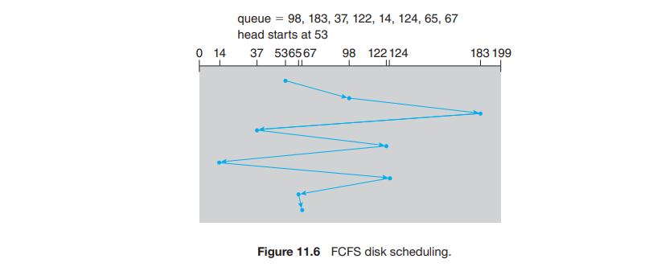
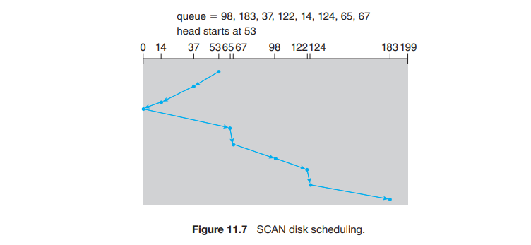
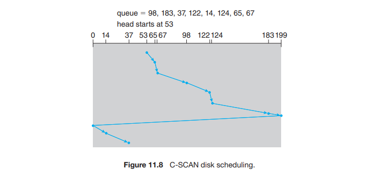

# 2. HDD 스케쥴링

**하드디스크 스케쥴링의 목표**

1. 접근 시간 최소화 ⇒ 탐색 시간, 회전 지연 시간
2. 전송 대역폭의 최대화 ⇒ 장치 대역폭

저장장치 I/O 요청 처리 순서를 관리해 이 둘을 모두 향상 가능.

프로세스가 입출력을 해야 할 때마다 운영체제에 시스템 콜을 한다.

이 호출에는 여러가지 인수가 주어진다.

- 작업이 입력인지 출력인지의 여부
- 연상이 수행될 파일을 가리키는 열린 파일 핸들
- 전송을 위한 메모리 주소
- 전송할 데이터의 양

- 드라이브가 쉬고 있다면 → 요청이 즉시 시작.
- 드라이브가 바쁘다면 → 드라이브의 큐에 들어감.

헤드 탐색을 피하면 성능을 최적화 할 수 있는 장치에 요청 큐를 유지하면 장치 드라이버는 큐의 순서를 조정, 성능을 향상할 수 있는 기회를 제공함.

과거 인터페이스의 목표와 현재의 목표가 다름.

```
**<과거>**
- 컴퓨터(호스트)가 사용할 트랙과 헤드 지정

**<현재>**
- 트랙과 헤드 지정 : 드라이브의 몫 (= HDD의 역할)
- LBA -> 물리주소 매핑 : 드라이브의 몫 (= HDD의 역할)
- 공정성, 적시성, 최적화 : 인터페이스의 몫 (= 컴퓨터의 몫)
	ex. 순서대로 진행되는 읽기/쓰기를 묶어서 처리 : 최적화의 예시 
```

대체적으로 LBA가 증가 시 물리적 주소도 증가한다고 보면 된다.

# FCFS 스케줄링

- FCFS = First Come, First Served
- 가장 공평해 보인다.
- 그러나 빠른 서비스를 제공할 순 없다.
- 때로는 묶어서 서비스하면 좀 더 나은 결과를 가져올 수 있다.



# SCAN 스케줄링

엘리베이터 알고리즘이라고도 한다.

왜 그런지는 그 과정을 보면 알 수 있다.

1. 한쪽 끝에서 다른 쪽 끝까지 처리한다.
2. 반대 방향으로 이동하면 끝까지 처리한다.
3. 끝날 때까지 이를 계속한다.



# C-SCAN 스케줄링

만약, 모든 요청이 균일하다면?

이런 경우에는 반대쪽으로 방향을 꺾기보다는 원통처럼 감겨있는 것처럼 이어져 있다고 보고 한쪽 방향으로 쭉 가는 것이 나을 것이다.

이를 실현시킨 알고리즘을 C-SCAN 스케쥴링이라고 한다.



# 알고리즘 선택 방법

- 3가지 알고리즘 이외에도 다양한 알고리즘이 존재.
- 특정한 요청 목록에 대해 최적의 검색 순서 계산 가능하나 비용이 너무 큼.
- 그리고 어떠한 알고리즘을 쓰든, 요청 갯수와 유형에 따라 성능은 달라짐.

**SCAN 및 C-SCAN 알고리즘**

- 기아 문제를 일으킬 가능성이 작다.
- 그래도 혹시 몰라서 리눅스에서는 마감시간 스케쥴러라는 것이 있음.
    - 읽기와 쓰기별로 큐를 유지 관리.
    - 읽기 연산에 좀 더 높은 우선순위를 부여
    - 대기열은 LBA 순서로 정렬, 기본적으로 C-SCAN을 구현

**마감 시간 스케쥴러의 특징**

- 2개의 읽기, 2개의 쓰기를 위한 4개의 큐 유지
- 하나는 LBA로 정렬, 다른 하나는 FCFS로 정렬
- 한 번의 배치 처리가 끝나면, 설정된 기간보다 오래된 요청이 FCFS에 있는지 검사
- 있다면, 해당 I/O 요청을 포함하는 LBA 큐가 다음 입출력 배치 대상으로 선택됨.