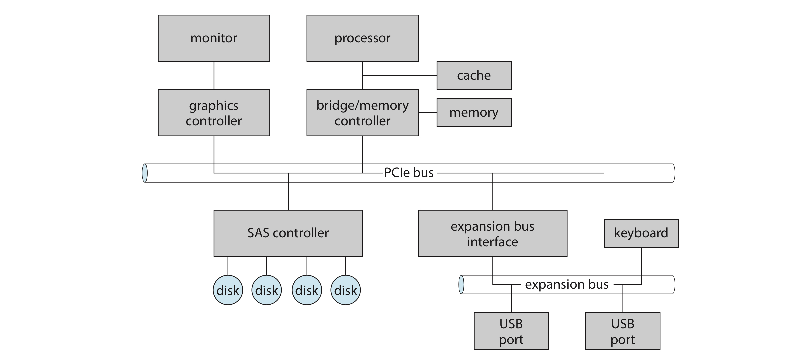
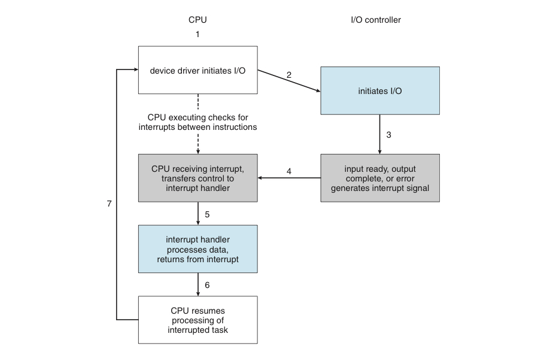
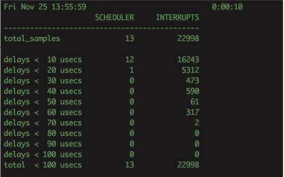

# 2. 입출력 하드웨어

장치들이 어떻게 부착되고, 제어되는 지를 이해하기 위한 개념

## 하드웨어 장치의 통신

- 신호 = 유/무선으로 보내짐
- 장치는 포트라는 연결점을 통해 컴퓨터와 접속
    - 대표적인 포트 : hdmi 포트, 이더넷 포트, usb 포트 등등
- 만약 하나의 장치들이 공동으로 여러 선을 사용한다면, 이를 버스라고 한다.
    
    (물론 버스의 정의를 좀 더 넓혀서 회선의 집합 + 프로토콜로 보기도 한다.)
    

여러 장비가 순차적으로 연결되어 있다면?

- 이를 **데이지 체인**이라고 한다.
- 데이지 체인은 하나의 버스처럼 동작한다.

### 버스와 PCI

- PCI 버스를 확장 버스에 연결하는 모습을 볼 수 있다.
- 또, 4개의 디스크가 직렬연결 SAS 버스에 연결된 모습도 볼 수 있다.

**PCIe의 특징**

- 하나 이상의 레인을 통해 데이터를 전송
    - 3레인은 2개의 신호 쌍으로 구성됨.
- 따라서 각 레인은 4개의 선으로 구성됨.
- 각 레인은 양방향으로 동시에 8비트 형식으로 데이터를 전송한다.

### 컨트롤러

<aside>
💡 포트, 버스, 장치를 작동할 수 있는 전자장치 집합체

</aside>

대표적인 컨트롤러의 예시를 알아보자.

1. 직렬 포트 컨트롤러 : 직렬 포트의 전기신호를 제어하고, 하나의 칩으로 구성
2. 광섬유 채널(FC) 버스 컨트롤러
    - 복잡하고, PC가 아닌 데이터 센터에서 사용됨.
    - 따라서 PC에서는 호스트 버스 어댑터로 구현됨.
    - 프로세서, 마이크로코드 및 일부 전용 메모리가 포함됨.
3. 디스크 컨트롤러
    - 디스크 드라이브 한 쪽에 있는 회로 기판.
    - SATA와 같은 컴퓨터와 디스크를 연계시키기 위한 프로토콜의 디스크 축 부분

## Memory-mapped 입출력

컴퓨터의 프로세서는 어떻게 명령어와 데이터의 컨트롤러에 전달하는가?

1. 특별한 입출력 명령어를 사용한다.
    - 이러한 명령어는 한 바이트나 워드를 특정 포트 주소로 전달하게 한다.
    - 해당 장치에 맞는 버스 회선을 선택, 장치 레지스터로 비트들을 가져오거나 읽어오게 한다.

1. 장치 제어 레지스터를 프로세서의 주소 공간으로 사상한다.
    - 각 장치들의 레지스터가 메모리 주소와 일대일 대응 됨.
    - CPU는 레지스터를 읽고 쓸 때 표준 데이터 전송 명령을 씀.

**2번의 방식을 Memory-mapped 입출력이라고 한다.**

이 방식은 특별 입출력 명령어 사용보다 단순하고, 빠르다.

따라서 점점 더 많은 I/O가 Memory-mapped 방식으로 바뀌고 있다.

### 레지스터의 종류

**입출력 컨트롤러의 4가지 레지스터**

1. 입력 레지스터 : 1~4바이트. 호스트가 입력을 위해 읽기를 수행
2. 출력 레지스터 : 1~4바이트. 호스트가 출력을 위해 쓰기를 수행
3. 상태 레지스터 : 호스트가 읽는 용도. 명령 완료, 바이트 읽기 가능 여부, 오류 여부 등의 상태를 보고.
4. 제어 레지스터 : 호스트가 명령을 내리기 위해 쓰기를 수행.

어떠한 컨트롤러는 레지스터의 크기를 확장시키기 위해 FIFO 칩들을 제공.

## 프로토콜와 폴링

호스트는 컨트롤러 사이의 프로토콜에 대해서 알아보자.

- 컨트롤러는 상태 레지스터의 busy 비트를 통해 자신의 상태를 나타냄.
    - 컨트롤러가 바쁘면 1, 한가로우면 0
- 호스트는 명령 레지스터의 command-ready 비트를 통해 입출력 요구 신호를 보냄.

이 과정을 나열해보면 다음과 같다.

1. 호스트가 반복적으로 busy 비트를 검사함.
2. 호스트가 명령 레지스터에 쓰기 비트를 설정하고, 출력 레지스터에 출력할 바이트를 씀.
3. 호스트가 command-ready 비트를 1로 설정
4. 컨트롤러가 command-ready 비트를 보고, busy 비트를 재설정
5. 컨트롤러가 명령 레지스터를 읽고, 쓰기 명령임을 인지.
    
    출력 레지스터를 읽고, 해당 바이트를 가지고 와서 출력
    
6. 컨트롤러가 command-ready 비트를 0으로 변경

단계 1에서 호스트는 폴링을 하게 된다. (=검사를 반복)

> **폴링이란? ⇒** 하나의 장치가 다른 장치의 상태를 주기적으로 검사하여 조건 만족 시 자료처리를 하는 방식.
> 

폴링 과정이 너무 길다면?

- 호스트가 다른 일을 하러 가게 됨. 이후 폴링이 끝났다는 것을 알게 되면 호스트가 다시 옴.
- 너무 오래 기다리면 데이터용 버퍼가 오버플로우되어 자료가 유실될 수도 있음.

한 장치를 폴링하기 위해서는 3개의 CPU 명령 사이클로 충분.

- 장치 레지스터 읽기 → 상태 비트 추출(by 논리곱) → 0이 아니면 분기.
- 그럼에도 불구하고 장치의 서비스 준비 시간이 길다면 다른 방법이 필요.

## 인터럽트와 그 구현

<aside>
💡 입출력 장치에 CPU에 자신의 상태 변화를 통보하는 하드웨어 기법.
반복적인 폴링 과정보다 효율적이다.

</aside>

기본 인터럽트 기법은 다음과 같다.

1. CPU 하드웨어는 매 명령어를 끝낸 후 인터럽트 요청 라인을 검사한다.
2. 입출력 컨트롤러가 요청 라인에 신호를 보내면, CPU가 이를 인지
    
    각종 레지스터 값과 상태 정보를 저장한다.
    
3. 메모리 상의 인터럽트 핸들러 루틴으로 이동
4. 인터럽트 핸들러가 인터럽트 발생 원인을 조사 후 작업 수행
5. 인터럽트 핸들러가 CPU에게 인터럽트 이전으로 돌아갈 것을 명령

이러한 기법을 실제로 적용한 모습이 아래 사진에 나와 있다.

10초 동안 23000개의 인터럽트를 처리했음을 알 수 있음.

오늘날에는 여기에 좀 더 추가해 세분화된 인터럽트 기법을 이용한다.

1. 특수한 상황에서의 인터럽트 발생 연기
2. 인터럽트 발생 여부 체크를 위한 효율적인 풀링 기법
3. 여러 인터럽트에 순위 매기기
4. 운영체제의 주의를 직접 돌릴 수 있는 별도의 방법 = 트랩

이러한 요소들은 CPU와 인터럽트 컨트롤러 하드웨어에 제공됨.

### 인터럽트 요청 라인

인터럽트 요청 라인은 크게 2가지가 있다.

1. 마스크 불가 인터럽트 : 회복 불가능한 메모리 오류 같은 이벤트를 위해 사용
2. 마스크 가능 인터럽트 : 필요하면 인터럽트 기능을 잠시 중단할 수 있음.
    - 인터럽트 되어서는 안되는 주요 명령 시퀀스를 수행하기 전 CPU가 끌 수 있음.
    - 장치 컨트롤러가 서비스를 요청하기 위해서 사용함.

### 인터럽트 벡터와 테이블

어떠한 종류의 인터럽트인지를 모아놓은 것을 인터럽트 테이블이라고 한다.

테이블에서 인터럽트 당 번호를 매겨놓은 목록을 인터럽트 벡터라고 한다.

이 인터럽트 벡터의 원소는 주소라고 하는 정수이다.

더 많고, 세세한 인터럽트의 예시를 위해 각 주소가 여러 인터럽트 핸들러를 가리키는 경우도 있다.

이를 인터럽트 사슬화 기술이라고 하며, 실제 인터럽트가 일어나면 전체 사슬을 검사한다.

### 인터럽트 우선순위 수준

- 인터럽트 기법은 알아서 인터럽트 우선순위를 정한다.
- 이를 통해 높은 인터럽트가 낮은 인터럽트를 선점할 수 있다.

### 인터럽트의 처리

대부분의 경우 인터럽트 처리는 시간과 자원이 제한되어 있음.

따라서 시스템은 인터럽트 처리를 2가지로 나눔.

1. 1차 인터럽트 처리기 = 문맥 교환, 상태 저장 및 처리 작업을 큐에 삽입
2. 2차 인터럽트 처리기 = 요청된 작업 처리 수행.

## 인터럽트의 활용 예시

1. 부팅 시 : 하드웨어 버스 조사, 인터럽트 핸들러 등록
2. 입출력 시 : 장치들이 인터럽트를 발생.
3. 예외 처리 : 0으로 나누기, 액세스 불가 메모리 접근 시
4. 가상 메모리 페이징 : 페이지 폴트를 통해 프로세스 사이를 왔다갔다 함.
5. 시스템 콜 수행 : 라이브러리 루틴이 일으키는 소프트웨어 인터럽트(= 트랩)
    - 단, 트랩은 입출력 장치 인터럽트에 비해 낮은 우선순위를 가짐.
6. 커널 안에서의 제어 흐름 : 인터럽트 간의 우선순위 판단. 쓰레드를 만들 수 있는 커널이면 이러한 제어 흐름을 만들기가 더 쉬워짐.

인터럽트는 시스템 속 모든 비동기적 이벤트를 처리하고, 커널 내의 수퍼바이저 루틴으로 달려가기 위한 용도로 수행.

또한 이러한 일들의 순서를 매기기 위해 인터럽트 간에도 순위를 매김.

따라서 커널의 인터럽트 처리는 매우 효율적으로 수행되어야 함.

단, 필요시에는 폴링과 같이 사용하기도 함.

## 직접 메모리 접근 (DMA)

> CPU가 입출력을 다루게 하니 너무 비효율적인 것 같다. 
입출력만 다루는 무언가를 만들면 안될까?
> 

이러한 생각에서 나온 것이 바로 DMA 컨트롤러, 또는 DMA라고 하는 특수 프로세서이다.

크게 DMA 요청(request) 선과 DMA 인지(acknowledge) 선 2개로 hand-shaking을 수행.

DMA는 다음과 같이 작동한다. (사실상 CPU가 하는 것과 크게 차이는 없어 보인다.)

1. 호스트가 메모리에 DMA 명령 블록을 쓴다.
    
    명령 블록 = 전송할 데이터에 대한 포인터, 전송할 장소에 대한 포인터, 전송할 바이트 수 등등..
    
    이러한 분산 수집방법으로 하나의 DMA 명령을 통해 여러개의 전송을 실행 가능.
    
    명령 블록은 보통 커널 공간에 있다. (사용자 공간과 장치의 전송은 memory-mapped로 많이 함.)
    
2. DMA는 버스를 통해 명령 블록에 접근한다.
3. 장치 컨트롤러가 DMA 요청 선에 신호를 보냄.
4. DMA 컨트롤러는 신호를 받고, 메모리 버스를 얻어 주소를 올린다.
    
    이후 DMA 인지 선에 신호를 보낸다.
    
5. 장치 컨트롤러가 DMA 인지 신호를 받으면, 컨트롤러는 한 워드를 메모리로 전송
6. 장치 컨트롤러가 DMA 요청 신호를 제거한다.
7. 전송이 끝나면 DMA 컨트롤러가 CPU에 인터럽트를 건다.

### 사이클 스틸링

<aside>
💡 DMA 컨트롤러가 메모리 버스를 점유 중 일때, CPU가 잠깐 동안 주 메모리 속 데이터에 접근하지 못하는 현상.

</aside>

이러한 사이클 스틸링은 CPU의 속도를 떨어트리지만, 전체적으로 봤을 때는 성능이 향상됨.

### 가상 주소와 물리 주소

어떠한 컴퓨터들은 DMA를 할 때 물리 주소를 사용

다른 컴퓨터들을 DMA를 할 때 직접 가상 주소 접근을 하기도 함.

- 가상 주소를 이용하면 CPU나 메모리의 개입이 없어도 됨.

### 커널 보호

보호모드에서 돌아가는 커널은 일반 프로세스가 입출력 명령을 직접 내리는 것을 금지.

- 접근 제어 + 시스템 고장 방지를 위한 수단
- 특권을 가진 프로세스만이 하드웨어에 접근 가능하게 됨.
- 이러한 장치가 없으면 물론 일반 프로세스가 직접 I/O 명령을 내릴 수 있긴 함.
- 다만, 시스템 보안과 안정성에 문제가 생길 수 있음.