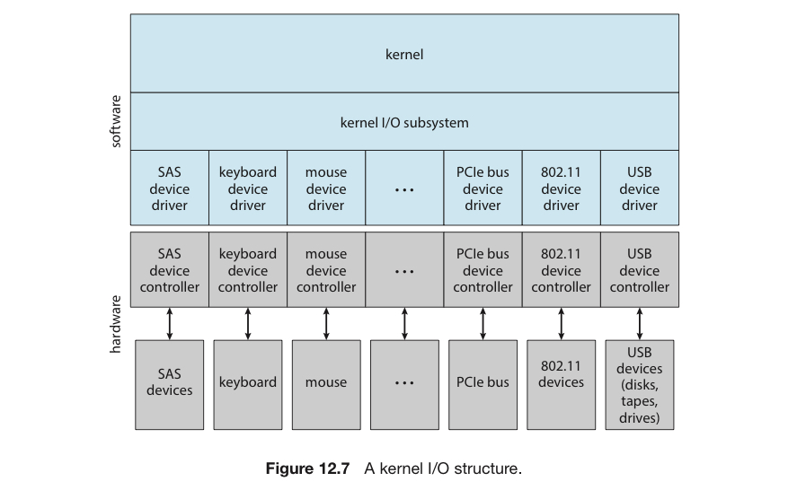
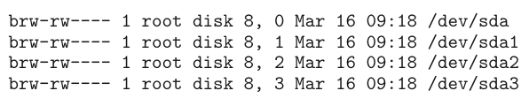

# 3. App의 입출력 인터페이스

응용 프로그램(App)은 어떻게 입출력 장치에 접근하는가?

모든 입출력 장치들이 일관된 방법으로 다뤄질 수 있게 하는 방법을 생각해보자.

# 인터페이스

결국은 추상화, 캡슐화, 계층화를 할 수 밖에 없다.

- 그래서 인터페이스 = 표준 함수들의 집합을 통해 접근한다.
- 장치 드라이버라고 불리는 커널 내의 모듈들은 각 입출력 장치를 위한 구체적 코딩을 제공해 인터페이스의 표준 함수를 내부적으로 수행함.
- 따라서 장치 드라이버의 목적은 하드웨어의 추상화, 캡슐화, 계층화라고 할 수 있다.
    - 하드웨어 간 차이를 숨기고, 간단한 인터페이스로 포장, 상위의 커널 입출력 서브시스템에 제공
    - 이를 통해 개발자의 작업을 간소화시킴



## 지원 항목

운영체제별, 기기별로 드라이브 인터페이스에 대한 규격이 다 다르다.

대표적인 기기별 차이는 아래와 같다.

1. 문자 스트림과 블록
2. 순차 접근과 임의 접근
3. 동기식과 비동기식
4. 공유와 전용
5. 동작 속도
6. 읽기/쓰기, 읽기 전용, 한 번만 쓰기

운영체제는 앱의 목적에 따라 장치들의 차이를 숨기고, 장치들을 몇 개의 범주로 나눈다.

- 대표적인 범주 : 블록 입출력, 문자 스트림 입출력, 네트워크 소켓 등등
- 또한 특별한 장치들; 클록, 타이머 등에 대한 지원도 한다.

또한 대부분의 운영체제는 App이 입출력 장치로 임의의 명령을 전달하게 끔 escape (또는 back-door) 시스템 콜을 가지고 있음. 대표적인 것이 리눅스의 `ioctl()`

```c
ioctl("장치 식별자", "장치에게 줄 명령(정수)", "포인터");
```

유닉스 및 리눅스의 장치 식별자는 메이저 및 마이너 장치 번호의 튜플.

예를 들어 시스템에 SSD 장치가 달려 있다고 하고, `ls -l /dev/sda *` 라는 명령어를 내리면…



다음 출력은 8이 메이저 장치 번호임을 보인다.

- 메이저 번호 : 장치 유형
- 두 번째 숫자 : 해당 장치의 인스턴스
- 이를 이용해 I/O 요청을 적절한 장치 드라이버로 라우팅함.

# 블록 장치와 문자 장치

## 블록 장치

> 블록 장치란?
> 
> - 블록 형식으로 데이터를 교환하는 장치
> - 하드디스크, CD-ROM 드라이브, 메모리 영역 등의 주소 지정 가능한 기기

블록 장치 인터페이스는 디스크와 같은 블록 지향 장치를 사용하기 위한 모든 요소를 제공

- 일반적으로 읽기와 쓰기, 탐색 명령을 제공함.
- 응용 프로그램은 파일 시스템 인터페이스를 통해 이 블록 인터페이스에 접근

## 비가공 입출력

운영체제나 DB는 블록 장치를 선형 배열처럼 이해.

이러한 접근 모드를 비가공 입출력이라고 함.

만약 App이 직접 버퍼링이나 잠금을 실행하려고 한다면, 충돌 발생 가능성이 높아짐.

따라서 비가공 장치의 접근은 장치의 제어권을 직접 앱에게 넘겨줘야 함.

- 즉 운영체제가 할 수 있는 것이 거의 없다는 이야기

그래도 운영체제가 할 수 있는 부분을 늘리고자 대안이 제시됨.

- 운영체제가 버퍼링과 잠금을 하지 않는 모드로 파일에 입출력.
- UNIX에서는 이러한 방식을 직접 입출력이라고 함.

## 메모리 맵드 파일 접근

<aside>
💡 실제 디바이스를 읽고 쓰는 명령 대신 메모리의 특정 번지를 읽고 쓰는 명령을 이용해 파일 입출력을 대신하는 방식

</aside>

💠 블록 장치 위의 층으로 구현할 수 있음.

💠 파일 이름을 가지고 지정된 시스템 콜을 수행

💠 파일 이름 ⇒ 메모리 참조

💠 파일 입출력 인터페이스를 쓰지 않고도 요구 페이징을 사용.

💠 더 효율적임.

💠 가상 메모리를 제공하는 운영체제는 커널 서비스를 위해 매핑 인터페이스를 이용

💠 커널이 디스크에 잇는 스왑 공간을 액세스 할 때도 이 방식을 활용.

## 키보드와 문자 접근

키보드는 문자 스트림 인터페이스를 통해 접근됨.

이 인터페이스의 시스템 콜은 다음과 같은 기능을 제공한다.

- 한 글자씩 읽기 및 받기.
- 한 줄씩 읽기
- 버퍼링, 편집키

이러한 인터페이스는 키보드나 마우스, 모뎀에 적합.

공통적으로 언제 어떠한 데이터가 입력될지 예측이 안됨.

또, 프린터처럼 바이트를 선형 스트림으로 출력하는 장치에도 적합.

# 네트워크 장치

## 소켓 인터페이스

<aside>
💡 컴퓨터 네트워크에서 통신을 가능하게 하는 추상화된 인터페이스를 의미

</aside>

💠 소켓을 생성, 원격지 주소와 연결, 접속 완료를 확인, 패킷을 송수신하는데 쓰임.

💠 네트워크 서버의 구현을 지원하기 위해 소켓들을 관리하는 select() 함수를 지원

💠 어느 소켓이 수신 대기 중인 패킷을 가졌는지, 여유가 있는지 등 여러 정보를 제공해줌.

💠 앱이 네트워크 상태를 폴링하거나 바쁜 대기를 할 필요가 없어짐.

💠 이를 통해 네트워크의 내부 사항을 캡슐화해 

## 프로세스 간 통신

- 앞에서 언급한 IPC 생각하면 될 듯.
- 유닉스의 FIFO, full-duplex STREAMS, 메시지 큐, 소켓 등등

# 클록과 타이머

대부분의 컴퓨터는 하드웨어 클록과 타이머를 가지고 3가지 기본적인 기능들을 제공한다.

- 현재 시각을 제공
- 지난 시각을 제공
- T 시각이 되면 X 명령을 실행

이 기능들은 운영체제에서만 사용되는 것이 아닌, 시간에 의존하는 앱들도 많이 쓴다.

그러나 이렇나 기능들을 구현하는 시스템 콜은 운영체제마다 다르다.

## 인터벌 타이머

<aside>
💡 지나간 시간을 재고, 특정 명령을 실행시키는 하드웨어

</aside>

💠 특정 시간이 지나면 인터럽트를 발생할 수 있게 설정 가능.

💠 이 과정을 1번 또는 주기적으로 인터럽트를 발생시키도록 설정 가능.

사용되는 예시는 다음과 같다.

- 프로세스의 CPU 선점
- 디스크 I/O 서브시스템이 캐시 버퍼를 flushing할 때
- 네트워크 혼잡이나 오류로 인한 작업 취소

운영체제는 일반 사용자 프로세스들이 타이머를 사용할 수 있도록 인터페이스를 제공.

- 이 경우 타이머 관련 요청이 타이머 하드웨어 채널 수보다 많아질 수도 있음.
- 이 때 커널은 이러한 요청을 마감시간 순으로 놓고, 가장 가까운 시간부터 인터럽트를 건다.

## 클록 하드웨어

최신 pc에는 고성능 이벤트 타이머(HPET)가 들어가 있으며, 10MHz 단위로 실행.

저장하고 있는 값이 HPET와 일치 시 1번 또는 반복적으로 트리거하도록 설정 가능할 수 있는 비교기가 있음.

트리거는 인터럽트를 발생하고, 운영체제의 클록 관리 루틴은 타이머의 목적과 수행할 조치를 결정

트리거 발생 간격

- 덜 정밀한 타이머 하드웨어
- 너무 정밀하면 오버헤드가 크다.
- 타이머 틱이 시스템의 time-of-day 클록에 사용되면, 시스템 클록이 부정확해질 수 있음.

이러한 부정확성을 보정하기 위해 네트워크 시간 프로토콜을 사용

- 따라서 대부분의 컴퓨터에서는 하드웨어 클록을 카운터로 구현
- 이 카운터의 값을 장치 레지스터로부터 읽을 수 있게 해줌
- 카운터는 정밀도가 높은 시계 역할을 하게 됨.
- 클록의 정밀도가 이렇게 높은 경우에는 시간 간격의 정확한 측정에만 사용.

# 입출력 1 : 봉쇄형 vs 비봉쇄형

## 봉쇄형 시스템 콜

- 앱이 이 시스템 콜을 호출하면, 호출 쓰레드가 봉쇄 상태로 들어 감.
    - 쓰레드를 실행 큐에서 대기 큐로 옮긴다는 것.
    - 물론 추후 입출력이 끝나면 다시 실행 큐로 옮겨짐.
    - 실행 재개 시 입출력 시스템 콜의 반환값을 얻게 됨.
- 입출력 장치의 작업은 수행시간이 다양하고, 예측하기 어려움.
    - 즉 언제 봉쇄가 풀릴지 모른다는 말.
- 그럼에도 불구하고 코드 작성이 쉬움

## 비봉쇄형 시스템 콜

- 이 시스템 콜은 호출해도, 해당 쓰레드가 봉쇄 상태로 들어가지 않음
- 몇 개의 바이트가 전송되었는지 알려주는 복귀 값을 되돌려 줌.
- 특정 경우에는 반드시 비봉쇄형 시스템 콜을 소환해야 함
    - ex. 스크린에 자료를 표기하면서 동시에 입력을 받아드리는 경우

## 비동기식 시스템 콜

- 비봉쇄형 시스템 콜처럼 봉쇄 상태로 들어가지 않음.
- 단, 비봉쇄형과 읽기(read)에서 차이가 난다.
    - 비봉쇄형 읽기 : 그 시점에 가지고 올 수 있는 데이터를 가지고 복귀
    - 비동기식 읽기 : 입력이 완전히 끝난 후 전체 데이터를 가지고 복귀.


## 비동기식 vs 동기식

이러한 비동기적 행동은 운영체제 전반에 걸쳐 일어나게 됨.

물론, 사용자 눈에는 띄지는 않지만 운영체제의 연산 안에 있음.

**보조 저장장치 & 네트워크 입출력**

- 앱이 요구를 한 경우, 운영체제는 요청을 버퍼에 우선 넣는다.
- 이후 여력이 생기면 그 때 요청을 완료한다.
    - 중간에 시스템이 고장 나면 요청도 날라감.
    - 이를 방지하기 위해 운영체제는 요청을 버퍼링하는데 시간제한을 둠.
- 시스템은 앱이 일부 버퍼의 플러시를 요청하도록 해 버퍼 플러시 간격을 기다리지 않고 보조 저장장치로 데이터를 강제 전송하도록 하는 방법을 제공
- 앱에서의 데이터 일관성은 커널에 의해 유지.
    - 아직 기록되지 않은 데이터가 읽기 요청을 한 앱에 전달되는 것을 보장하도록 커널은 입출력 명령을 장치에 내리기 전에 데이터를 읽음.
- 입출력을 구현한 방법에 따라 같은 파일을 대상으로 입출력을 수행하는 여러 쓰레드는 일관적이지 않은 데이터를 전달 받을 수 있음.
    - 이 경우 쓰레드는 잠금 프로토콜을 사용할 필요가 있음.

**네트워크 소켓**

- `select()` : 비봉쇄형 시스템 콜의 좋은 예시
    - 최대 대기 시간만을 인자로 설정
    - 다만 `select()`의 사용은 오버헤드의 발생을 야기
- Mach는 봉쇄형 다중 읽기를 제공
    - 한 번 부르면 몇 개의 입출력 장치를 검사
    - 이후 이 중 하나라도 데이터를 가지고 있으면, 데이터와 즉시 복귀

# 입출력 2 : 벡터형

- 하나의 시스템 콜을 호출하여 복수의 위치에 여러 입출력 연산을 수행할 수 있음.
- ex. UNIX readv 시스템 콜 : 여러 버퍼로 이뤄진 벡터를 인자로 받아 벡터와 목적지 간의 읽기 혹은 쓰기 작업을 수행.

왜 이러한 분산-수집 방식이 유리한가?

- 여러 개의 개별 버퍼 내용을 한 개의 시스템 콜을 통해 입출력할 수 있어 문맥 교환과 오버헤드가 적음.