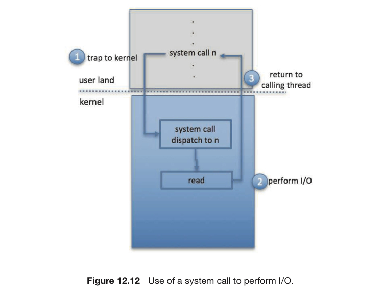
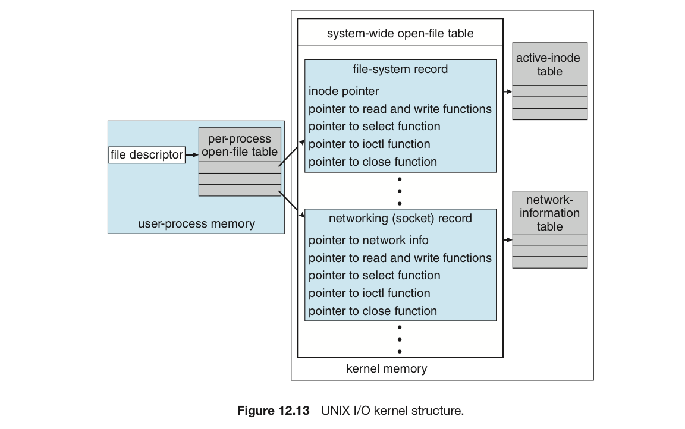

# 4. 커널 입출력 서브시스템

커널은 입출력과 관련된 많은 서비스를 제공.

이들은 하드웨어와 장치 드라이브 구조를 바탕으로 함.

# I/O 스케쥴링

입출력 요구를 스케줄링 하는 것 = 요구를 실행할 순서를 결정.

- 앱이 원하는 대로 스케줄링하면 성능이 떨어짐
- 따라서 시스템 성능을 향상하면서 프로세스 간 공정성을 확보해야 함.
- 또한 입출력 완료까지의 대기 시간도 줄어야 함.

```
<예시>
1번 프로그램 => 디스크 끝 부분 블록 요구
2번 프로그램 => 디스크 시작 부분 블록 요구
3번 프로그램 => 디스크 중간 부분 블록 요구

배치를 2, 3, 1로 하는 것이 현명한 선택.
```

운영체제 개발자들은 각각의 장치마다 대기 큐를 유지해 스케쥴링 구현.

- 봉쇄형 시스템 콜 ⇒ 입출력 요청을 대기 큐 보냄 ⇒ 큐 전체 재배치
- 때로는 급한 작업이다 싶으면 해당 작업을 먼저 처리해 주기도 함.
    
    ex. 가상 메모리로부터의 페이징 요청.
    

커널이 비동기적 입출력을 제공한다면, 동시에 많은 입출력 요청을 추적해야 함.

- 이를 위해 각 **장치 상태 테이블**에 대기 큐를 연동
- **장치 상태 테이블** : 각 입출력 장치에 대한 정보를 보관하고 있음.

# 버퍼링

<aside>
💡 컴퓨터 시스템에서 데이터를 일시적으로 저장하는 임시 메모리 영역인 버퍼(Buffer)를 이용하는 기술

</aside>

## **쓰는 이유 1**

▶️ 데이터 생산자와 데이터 소비자 사이의 다른 속도를 대처하기 위해서

- 생산자가 쓴 데이터를 ⇒ 버퍼에 임시 보관.
    
    이후 데이터가 다 써지면 그때 ⇒ 소비자에게 보냄.
    

```
인터넷 => SSD로 파일을 보내는 상황.
- 네트워크는 드라이브보다 1000배는 더 느림.
- 드라이브 쓰기가 즉각적이지 않고, 네트워크 인터페이스에는 추가 수신 데이터를 저장할 정소가 부족.
- 따라서 버퍼를 2개로 놓고 사용.

1. 네트워크가 1st 버퍼를 채운 후 드라이브 쓰기가 요청된다.
2. 첫 번째 버퍼가 저장장치에 기록되는 동안, 두 번째 버퍼를 채우기 시작한다.
3. 네트워크가 두 번째 버퍼를 채울 때 첫 번째 버퍼의 드라이버 쓰기가 완료
4. 두 번째 버퍼에서 SSD로 데이터가 쓰일 동안 네트워크가 첫 번째 번호로 전환
```

⇒ 이러한 것을 이중 버퍼링이라고 하며, 데이터 간의 타이밍 요구사항을 해제한다.

## **쓰는 이유 2**

▶️ 데이터 전송 크기가 다른 장치들을 이어주기 위해서

- 특히 컴퓨터 네트워킹에서 많이 발생
- 생산 측 ⇒ 버퍼 (데이터가 쪼개짐) ⇒ 전송 ⇒ 수신 측 (버퍼들 결합)

## **쓰는 이유 3**

▶️ App의 입출력 복제 시맨틱을 지원하기 위해서

- App이 시스템 콜을 하는 시점의 버퍼 버전만 디스크에 쓰는 것을 보장하겠다는 뜻.
- App으로 복귀 전, write() 시스템 콜이 App의 버퍼 속 자료를 커널 버퍼로 복사.

# 캐싱

<aside>
💡 자주 사용될 자료의 복사본을 저장하는 빠른 메모리 영역

</aside>

캐시된 복사본 은 원래 자료를 사용하는 것보다 더 효과적.

- 버퍼 : 데이터를 가지고 있는 유일한 장소
- 캐시 : 다른 곳에 이미 저장된 데이터의 복사본을 추가로 저장하는 개념.

캐싱과 버퍼링은 서로 다르지만, 메모리 영역에서 둘을 모두 쓰기도 함.

- 복사 시맨틱 유지 & 효율적 스케쥴링을 위해 디스크 데이터를 버퍼에 유지.
- 이를 캐시로도 옮겨 App이 공유하거나 기록된 후 곧바로 다시 읽히는 파일의 I/O 효율 향상

# 스풀링 및 장치 예약

## 스풀링

<aside>
💡 스풀 = 끼워넣기(인터리브)가 안되는 장치를 위해 데이터를 보관하는 버퍼

</aside>

대표적인 장치가 바로 프린터이다.

- 한 번에 하나의 작업(출력)만을 할 수 있다.
- 여러 출력 요구가 섞여버리지 않도록 애햐 한다.

운영체제는 모든 출력을 가로챈 다음, 각각 대응되는 보조 장치파일에 스풀링 시킴.

- 이후 대기 중인 파일을 한 번에 하나씩 프린터로 내보냄.
- 시스템 디먼 프로세스나 커널 쓰레드에 의해 처리.
- 두 경우 모두 프린터에 작업을 열거, 취소, 임시중단 하는 제어 인터페이스 제공

## 멀티플렉스

프린터, 테이프 같은 장치들은 입출력 요구를 멀티플렉스할 수 없음.

- 이를 해결하기 위한 방법 중 하나가 스풀링
- 다른 방법 : 한 프로그램만이 장치를 독점적으로 사용하게 하는 것이 있음.
    - 이 경우 사용이 끝나야 타 프로그램으로 전환
- 또 다른 방법 : open() 할 수 있는 파일 핸들의 갯수를 1개로 제한.

대부분의 운영체제는 자기들끼리 배타적 접근을 협조적으로 하는 방편을 제공함.

물론 이 과정에서의 교착 상태 해결법도 운영체제가 책임질 몫.

# 오류 처리

입출력 시스템 콜 = 성공/실패를 나타내는 비트를 반환.

- 유닉스에서는 `errno`라는 변수를 사용.
- 여러 가지 종류의 에러를 구분해줌.
- 단, 이 정보가 App까지 가지는 않음.

# 입출력 보호

정상적인 동작을 방해하는 입출력 명령을 막는 것.

- 모든 입출력 명령을 특권 명령으로 정의
    - 따라서 사용자가 직접 입출력 명을 수행할 수 없음.
    - 대신, 운영체제가 입출력을 대신하도록 시스템 콜 제공
    - 운영체제는 요청을 검사, 유효 시 실행
    - 그리고 호출 쓰레드로 복귀
- 메모리 맵드 메모리나 입출력 포트 메모리 역시 보호 대상
    - 단, 커널이 사용자 접근을 무조건적으로 막아서도 안됨
    - 일부 장치들은 그래픽 성능을 높이기 위해 직접 접근할 수도 있음.
    - 이 경우, 그래픽 메모리의 한 부분이 1번에 1프로세스에 할당되도록 잠금 기법 사용.

# 커널 자료구조

커널 속 자료구조는 입출력 구성요소에 대한 상태 정보를 유지한다.



## 유닉스

- 파일 시스템 인터페이스를 사용해 다양한 것에 액세스 (사용자 파일, raw 장치 등등…)
- 모든 객체가 read()를 지원해도 내부에서의 작동원리는 객체마다 달라짐.
- 이러한 다양성을 객체지향 기법으로 하나의 구조를 묶음.



## 윈도우

- 입출력 서비스 : 커널 밖의 입출력 매니저가 대신 함.
- 요청 ⇒ 메시지로 변환 ⇒ 입출력 서비스 ⇒ 장치 드라이버
- message passing 횟수가 더 많이 늘어나므로 오버헤드가 늘어남.
- 대신 입출력 시스템의 구조와 설계가 간단해지고, 커널의 크기가 작아지고 융통성이 커지게 됨.

# 전원 관리

## 전력 사용

> 운영체제를 통해서 전력 사용을 줄이는 방법을 알아보자.
> 

클라우드 컴퓨팅 환경에서 다음과 같은 도구를 사용해 처리 부하를 조정.

- 모니터링과 시스템에서 모든 사용자 프로세스를 대피하고
- 해당 시스템을 유휴 상태로 만들며
- 필요 시 전원을 끄는 역할.

또한 운영체제는 부하를 분석한 후 

- 부하가 낮고, 하드웨어 기능이 활성화되어 있으면 일부 구성요소의 전원을 끌 수 있음.
- 시스템 부하가 필요하지 않으면 CPU 코어 일시 중단
- 단, 코어의 상태는 반드시 저장되어야 함.
- 큰 데이터 센터의 경우 이러한 방법으로 전기를 절약함.

## 모바일 시스템

배터리 수명을 늘려야 하는 이상 전원 관리가 굉장히 중요.

안드로이드에서 전원 관리를 하는 3가지 기법을 알아보자.

1. 전원 축소 : 필요 시 깊은 슬립 상태로 만드는 기능.
    - 완전히 꺼진 것보다는 전력을 조금 더 씀.
    - 외부 자극에 반응해 다시 깨어날 수 있음.
    - CPU 역시 가장 낮은 슬립 상태 (몇 밀리와트만 소비)
2. 구성요소 수준 전원관리
    - 각 구성요소 간 관계와 사용여부를 알 수 있는 인프라
    - 각 기기 간 연결고리를 트리 구조로 작성
    - 이걸 참조해 개별 구성요소의 전원을 관리
3. wakelock
    - 전원 축소로 가는 것을 막는 기능
    - ex. 앱을 업데이트하는 경우, 계속 영상을 보는 경우

물론, 현실에서의 전원 관리는 이것보다 더 복잡함.

최신 범용 컴퓨터는 다른 하드웨어 코드 집합인 ACPI를 사용해 하드웨어를 관리.

이는 많은 기능을 가진 일종의 산업 표준.