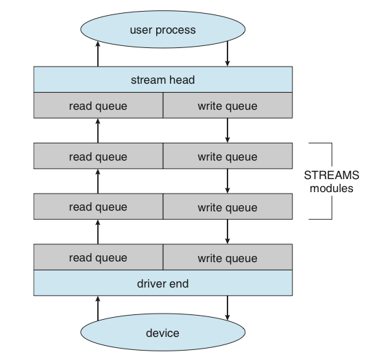

# 6. STREAMS

## STREAMS란?

<aside>
💡 장치 드라이버와 사용자 프로세스의 완전 양방향 연결을 위한 기법

</aside>

- 동적으로 드라이버 코드의 파이프라인을 조립할 수 있음
- 사용자 프로세스와 상호 연동하는 스트림 헤드
- 디바이스를 제어하는 드라이버 엔드
- 스트림 헤드와 드라이버 엔드를 연결하는 스트림 모듈로 구성됨.

## STREAMS 모듈

- 스트림 처리 기능을 제공
- `ioctl()` 시스템 콜을 사용해 스트림에 푸시됨.
- 인접한 모듈의 큐 사이에서 메시지가 교환. 따라서 한 모듈의 큐가 인접 큐를 오버플로 시킬 수도 있음.
    - 이러한 오버플로를 방지하기 위해 큐는 흐름 제어를 지원
    - 흐름 제어가 없다면, 큐는 모든 메시지를 받고, 그 즉시 버퍼링 없이 인접 모듈의 큐로 메시지를 보냄.
- 흐름 제어를 지원한다면, 메시지를 버퍼링하고 충분한 버퍼 용량이 없으면 메시지를 받지 않음.
- 흐름 제어는 인접 모듈의 큐 사이에 제어 메시지를 교환함으로써 지원됨.

## 사용자 프로세스

`write()` 또는 `putmsg()` 시스템 콜을 사용함으로써 디바이스에 데이터를 쓸 수 있음.

- `write()` 시스템 콜 : 미가공 데이터를 스트림에 씀.
- `putmsg()` 시스템 콜 : 사용자 프로세스가 메시지를 지정하는 것을 허용

스트림 헤드는 메시지로 데이터를 복사하고 다음 모듈의 큐에 전달.

이러한 메시지 복사는 드라이버 엔드, 즉 디바이스에 메시지가 복사될 때까지 계속됨.

유사하게 사용자 프로세스는 `read()`, `getmsg()` 시스템 콜을 사용해 스트림 헤드로부터 데이터를 읽어드림.

read() 사용시 스트림 헤드는 인접 큐로부터 메시지를 얻고, 프로세스에 일반 데이터를 반환.

- 일반 데이터 = 구조화 되지 않은 바이트 스트림.

## STREAMS의 특징

스트림스 입출력은 사용자 프로세스가 스트림 헤드와 통신할 때를 제외하고는 비동기적.

- 쓰기를 할 때 사용자 프로세스는 다음 큐가 흐름 제어를 사용한다고 가정 시 메시지를 복사할 공간이 있을 때까지 봉쇄됨.
- 마찬가지로 사용자 프로세스는 STREAMS에서 읽기를 할 때 데이터가 이용 가능할 때까지 봉쇄됨.

스트림 헤드의 모듈과 마찬가지로 드라이브 엔드 역시 읽기와 쓰기 큐를 가지고 있음.

- 그러나 반드시 인터럽트에 응답해야 한다는 차이점을 가지고 있음.
- 어쨌든 모든 데이터를 처리해야 함.

드라이버 엔드 역시 흐름 제어를 반드시 지원해야 함.

- 다만 디바이스의 버퍼가 가득 찼을 때는 수신 메시지를 버림

이외에도 장점에 대해 언급해 보자면…

- 디바이스 드라이버와 네트워크 프로토콜을 작성할 때 모듈식이고, 점진적인 접근을 위한 프레임워크를 제공
- 모듈은 다른 스트림이므로, 다른 디바이스에 의해 사용될 수 있음.