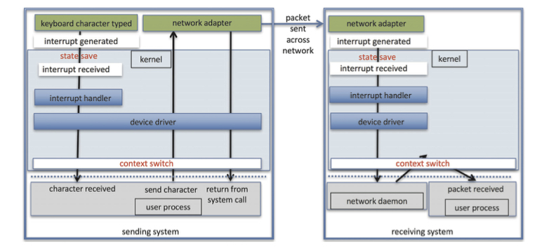

# 7. 성능

## 입출력과 성능

✅ 입출력 과정은 CPU에 부담을 많이 줌.

- 장치 드라이버 코드 실행, 프로세스 봉쇄, 스케쥴링 등등…

✅ 입출력 과정은 커널의 인터럽트 처리 과정에 영향을 많이 받음. 이 과정에서 메모리에 부하를 많이 주게 됨.

✅ 사실 인터럽트 처리 자체가 부담이 많이 걸리는 작업.

- 상태 바꾸기, 핸들러 수행, 상태 복원이 반복되기 때문
- 이후 봉쇄된 프로세스가 해제되는 과정에서 문맥 교환 오버헤드가 발생

✅ 네트워크의 트래픽도 마찬가지로 문맥 교환 야기의 주범

## 프론트 엔드 처리기

일부 시스템은 터미널 입출력을 전담하는 프론트 엔드 처리기를 사용.

- 터미널 집중기
- 입출력 채널 : 특수목적 CPU로, 메인프레임에서 많이 사용

## 입출력의 효율 높이기

1. 문맥 교환의 빈도를 줄인다.
2. 메모리에서 장치와 앱 사이에 데이터가 복사되는 횟수를 줄인다.
3. 인터럽트 빈도를 줄인다.
4. DMA나 채널로 CPU의 입출력 부담을 줄인다. 입출력과 주 연산을 최대한 중첩시킨다.
5. 원시 처리 연산을 하드웨어로 구현, 장치 컨트롤러 내의 그들의 작업이 CPU와 버스의 작업과 병렬로 진행되게 한다.
6. CPU, 메모리, 버스, 입출력 등에 대한 부하가 균일하게 된다.

## 입출력 기능 구현 위치

1. 처음에는 응용 프로그램 수준에서 구현
    
    가장 신축적이며 응용 프로그램의 버그는 시스템 전체의 고장으로 이어질 가능성이 작음.
    
    장치 드라이버 코드를 바꿀 때마다 장치 드라이버를 재부팅, 재적재할 필요가 없어짐.
    
    단, 문맥 교환의 오버헤드 때문에 비효율적일 순 있음.
    
2. 이후 커널에서 재구현. 이 경우 운영체제의 개발 시간과 노력이 많이 듬.
    
    또한 시스템 고장과 기존 자료 파괴를 야기할 수 있음.
    
3. 가장 높은 성능은 하드웨어에서 구현.
    
    단, 오류를 고치기 어렵고 개발 시간이 오래 걸린다.