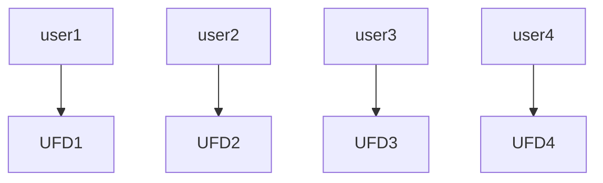
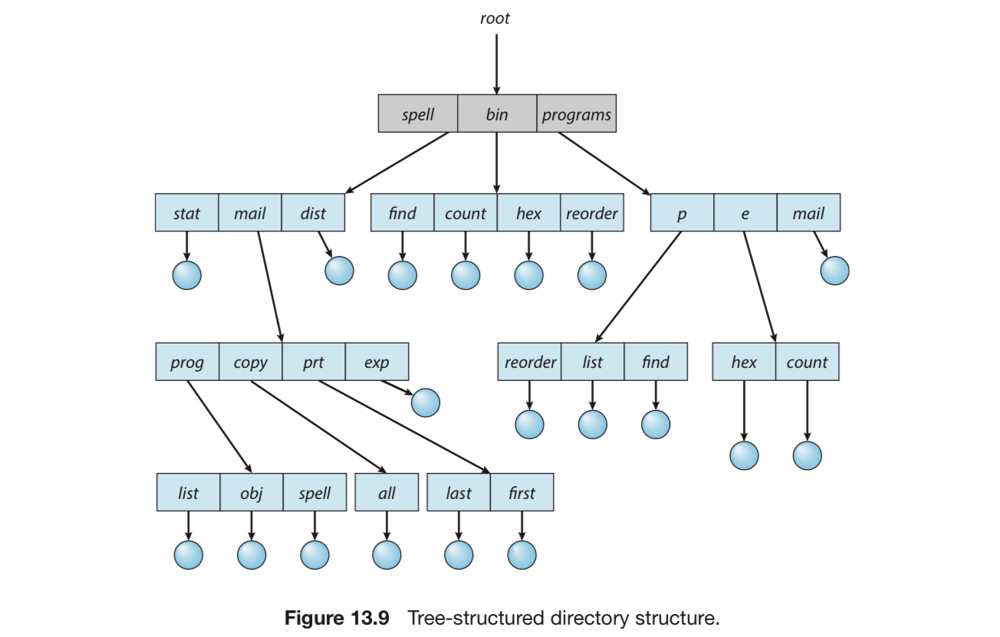
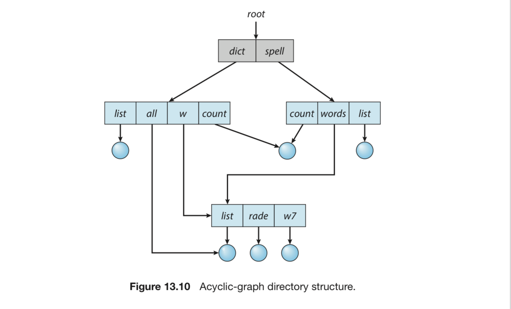
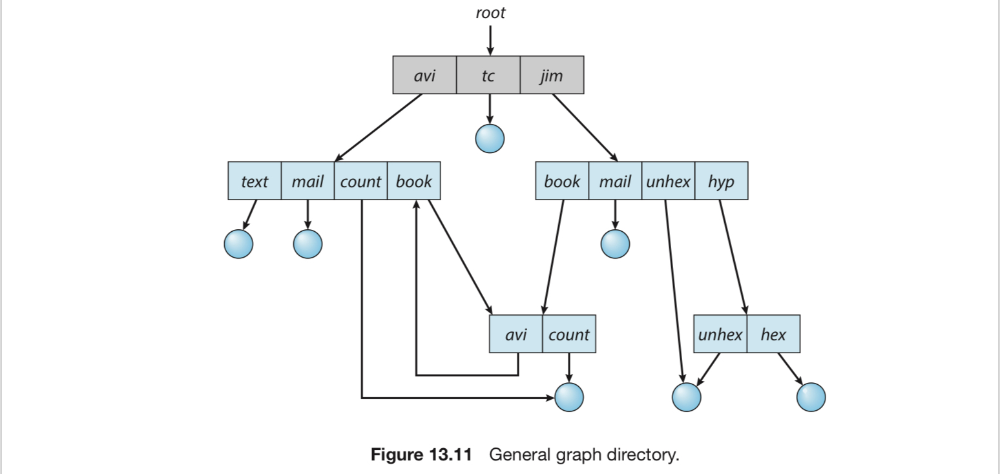

# 3. 디렉터리와 그 구조

# 디렉터리란?

<aside>
💡 파일 이름을 매핑된 파일 제어 블록으로 바꿔주는 심볼 테이블

</aside>

- 매핑 방식에 따라 디렉터리의 종류를 나눌 수 있음.
- 디렉터리 역시 연산 기능을 가지고 있어야 함.

## 디렉터리의 연산

1. 파일 찾기
    - 파일 이름은 심볼릭한 형태를 가지며, 비슷한 이름은 파일 간 관계를 암시
    - 따라서 특정 패턴과 일치하는 이름을 갖는 모든 파일을 찾을 수 있어야 함.
2. 파일 생성 : 새 파일을 생성, 디렉터리에 넣는다.
3. 파일 삭제 : 필요 없는 파일을 디렉터리에서 제거
4. 디렉터리 나열 : 디렉터리 속 파일을 나열하고, 그 항목을 보여줌.
5. 파일의 재명명 : 파일 이름 바꾸기. 
    - 새 이름이 너무 기존 디렉터리에 반영될 수 없다면, 디렉터리 구조 내에서 항목의 위가 변경될 수 있어야 함.
6. 파일 시스템의 순회
    - 여러 디렉토리를 순회하면서 파일을 볼 수 있게 해주는 기능
    - 파일 시스템과 관련된 구조를 주기적으로 보조저장장치에 저장
        - 이 기능은 장애 시 백업 사본을 제공해줌
    - 파일이 더 이상 사용되지 않으면, 파일은 백업 사본에 복사됨.
        - 이후 기존 파일은 타 파일에 의해 재사용

# 디렉토리의 종류

## 1단계 디렉토리

<aside>
💡 모든 파일 = 하나의 디렉터리 밑에 있음.

</aside>

- 개념이 간단하다.
- 그러나 파일의 크기가 커지거나 다수의 사용자가 사용하는 상황에서는 제약이 커짐
    - 모든 파일이 다른 이름을 가져야 하는데, 복잡한 상황에서는 이게 힘들 수 있음.
    - 모든 파일의 이름을 다 기억하는 것이 힘들 수도 있음.

## 2단계 디렉터리

<aside>
💡 각 사용자에게 서로 다른 디렉터리 파일을 만들어줌.

</aside>



위의 디렉터리 = 마스터 파일 디렉터리 (Master File Directory, MFD)

아래의 디렉터리 = 사용자 파일 디렉타리 (User File Directory, UFD)

파일 삭제, 검색, 생성 때 모두 해당 사용자가 소속된 UFD에서만 이뤄짐

- ex. UFD1의 helloworld.c 와 UFD2의 helloworld.c는 다른 파일

이를 위해서 UFD를 새로 만들거나 삭제할 수 있어야 함

- 적정한 사용자 이름과 회계 정보를 가지고 특수 시스템 프로그램을 수행
- 이 프로그램을 이용해 UFD를 생성하고 MFD에 이를 추가함.
- 시스템 관리만이 이 프로그램을 실행할 수 있음.

문제점 : 여러 사용자 간의 파일 공유가 불가능하다.

- 이를 위해 전체 디렉토리 구조를 트리로 생각한다음, 경로명을 이용함.
- MFD가 트리의 루트가 되고, UFD가 트리의 자식이 됨.
- 사용자 이름과 파일이름은 루트부터 자식까지의 경로가 됨
- 이러한 경로명을 이용해 다른 사용자가 가진 파일을 지칭

```
# 리눅스 
/inchoi/test

# 윈도우 (콜론 앞은 볼륨을 의미)
C:\user\test
```

명령이 실행되는 구조

1. 대부분의 시스템 프로그램은 이진 파일의 형태로 운영체제 안에 존재한다.
2. 명령 입력 시 인터프리터로 명령이 들어간다.
3. 시스템에서 명령은 실행 파일의 이름과 같다.
4. UFD에서 해당 시스템 파일을 찾아 복사한다.

시스템 파일은 특정한 사용자 디렉터리에 들어가 있다

- 명령이 주어질 때마다 시스템은 자동적으로 특수 사용자 디렉터리를 검색
- 이러한 디렉터리 탐색 순서를 탐색 경로라고 한다.

## 트리 구조 디렉터리

2단계 디렉터리 구조를 일반화한 것.



- 각 디렉터리는 특별한 취급을 받는 파일이라고 생각할 수 있다.
- 각 항목은 1비트를 사용해 0이면 일반 파일, 1이면 디렉터리 파일로 나눈다.

각 프로세스는 현재 디렉터리를 가지고 있음.

- 검색 순서 : 현재 디렉터리 → 파일 이름 + 탐색 경로 → 그 파일이 있는 디렉터리
- 현재 디렉터리를 다른 디렉터리로 가려면 change directory 시스템 콜을 해야 함
    - 이 호출은 새 디렉터리 이름을 매개변수로 사용해야 함.
    - 시스템은 각 프로세스의 현재 디렉터리를 추적하고 그에 대한 연산 작업을 App에게 맡김.
- 따라서 트리 디렉터리는 타 사용자의 파일도 건드릴 수 있다.

사용자가 로그인한 쉘의 현재 디렉토리 = 사용자가 로그인한 경우 설정되는 곳

- 운영체제는 사용자의 항목을 검색하기 위해서 계정 파일을 검색
- 계정 파일 = 사용자의 현재 디렉터리를 가리키는 포인터를 포함
- 이 포인터가 사용자의 현재 디렉터리를 가리키는 지역 변수에 복사
- 해당 쉘에서 타 프로세스들이 복제될 수 있고, 보통 자식 프로세스들의 현재 디렉터리는 부모 프로세스와 같음.

**경로명의 종류**

- 절대 경로 : 루트부터 지정된 파일까지를 쭉 써놓은 것
- 상대 경로 : 현재 디렉터리를 기준으로 지정된 파일까지의 경로를 정해놓은 것.

서브 디렉토리의 허용 = 임의 방식으로 파일 구성 가능

- 주제에 따라 다른 파일을 포함하거나
- 정보의 유형에 따라 개별적인 디렉터리 생성 가능.

트리 구조의 문제점 : 디렉터리의 삭제

- 만약 디렉터리가 비어있다면 괜찮음.
- 그러나 디렉터리가 파일이나 서브 디렉터리로 차 있다면, 2가지 방법이 있음
    1. 삭제하지 않는다.
    2. 파일을 모두 삭제한 후 디렉터리를 삭제한다.
- 2번 방법은 위험성이 조금 더 높긴 하다.

## 비순환 그래프 디렉터리

트리 구조는 파일이나 디렉터리의 공유를 허락하지 않는다.

이를 위해서 도입한 것이 바록 비순환 그래프 모양의 디렉터리



공유의 조건 = 디렉터리나 파일을 복사하지 않고도 접근이 가능해야 함.

팀을 이뤄 작업할 때, 공유되어야 할 모든 파일은 하나의 디렉터리에 놓일 수 있음.

- 각 팀 구성원의 홈 디렉터리는 공유 파일 디렉터리를 서브 디렉터리로 놓게 됨

**공유 파일 구현법**

1. 링크 이용
    - 링크 = 다른 파일이나 서브 디렉터리를 가리키는 포인터
    - 절대 / 상대 경로명으로 구현될 수 있음
    - 파일에 대한 참조가 일어나면, 디렉터리를 검색
        - 만약 디렉터리 항목이 링크로 표시되어 있다면, 실제 파일 이름은 링크 정보에 표기
        - 실제 파일에 대한 경로 이름을 사용함으로써 우리는 링크를 해석한다.
    - 링크는 디렉터리 항목의 형식을 통해서 쉽게 구분 + 간접적 포인터로 지칭
    - 운영체제는 트리 순환 시 비순환 구조를 위해 링크를 무시함.
2. 디렉터리의 동일한 항목 내용 복사
    - 링크와는 차이가 있음.
    - 링크 = 원래의 디렉터리와는 다름.
    - 복사본 = 원래의 디렉터리와 같음.
    - 단 일관성의 문제가 발생할 수 있음.

**공유 파일의 삭제**

공유 파일에 할당한 공간을 언제 반납하고 재사용할 수 있는가?

1. 누구든지 삭제할 경우 그 파일을 삭제
    - 존재하지 않는 파일에 대한 포인터들이 존재하게 되는 문제 발생
    - 남은 파일 포인터들이 실제 디스크 주소를 포함하고, 그 공간을 다른 파일을 재사용 하는 것에 사용한다면 해당 다른 파일을 제대로 활용 불가.
2. 심볼릭 링크로 공유하는 경우
    - 링크는 살아 있는데, 링크가 가리키는 파일이 삭제된 경우
    - 이러한 링크를 삭제할 순 있지만, 파일마다 연관된 링크의 목록을 유지하지 않으면 탐색 비용이 커진다.
    - 그냥 링크를 납두는 경우도 있다. (이 경우 링크 실행 실패의 책임은 사용자가 지게 된다.)
3. 모든 참조가 지워질 때까지 원 파일을 보존하는 것
    - 파일에 대한 마지막 참조가 삭제되었는지 판단해야 함
    - 파일에 대한 모든 참조 리스트를 확인해서 결정
    - 단 리스트 사이즈가 너무 크다면 문제가 발생할 수 있음.
    - 리눅스의 하드 링크가 이러한 방식 사용

## 일반 그래프 디렉터리

기존의 트리에 새 링크를 넣어 **순환을 허용**할 때 생기는 그래프 구조.



**파일 삭제 시 생기는 문제**

- 아무것도 참조하지 않는 파일의 참조 계수가 0이 아닐 수도 있음
- 이 경우 마지막 참조가 제거되고 디스크 공간이 재할당될 수 있도록 가비지 수집을 해야 함.

가비지 컬랙션은 전체 파일 시스템을 검색 & 접근 가능한 모든 것을 표기

두 번째 탐색에서 표시되지 않는 것들을 검색 & 사용 가능한 공간 리스트에 추가

단, 시간을 매우 많이 소모한다는 단점 존재.

**새 링크가 순환을 만드는지 알기**

- 여러가지 알고리즘이 존재
- 최선) 디렉터리를 탐색하는 도중 링크를 검색하지 않는 방식
    
    ⇒ 순환도 피하고, 오버헤드도 피한다.