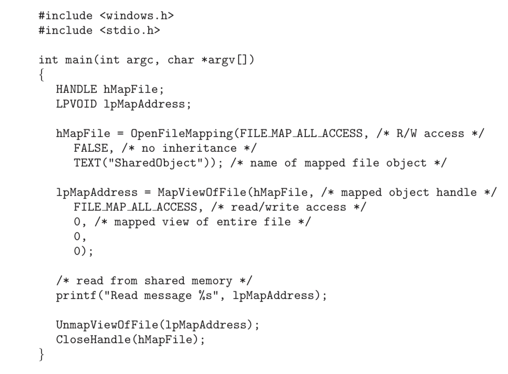

# 5. 메모리 맵드 파일

가상 메모리를 이용해 디스크 입출력을 메모리 참조 방식으로 대신하는 방식.

## 기본 기법

프로세스의 페이지 일부를 디스크 속 파일의 블록에 사상.

첫 번째 접근은 일반적인 요구 페이징 과정에 따라 페이지 폴트가 발생

이때 그 파일 내용 중 페이지 크기만큼의 해당 부분이 파일 시스템으로부터 메모리 페이지로부터 읽혀 들어오게 됨.

이후의 과정은 일반적인 메모리 액세스와 같이 처리됨

- read(), write()가 실행되지 않으므로 오버헤드 없이 파일을 메모리를 통해 조작
- 단순하고 더 빠르게 파일에 접근하고 사용할 수 있음

메모리에 사상된 파일에 대한 쓰기가 반드시 보조 저장장치의 파일에 즉각적으로 써지지는 않음.

- 시스템은 파일을 받을 때만 메모리 이미지 변경 사항에 따라 파일을 업데이트
- 메모리 부족 상황에서 시스템은 다른 용도로 메모리를 확보할 때 변경사항을 잃지 않도록 스왑 공간에 반영

파일이 닫히면 메모리에 사상된 모든 파일이 보조 저장장치의 파일에 다시 쓰이고, 프로세스의 가상 메모리에서 제거

일부 운영체제는 특정 시스템 콜을 통해서만 메모리 사상 파일을 처리해줌.

- 솔라리스의 mmap()이 대표적인 예시

여러 프로세스가 데이터 공유를 위해 파일을 공유할 수도 있음

- 이 경우 그 파일을 공유하는 프로세스들의 페이지 매핑 테이블이 모두 그 파일에 대응하는 물리 메모리 상의 페이지를 가리키게 됨.
- 이 페이지에는 디스크 파일의 내용이 올라와 있음

- 메모리 사상 시스템 콜이 copy-on-write 기능을 지원해 파일을 read-only로 공유할 경우, 모든 프로세스가 처음에는 1개의 페이지를 공유하다가 특정 프로세스가 이를 수정하면 별도의 페이지 복사본이 만들어질 수 있음
- 이때 페이지 수정 작업이 프로세스 간에 동기화되어야 한다면 상호 배제 기법을 쓰면 됨

공유 메모리를 메모리 사상 파일로 구현하는 것은 자주 있는 일

- 프로세스는 공유 메모리를 이용해 통신할 수 있음
- 메모리 사상된 파일은 프로세스 사이 공유 공간으로 작동

## Windows의 공유 메모리

1. 먼저 사상된 파일에 대한 파일 매핑을 생성
2. 사상된 파일의 프로세스 가상 주소 공간상의 뷰를 만듬
3. 타 프로세스는 파일을 오픈한 뒤 사상된 파일의 뷰를 가상 주소 공간상에 생성
4. 사상된 파일 = 프로세스 간의 통신을 위한 공유 메모리 객체를 나타냄

소비자 프로세스가 이름 있는 공유 메모리 객체에 대한 뷰를 생성하는 과정.

- CreateFile() : 사상된 파일을 열고 이에 대한 핸들을 반환
- CreateFileMapping() : 파일 핸들의 사상을 생성
    - SharedObject라고 불리는 named 공유 메모리 객체 생성
    - 메모리 사상 파일의 뷰를 자신의 주소 공간상에 생ㅅ어
    - 마지막 세 인자의 값을 0으로 지정, 뷰를 전체 파일에 대한 것으로 지정
        
        대신 오프셋과 크기를 주면 파일의 일부만을 갖는 뷰를 생성할 수도 있음 
        
- MapViewOfFile() : 사상된 파일의 가상 주소 공간상의 뷰를 생성
    - 공유 메모리 객체에 대한 포인터를 한봔
    - 이 메모리 영역에 접근 = 메모리 사상 파일에 대한 접근
    - 여기서 “Shared memory message”라는 메세지를 공유 메모리에 기록.

소비자 프로세스가 이름 있는 공유 메모리 객체에 대한 뷰를 생성하는 과정.

이미 존재해 이름이 있는 공유 메모리 객체에 대한 사상을 만들어 내는 것이라 좀 더 단순하다.

- 소비자 프로세스는 사상된 파일의 뷰를 생산자와 마찬가지로 생성
- 이후 생산자 프로세스의 “Shared memory message”라는 메세지를 읽어드림
- 마지막으로 UnMapViewOfFile() 함수로 두 프로세스가 사상된 파일의 뷰를 제거