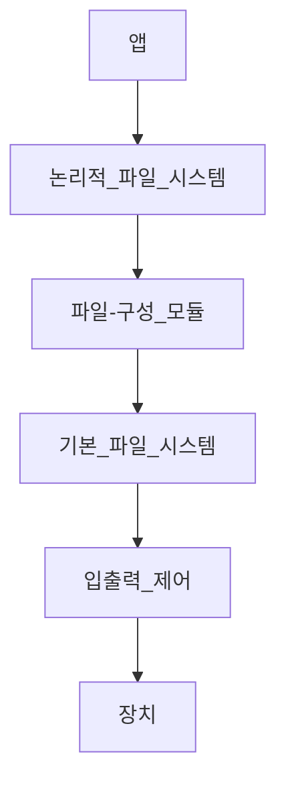

# 1. 파일 시스템 구조

## 보조 저장장치

파일 시스템을 유지하기 위한 보조 저장장치 = 디스크

```
1. 디스크는 추가 장소를 사용하지 않고 재기록이 가능
- 디스크로부터 한 블록을 읽고, 변경하는 방식

2. 디스크에 있는 임의 블록에 직접 접근 가능
- 따라서 아무 파일이나 순차적으로, 또 무작위로 접근 가능
- 파일 간의 전환은 헤드 이동과 매체 회전으로 이뤄짐.
```

물론, NVM(비휘발성 메모리)도 점점 많이 사용하고 있다.

I/O 효율성을 향상하기 위해 메모리와 보조 저장장치 간 I/O 전송은 블록 단위로 실행

- 하드 디스크 드라이브의 각 블록에는 하나 이상의 섹터가 있음
- 섹터 = 512바이트 or 4096 바이트

NVM에서는 4096개의 블록 존재. 전송 방법은 디스크와 유사.

## 파일 시스템의 특징

쉽게 데이터를 저장하고, 찾고, 인출하게 해 저장장치를 더 효율적이고 편리하게 쓸 수 있게 해줌.

설계에 있어서 크게 두 가지의 문제를 가지고 있음.

1. 파일 시스템이 사용자에게 어떻게 보이는가?
    - 파일이란 무엇인가?
    - 파일의 속성, 디렉토리 구조은 어떻게 되는가?
    - 파일의 연산은 어떻게 진행되는가?
2. 논리 파일 시스템을 어떻게 물리 저장장치로 매핑시킬 것인가?
    - 매핑시킬 알고리즘과 데이터 구조는?

파일 시스템은 여러 층으로 이뤄져 있음.



각 층은 낮은 층의 기능을 사용해 새 기능을 만들어 상위 층에 제공한다.

입출력 제어부터 논리적 파일 시스템까지 살펴보자.

### 입출력 제어

장치 드라이버 루틴과 인터럽트 핸들러로 이뤄져 있음.

메모리와 디스크 시스템 간 정보 전송을 담당.

- 장치 드라이버 : 번역기의 역할
    - 입력 명령 (고수준) ⇒ 출력 명령 (저수준)
    - 각 명령은 시스템의 타 부분과 접속하는 하드웨어 컨트롤러가 사용
- 장치 드라이버는 입출력 컨트롤러 메모리의 특별한 위치에 특정 비트 설정
    - 이를 통해 컨트롤러가 어느 장치에 어느 일을 수행할지를 알림.

### 기본 파일 시스템

리눅스에서는 “*블록 입출력 서브시스템”* 으로 불림

적절한 장치 드라이버에게 저장장치 상의 블록을 읽고 쓰도록 명령을 내림

- 논리 블록 주소를 기반으로 드라이버에 명령을 내림
- 입출력 요청 스케쥴링도 고려함
- 여러 가지를 저장할 메모리 버퍼와 캐시도 관리
    - 대상 : 파일 시스템, 디렉토리, 데이터 블록
- 버퍼 내 블록은 보조 저장장치의 전송이 일어나기 전 할당
    - 버퍼가 가득 차면, 요청된 입출력의 완료를 위해 다른 버퍼를 찾거나 가용 공간을 확보
- 캐시는 종종 성능 향상을 위해 파일 시스템의 메타데이터를 저장.
    - 이를 위해 캐시 내용 관리는 필수적임.

### 파일-구성 모듈

파일과 상응하는 논리 블록을 알고 있음.

각 파일의 논리 블록에 번호가 할당되어 있는 방식

또한 가용 공간 관리자 역시 포함하고 있음.

파일 구성 모듈이 요구 시 사용 가능한 블록을 할당.

### 논리적 파일 시스템

메타데이터 정보를 관리함.

- 메타데이터 : 파일의 내용(=데이터)를 제외한 나머지 정보

파일 이름을 심볼릭하게 줄 경우, 이를 처리하여 하위층인 파일-구성 모듈에 줘야 함.

- 이를 위해 디렉터리 구조를 관리.

## 파일 제어 블록 (PCB)

<aside>
💡 파일에 관한 정보를 가진 블록

</aside>

소유, 허가, 파일 내용의 위치를 포함하고 있음.

파일 구조를 유지하는 기틀이라고 할 수 있다.

리눅스와 유닉스에서 i-node로 구현되어 있음.

## 계층 구조의 특징

- 장점 : 코드 중복의 최소화
- 다수의 파일 시스템은 I/O 제어와 기본 파일 시스템 코드를 사용
    - 이때 각 파일 시스템은 자신의 논리 파일 시스템과 파일 구조 모듈을 가짐.
- 단점 : 계층화로 인해 오버헤드가 생길 수 있음.
- 따라서 계층 구조를 잘 설계하는 것이 필요

## 파일 시스템 : 예시

- CD-ROM : ISO 9660 포멧
- 유닉스 : UFS (FFS 기반)
- 리눅스 : EXT3, EXT4
- 윈도우 : FAT, NTFS, CD, DVD
- 분산 파일 시스템