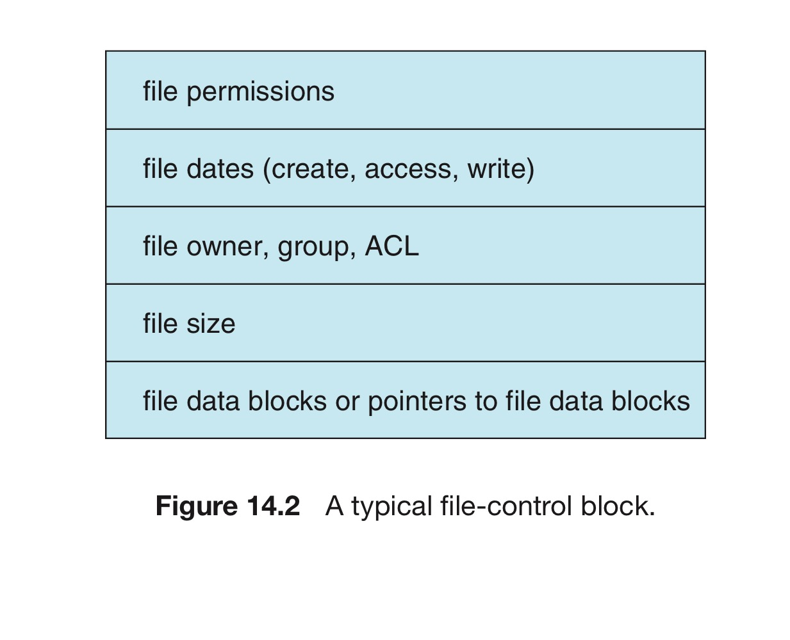
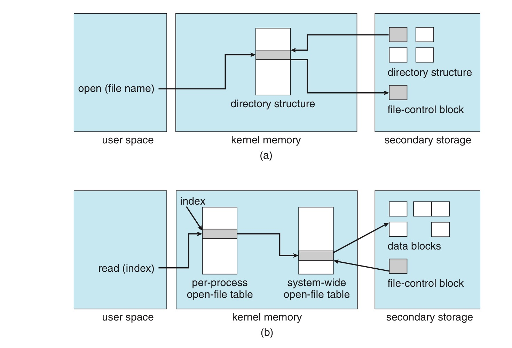

# 2. 파일 시스템 연산 구현

# 개요

공통 요소 : 디스크 상의 구조 + 메모리 내의 구조

## 디스크 상의 구조

1. 부트 제어 블록 : 시스템이 그 파티션으로부터 운영체제를 부트시키는 데 필요한 정보를 가짐. 
    - 일반적으로 한 파티션의 첫 번째 블록임
    - UFS의 부트 블록, NTFS의 파티션 부트 섹터
2. 볼륨 제어 블록 : 여러가지 볼륨 관련 정보를 포함
    - 볼륨 관련 정보 : 볼륨의 블록 수, 블록의 크기, 가용 블록의 수와 포인터, 가용 FCB 수와 포인터
    - UFS의 슈퍼블록, NTFS의 마스터 파일 테이블
3. 디렉터리 구조 : 파일을 조직화 하는데 사용됨.
    - UFS에서는 파일 이름 및 해당 i-node 번호가 저장됨
    - NTFS는 마스터 파일 테이블에 이러한 정보가 있음.
4. 파일별 FCB : 자세한 파일 정보를 가지고 있음.
    - 디렉터리 항목과의 연결을 위해서 고유한 식별 번호를 가지고 있음.
    - NTFS는 마스터 파일 테이블에 해당 정보가 있음.
    - NTFS는 파일마다 한 행을 가진 관계 DB 구조를 이용함.

## 메모리 내의 구조

메모리 내부의 정보는 파일 시스템 관리와 캐싱을 통한 성능 향상을 위해 사용됨.

이러한 정보들은 마운트 시점에서 적재되고, 파일 시스템 동작 중에 갱신되며, 마운트 해제 시에 제거됨.

다수의 자료구조 유형으로 이러한 정보를 저장함.

1. (메모리 내) 파티션 테이블 : 마운트된 모든 파티션 정보를 포함함.
2. (메모리 내) 디렉터리 구조 : 최근 접근된 디렉터리의 디렉터리 정보를 가짐
    - 파티션이 마운트된 디렉터리의 경우 파티션 테이블에 대한 포인터를 포함할 수 있음.
3. 범 시스템 오픈 파일 테이블 : 타 정보와 더불어 오픈된 각 파일의 FCB의 복사본을 가지고 있음.
4. 프로세스별 오픈 파일 테이블 : 프로세스가 연 모든 파일에 대해 타 정보 및 범 시스템 오픈 파일 테이블 내의 해당 항목에 대한 포인터를 포함하고 있음
5. 버퍼 : 파일 시스템이 다른 파일 시스템으로부터 읽히거나 써질 때 파일 시스템 블록을 저장.

## 새 파일 생성

1. 프로세스가 논리 파일 시스템을 호출
2. 논리 파일 시스템은 디렉터리 구조의 포맷을 알고 있음
3. 새 FCB를 할당하고, 해당 디렉터리를 메모리로 읽어 새 파일 이름과 FCB로 디렉터리를 갱신
4. 이를 파일 시스템에 다시 쓴다.

FCB는 다음과 같이 생겼다.

유닉스 계열은 디렉터리를 하나의 파일로 간주. (디렉터리라고 지정하는 유형 필드가 존재)

윈도우는 디렉터리와 파일을 구분하고, 각각의 시스템 콜을 가지고 잇음.

논리적 파일 시스템은 디렉터리 입출력을 저장장치 블록 위치로 매핑하기 위해 파일 구성 모듈을 호출

- 이것은 기본적인 파일 시스템과 입출력 제어 시스템에서 처리됨.

# 사용법

## open() 작동

1. open() 시스템 콜이 시작.
2. 논리적 파일 시스템에 파일 이름을 넘겨준다.
3. 범 시스템 오픈 파일 테이블을 검색
    - 사용 중이면 기존 범 시스템 오픈 파일 테이블을 가리키는 프로세스별 오픈 파일 테이블 항목이 생성됨
    - 이 알고리즘을 통해 상당한 양의 오버헤드를 줄일 수 있음.
4. 파일이 오픈되지 않았으면, 주어진 파일이름을 디렉토리에서 검색
    - 디렉토리 구조의 일부를 메모리에 캐싱해 검색 속도를 향상
    - 파일이 발견되었으면, FCB가 메모리 내 범 시스템 오픈 파일 테이블에 복사됨
    - 이 테이블은 FCB를 저장하고, 파일을 오픈한 프로세스의 수도 저장.
5. 포인터 & 몇 개의 필드 생성
    - 필드 : 파일 포인터 & 파일 접근 모드 등을 포함
    - 포인터 : 반환되는 값으로, 파일 디스크립터가 이것.

## 종료 시

프로세스가 파일을 닫을 때, 프로세스별 테이블 항이 삭제되고 범 시스템 항목의 오픈 계수는 감수.

오픈했던 모든 사용자가 파일을 닫으면 디스크 기반 디렉터리 구조에 업데이트된 파일 정보가 복사되며, 범 시스템 오픈 파일 테이블에서 해당 항목을 삭제

## 장점

이러한 기법을 사용함으로써 실제 데이터 블록을 제외한 오픈 파일에 대한 모든 정보가 메모리 안에 존재.

디스크 입출력 작업을 줄여줄 수 있음. (실제 예시 : BSD UNIX 시스템. 평균 캐시 적중률 85%)

