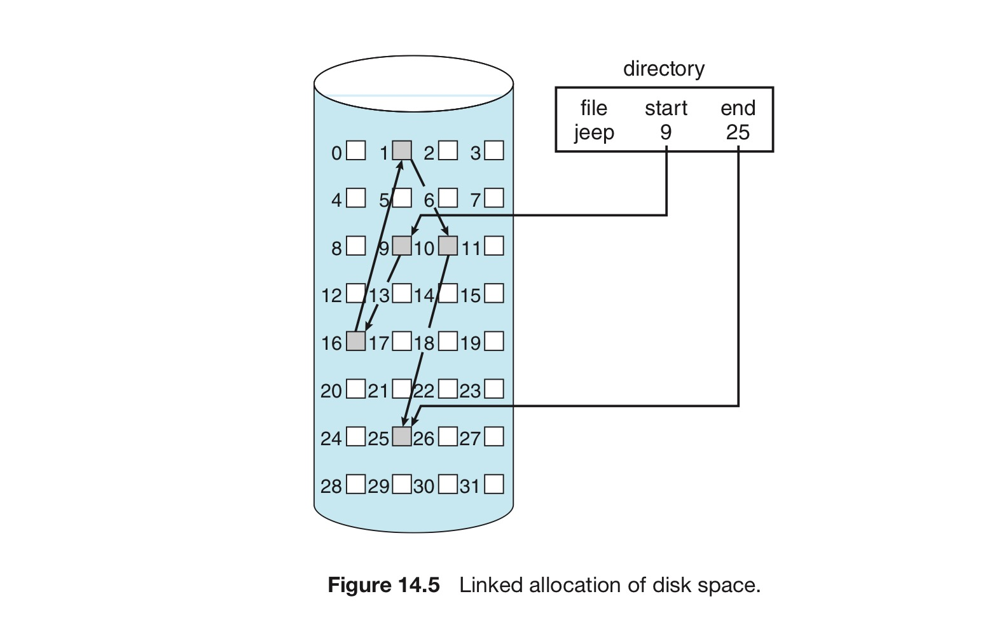
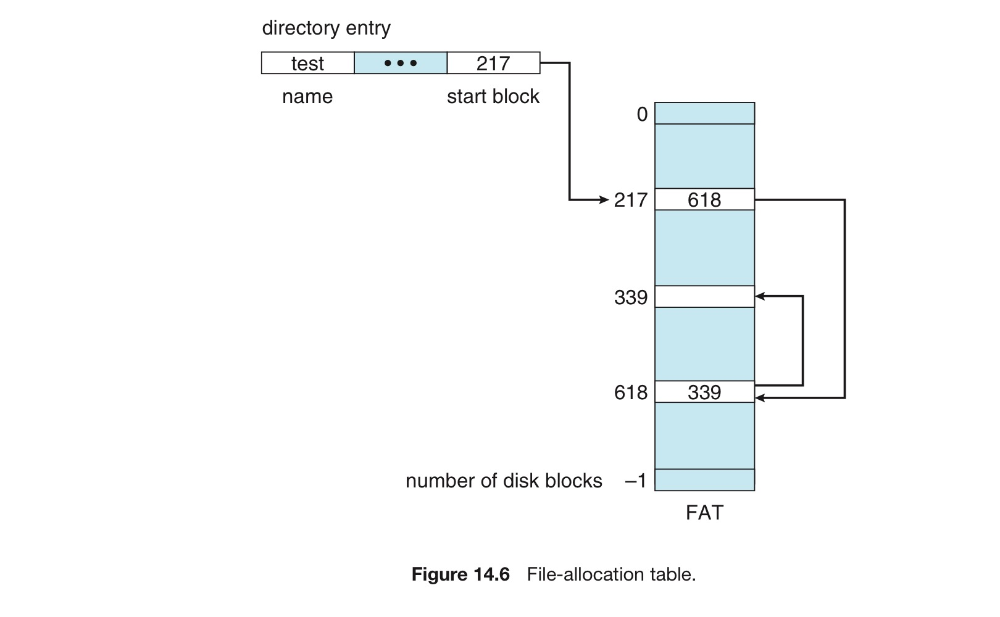
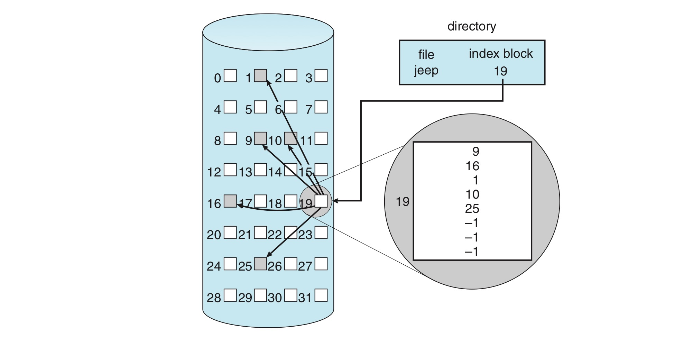
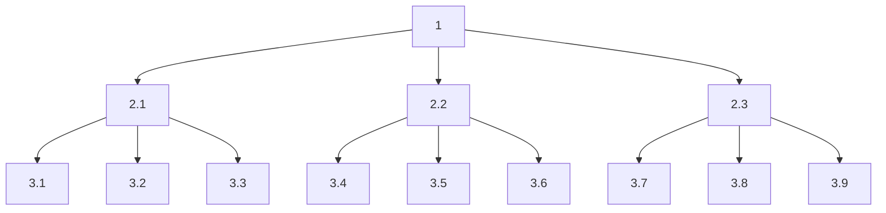
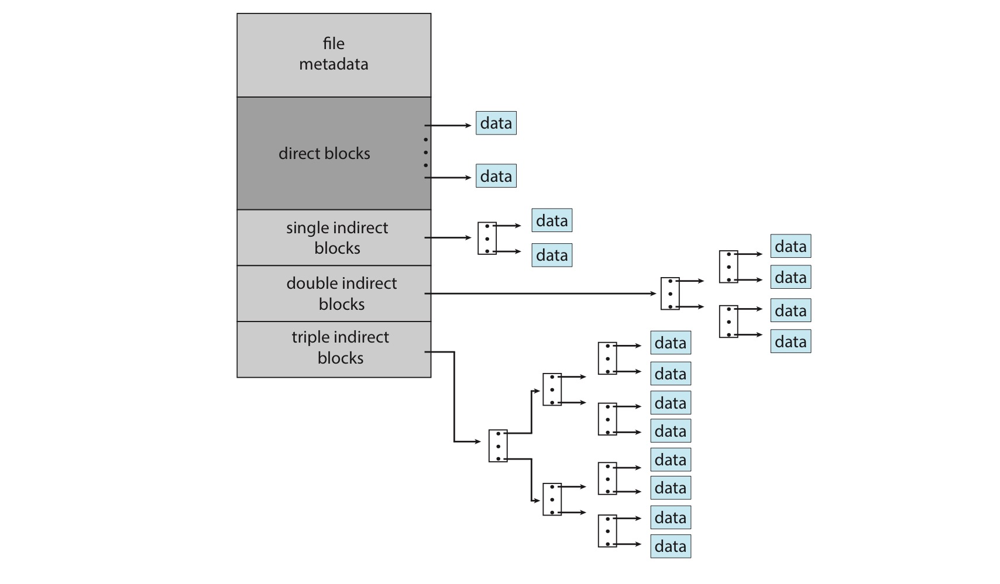

# 4. 할당 방법

파일을 어떻게 저장장치에 배치할 것인가?

크게 3가지 방법이 있으며, 이를 알아보자.

# 연속 할당

```
파일 1 : 블록 1, 블록 2, ... 블록 5
파일 2 : 블록 6, 블록 7, ... 블록 14
```

파일의 할당 : 첫 블록의 주소 + 파일의 길이로 결정

각 파일을 위한 디렉터리 항목은 이 파일의 디스크 내 시작 블록 주소와 이 파일의 크기만 표시하면 됨

- 접근 시에도 첫 블록의 주소 + 몇 번째 블록을 조합해 찾는다.
- 그래서 순차 접근과 직접 접근 두 가지를 모두 지원.

단, 몇 가지 단점 때문에 최신 파일 시스템에서 사용되지는 않는다.

## 장점

- 구현이 쉽다.
- (하드디스크 기준) 헤드 이동이 필요하지 않음.
    - 필요 시 한 트랙만 이동하면 됨.
    - 디스크 탐색 횟수를 줄일 수 있음.

## 단점

1. 새 파일을 위한 가용공간을 찾기 어렵다
    - 최초 적합과 최적 적합을 이용해 이를 해결한다.
    - 단, 이 알고리즘 모두 외부 단편화 때문에 어려움이 있다.
        - 파일이 할당되고 반납되면서 가용 디스크 공간이 조각으로 나눠짐.
        - 이때, 제일 큰 연속 덩어리가 요구 크기보다 작으면 이들 중 하나도 요구를 만족 불가
        - 디스크 공간의 전체 크기와 평균 파일 크기에 따라 외부 단편화가 작은 문제 또한 발생
    - 이를 극복하기 위해 전체 파일 시스템을 다른 장치로 복사한다.
        - 원래 장치가 완전히 비어 하나의 큰 연속 가용공간이 됨
        - 이후 이 공간에서 할당을 받으며 파일들을 원래의 장치로 재복사
        - 모든 가용공간을 모아서 단편화를 해결
        - 가용공간을 모을 시간이 많이 걸린다는 것이 문제.
    - 가용공간 모으기를 마운트를 해제한 채 오프라인 시점에서도 할 수 있음.
        - 밀집 작업 중에는 시스템이 정상 작동하지 않음
        - 따라서 온라인 시점에서 하면 시스템 성능이 굉장히 저하됨.

1. 얼마나 많은 공간이 필요한지 결정하기 힘들다.
    - 너무 작은 공간을 예약했다면 파일이 커질 수 없음.
        - 최적 적합 방법 사용 시, 양 끝 인접 공간이 모두 사용중
        - 따라서 파일 확장이 불가능함.
        - 사용자에게 알리거나, 더 큰 조각으로 파일을 이동
        - 둘 다 반복된 수행을 요구하거나, 비용이 많이 든다.
    - 그렇다고 선 할당은 비효율적임
    - 따라서 운영체제는 어느 정도의 연속된 공간만 초기에 할당
        - 이후 필요시 n개의 연속된 공간을 단위(extend)로 할당

# 연결 할당



- 디렉토리 (검은색 상자)는 파일의 첫 블록, 마지막 블록에 대한 포인터를 가지고 있음.
- 각 블록은 다음 블록을 가리키는 포인터를 포함.
    - 포인터가 차지하는 부분은 사용자가 사용할 수 없음

## 새 파일 생성

1. 디렉토리 내 새 항목을 생성
2. 처음에는 포인터가 null 값이고, 크기 필드도 0값.
3. 쓰기 실행 시 가용 블록을 할당받아 쓰고, 파일에 끝에 연결

## 장점과 단점

- 외부 단편화가 없음.
- 가용 공간 리스트의 어떠한 가용 블록을 이용해도 무방
- 파일은 얼마든지 커질 수 있음

- 순차적 접근 파일에만 효과적으로 사용
- 직접 접근 방식에는 매우 비효율적.
    - 탐색이 많이 필요함
- 포인터를 위한 공간이 필요
    - 이를 해결하기 위해 블록을 모은 **클러스터**라는 단위를 도입
    - 논리-물리 매핑을 유지하면서도 탐색이 줄어듬
    - 물론, 내부 단편화가 증가될 수 있음.
    - 또 소량의 데이터 요청이 많은 데이터 전송을 유발, I/O 성능이 저하될 수 있음.
- 하나의 포인터를 잃어버리면 파일 전체가 날라간다.
    - 해결 방안 : 이중 연결리스트나 블록마다 파일 이름 & 상대 블록 번호 저장
    - 단 이러한 해결 방안은 더 많은 오버헤드를 필요로 한다.

## 파일 할당 테이블(FAT)



각 파티션의 시작 부분이 FAT로 사용

FAT 테이블은 각 블록 마다 1개의 항목을 가지고 있음.

- 이 항목은 디스크 블록 번호를 인덱스로 찾음
- 디렉토리의 항목은 각 파일의 첫 번째 블록 번호를 가리킴

블록 번호 ⇒ FAT 테이블 ⇒ 다음 블록 번호

- 마지막은 파일의 끝을 나타내는 특수한 값을 가지고 있음.
- 파일에 새 블록을 할당할 경우, 값이 0인 테이블 항목을 찾아 이전 파일의 마지막 값을 이 항목으로 대체
- 무작위 접근의 시긴을 개선할 수 있는 방법.

단, FAT가 캐시되지 않으면 검색에 많은 시간이 필요

- FAT 검색을 위해서 디스크 헤드를 반드시 파티션의 시작 부분으로 이동
- 찾고자 하는 블록 주소를 찾은 뒤, 다시 또 이동 (최악 : 2번의 이동)

# 색인 할당

연속 할당 : 외부 단편화 문제 & 파일 크기 선언 문제

연결 할당 : FAT 없이 직접 접근 방식을 지원할 수 없음.

두 가지 문제를 동시에 해결하기 위해 나온 것이 색인 할당.

색인 할당은 모든 포인터를 색인 블록으로 관리해 이 문제를 해결.



## 색인 블록

각 파일은 저장장치 블록 주소를 모아 놓은 색인 블록을 가짐

- 색인 블록의 i번째 항목은 파일의 i번째 블록을 가리킴
- 디렉터리는 색인 블록의 주소를 가지고 있음
- i번째 블록을 읽기 위해서는 색인 블록 항목에 있는 i번째 항목에서 포인터를 얻어서 그 블록을 읽음.
- 페이징 기법과 유사하다고 할 수 있음.

파일 생성 시 색인 블록의 모든 포인터 = null

i번째 블록이 처음 쓰이면, 가용 블록 관리자로부터 한 블록을 받아 그 주소를 색인 블록의 i번째 항에 기록

## 색인 블록의 크기

**색인 할당 : 외부 단편화 없이 직접 접근을 지원**

- 저장장치의 어느 블록이든 더 많은 공간의 요청을 만족시킬 수 있기 때문
- 그러나 공간 낭비로 인한 어려움을 겪음

**색인 할당의 포인터 오버헤드 >> 연결 할당의 포인터 오버헤드**

- 색인 할당 : 1, 2개 포인터만 null이 아니어도 전체 색인 블록을 할당해야 함.
- 연결 할당 : 블록당 하나의 포인터 공간만 손실.

**따라서 색인 블록의 크기에 대한 고찰이 필요**

- 모든 파일에 색인 블록이 필요하므로 색인 블록은 최대한 작을수록 좋다.
- 그러나 색인 블록이 너무 작으면 큰 파일에 충분한 포인터를 보유할 수 없음.

**이를 처리해주는 기법은 크게 3가지가 존재한다.**

1. 연결 기법 : 하나의 색인 블록 = 한 저장장치 블록
    
    파일의 크기가 커지면 여러 개의 색인 블록을 연결한다.
    

```
ex. [색인 블록 1] - [색인 블록 2]

색인 블록 1 : 헤더(파일 이름을 나타냄), 첫 100개의 디스크 블록 주소
색인 블록 2 : 
	- 작은 파일이면 null
	- 큰 파일이면 다른 인덱스 블록에 대한 포인터
```

1. 다중 수준 색인 : 1st 색인 블록 ⇒ 2nd 색인 블록들 ⇒ 3rd 색인 블록들 …
    
    연결 기법의 변경이라고 볼 수 있고, 파일 크기에 따라 3번째나 4번째까지 연결됨.
    
    한 블록의 크기가 4096바이트라면, 1024개의 4바이트 포인터를 한 인덱스 블록에 저장
    
    2단계 색인까지 쓴다면 10485756개의 데이터 블록을 가질 수 있고, 이는 4GB에 해당
    



1. 결합 기법 : 파일의 i-node에 색인 블록의 15개 포인터를 유지하는 것
    
    처음 12개 : 직접 블록을 가리킴. 
    
    이후 3개 : 간접 블록을 가리킴. 
    
    - 13번째 : 단일 간접 블록 (데이터를 저장하고 있는 블록의 주소 저장)
    - 14번째 : 이중 근접 블록 (실제 데이터 블록을 가리키는 포인터를 저장하는 블록 저장)
    - 15번째 : 삼중 간접 블록의 주소 저장
    
    4바이트 파일 포인터가 가리킬 수 있는 블록보다 더 많은 블록을 할당할 수 있음
    



# 할당방식과 성능

## 할당 방법의 선택 기준

1. 공간 효율성
2. 데이터 블록 접근 시간
3. 순차(직접) 접근 vs 랜덤 접근

## 할당 성능과 접근 파일

연속 할당은 직접 접근 파일을 지원하는데 어울림.

- i번째 블록의 주소를 직접 접근 가능
- 파일의 시작 주소를 메모리에 쉽게 유지하기 때문

연결 할당은 순차 접근 파일을 지원하는데 어울림. 

- 순차적 액세스가 적합
- 직접 액세스를 하려면 i번의 블록 읽기가 필요

따라서 운영체제에서 접근 형태가 먼저 고려되어야 함.

- 순차 접근 ⇒ 연결 할당
- 직접 접근 ⇒ 연속 할당
    - 순차 접근 & 직접 접근 모두 사용가능

그러나 파일을 생성할 때는 최대 크기를 먼저 선언해야 함

- 이 경우 운영체제는 두 가지 방법을 모두 제공하는 알고리즘과 자료구조를 유지해야 함
- 또 이렇게 선언한 파일을 변경 시, 기존 파일 내용을 새로 복사하면서 변경해야 ㅎ마

## 색인 할당의 성능

- 색인 할당이 메모리 내 상주 시 직접 접근이 가능
    - 그러나 이 경우 많은 양의 메모리가 필요
    - 메모리 부족 시 먼저 색인 블록을 읽은 후 원하는 자료 블록을 읽어야 함
    - 큰 파일 : 모든 인덱스 블록을 읽어 포인터를 하나하나 따라가야 끝을 읽을 수 있음.
- 따라서 색인 할당 방식은 인덱스 구조, 파일의 크기, 원하는 블록의 위치에 따라 성능이 달라짐

## 기타 최적화 방법

1. 연속할당과 색인할당 결합하기
    1. 큰 파일은 색인할당, 작은 파일은 연속할당
2. 디스크-헤드 이동을 줄이기 위한 기법
3. NVM 성능을 극대화하기 위한 기법