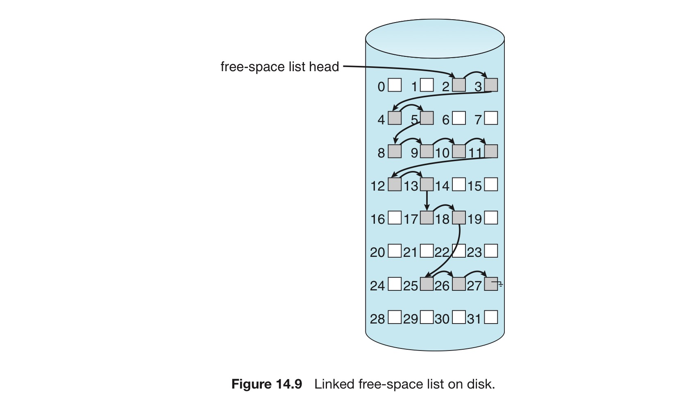
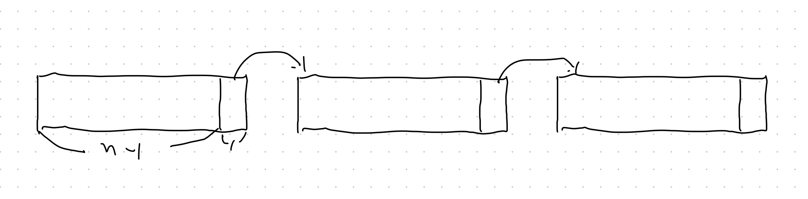

# 5. 가용 공간의 관리

가용 공간을 관리하기 위해 가용 공간 리스트를 만든다.

해당 가용 공간 리스트는 파일 생성에 사용되며, 꼭 리스트의 형태일 필요는 없다.

가용 공간 리스트를 만드는 여러 가지 방식을 알아보자.

## 비트 벡터

```
001100101000100101001000100110010

- 비어있는 블록 : 0
- 할당된 블록 : 1
```

- 첫 번째 가용 블록, 또는 연속된 가용 블록을 찾기 편하다
    - 비트 벡터의 각 원소를 순서대로 확인하면 된다.
- **첫 번째 가용공간의 위치**
    - `(비트 수) * (값이 0인 워드 수) + (첫 번째 1비트의 변위)`
    - 첫 0이 아닌 워드를 만나게 될 때, 첫 번째 1인 비트를 찾기 위한 식
- 그 전체가 메인 메모리 내에 존재하지 않으면 비효율적.
    - 가끔 복구할때 파일 시스템을 저장하는 장치에 기록되긴 함
    - 그래도 메모리 내에 존재해야 함.

## 연결 리스트

모든 가용 블록을 함께 연결하는 것.



- 첫 번째 가용 블록(free-space list head)은 다음 가용 블록을 가리키는 포인터를 가짐.
- 두 번째 가용 블록은 세 번째 가용 블록을 가리키는 포인터를 가짐.
- 이하 반복…

- HDD에서 이 기법은 리스트를 순회하려면 매번 디스크에 접근해야 함
- 그렇지만, 가용 리스트 순회는 빈번하게 일어날 일은 아님.
- FAT 기법은 가용 블록 어카운팅 + 할당 자료구조를 결합
    - 따라서 별도의 기법이 필요 없음.

## 그룹핑



- 가용 리스트 방식의 변형
- 첫 번째 가용 블록 내에 n개의 블록 주소를 저장하는 방법
- 이 중 처음 n-1개는 실제로 비어 있는 블록의 주소
- 단 마지막 1개는 다른 가용 블록을 가리킴
- 다수 개의 가용 블록 주소들을 쉽게 찾을 수 있음.

## 계수

- 연속된 가용 블록의 첫 블록의 주소와 연속된 블록의 갯수만 유지하는 기법
- 디스크 공간이 연속된 블록 단위로 할당 및 반환된다는 점을 이용한 기법
- 따라서 가용 공간 리스트의 각 항은 하나의 장치 주소와 블록의 갯수로 구성됨
    - 각 항은 주소만 저장하는 경우에 비해 더 필요 공간이 커짐
    - 그러나 통상 계수가 1보다 큰 경우가 많기에 전체 길이는 더 짧아짐
- 블록 할당의 범위(extend)와 비슷함.
- 이 항들은 균형 트리의 형태로 설계되기 함

## 공간 맵

대규모의 파일을 다룰 때 쓰는 방법 (ex. 오라클 Solaris의 ZFS)

**여러가지 장치**

- 메타슬랩 : 장치의 공간을 관리 가능한 덩어리로 나누기 위해 생성
    - 각 메타슬랩은 연관된 공간 맵을 가지고 있음
- 가용 블록에 대한 정보를 저장하기 위해 계수 알고리즘을 사용
- 로그-구조 파일 시스템 기법을 사용해 계수 구조를 저장
- 공간 맵은 할당 및 반환 활동을 계수 형식으로 시간 순으로 기록함

**공간맵의 작동 방향**

- ZFS가 메타슬랩에서 공간을 할당/반환할 때, 관련된 공간맵을 변위에 따라 색인된 균형-트리 형태로 메모리에 적재
- 이후 로그를 재실행하여 이 구조를 반영. 메모리 내 공간맵은 메타슬랩의 할당과 반환 상태를 정확히 표현.
- 또한 ZFS는 연속된 가용 블록을 결합해 하나의 항으로 만들어 맵을 가능한 한 압축
- 마지막으로 ZFS의 트랜잭션 기반 연산의 일부분으로 디스크에 존재하는 가용 공간 리스트가 갱신
    - 집합 및 정렬 단계에서 블록 요청이 발생할 경우, ZFS는 이 요청을 로그에서 충족
    - 로그 + 균형 트리로 가용 리스트의 역할 수행

## 미사용 블록 제거

NVM에서 주로 사용하는 방법.

- NVM은 덮어쓰기가 불가능하기 때문
- 저장장치 공간을 쓰기 가능한 상태로 유지하는 기법.
- 장치가 꽉 차는 것을 방지한다.