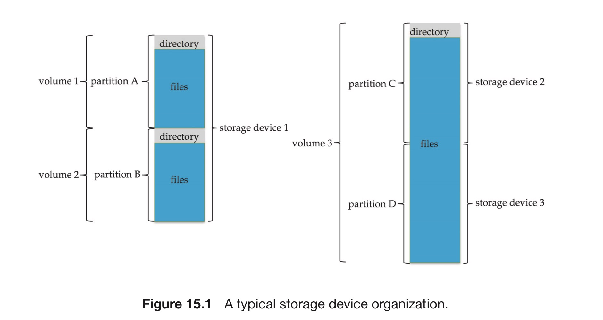
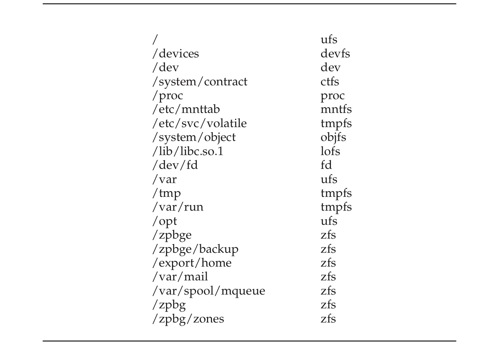

# 1. 파일 시스템

### 컴퓨터와 파일

컴퓨터 1대 ⇒ 수십, 수천만개의 파일이 존재.

- 파일은 임의 액세스 저장장치에 저장됨.
- 저장장치 ⇒ 파티션으로 분할 ⇒ 볼륨을 보유
    - 볼륨은 다시 파일 시스템을 보유
    - 볼륨은 여러 파티션에 걸쳐서 확장될 수 있음

컴퓨터는 또한 다양한 파일 시스템을 가질 수 있고, 이들의 종류를 나열할 수도 있음

전형적인 파일 시스템의 구조는 다음과 같다.

### 예시 : 솔라라스

- tmpfs : 램에 생성. 시스템 재부팅이나 고장 시 지워짐.
- objfs : 디버거가 커널 심볼에 접근할 수 있게 하는 가상 파일 시스템. 실제로는 커널 인터페이스
- ctfs : 시스템이 부트될 때 시작. 운영체제가 실행되는 동안 타 프로세스를 관리하기 위한 contract 정보를 저장
- lofs : 한 파일 시스템 대신 다른 파일 시스템 형태로 보여주는 가상 파일 시스템
- procfs : 모든 프로세스에 관한 정보를 파일 시스템 형태로 보여주는 가상 파일 시스템
- ufs, zfs : 범용 파일 시스템